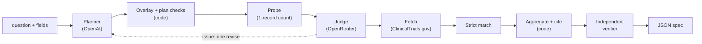

# ctviz

**Demo video (1 min):** [watch on Google Drive](https://drive.google.com/file/d/1DnCL9A0Yw9TySxYY96eS8LRgyNGSmrOc/view?usp=sharing) — me running questions through the
web UI and explaining the answers.

## 1. What it is

`ctviz` is a FastAPI backend that takes a natural-language question about clinical trials (plus
optional structured fields such as `drug_name` or `start_year`) and returns a JSON **visualization
spec**: `type`, `title`, `encoding`, `data` and `meta`. A frontend can render it without guessing.
Data comes from the ClinicalTrials.gov v2 API, and every bar, point, node and edge cites the exact
trial records and fields behind it.

The design rule is that **LLMs decide what to ask; code decides what is true.** A planner LLM turns
the question into a typed plan chosen from menus; deterministic code fetches, matches, counts and
cites; an independent verifier recounts every datum from the raw records. No count, category label
or excerpt is written by an LLM. Details: [docs/DESIGN.md](docs/DESIGN.md).



## 2. Quickstart

Requires Python 3.12+ and [uv](https://docs.astral.sh/uv/).

```bash
make install                  # uv sync
cp .env.example .env          # then fill in OPENAI_API_KEY and OPENROUTER_API_KEY
make run                      # uvicorn on http://127.0.0.1:8000 (with --reload)
```

```bash
curl -s -X POST http://127.0.0.1:8000/v1/visualize \
  -H 'content-type: application/json' \
  -d '{"query": "How has the number of trials for this drug changed over time?",
       "drug_name": "Pembrolizumab"}' | python3 -m json.tool | head -40
```

Other endpoints: `GET /health` (which providers are configured, as booleans; never the keys) and
`GET /v1/schema` (JSON Schema of the request and response).

The planner needs an OpenAI key. The judge needs an OpenRouter key but **fails open**: without it
the plan runs unreviewed and the response says `judge.status = "unavailable"`.

### No keys? `make demo-offline`

```bash
make demo-offline             # PLANNER_MODE=replay uvicorn ... --port 8000
```

Replay mode needs no `.env`, no API key and no network. It answers only these canned questions
(`examples/canned_plans.json`), each served from a recorded ClinicalTrials.gov fixture:

- How has the number of pembrolizumab trials changed over time?
- How many pembrolizumab trials are there by phase?
- How many multiple sclerosis trials are recruiting, by country?
- What is the enrollment distribution for psoriasis phase 2 trials?
- Duration versus enrollment for completed phase 3 Crohn's disease trials
- Show the sponsor-drug network for glioblastoma trials

Everything after the planner/judge/client boundary (checks, probe, aggregation, citations,
verifier) is the same production code path as a live request. Any other question in replay mode
returns an error naming the available questions.

## 3. Request schema

`POST /v1/visualize`. Only `query` is required. Unknown fields are rejected (HTTP 422, in the
response envelope). Inputs are forgiving: human spellings are coerced to canonical values.
The machine-readable schema is at `GET /v1/schema` (`request`); generate TypeScript types from it
with any JSON-Schema tool.

| Field | Type | Required | Validation / accepted spellings | Effect |
|---|---|---|---|---|
| `query` | string | yes | 3-500 chars | the question |
| `drug_name` | string | no | 1-100 chars | drug search (`query.intr`) |
| `condition` | string | no | 1-100 chars | condition search (`query.cond`) |
| `sponsor` | string | no | 1-120 chars | sponsor search |
| `sponsor_role` | `"lead"` \| `"any"` | no | default `lead` | lead sponsor only (`query.lead`) vs lead or collaborator (`query.spons`) |
| `trial_phase` | phase or list | no | "Phase 3", "3", "phase2/3", "N/A", "Early Phase 1", `PHASE3` | phase filter |
| `status` | status or list | no | "recruiting", "Active, not recruiting", `RECRUITING`, ... | overall-status filter |
| `country` | string | no | "USA" and other aliases map to the API spelling ("United States") | country filter |
| `start_year` | int | no | 1900 to current year + 5 | earliest start year |
| `end_year` | int | no | same range; must be >= `start_year` | latest start year |
| `study_type` | string | no | `INTERVENTIONAL`, `OBSERVATIONAL`, `EXPANDED_ACCESS` (case/space-insensitive) | study-type filter |
| `nct_ids` | list of string | no | each `NCT` + 8 digits, max 50 | restrict to those trials (a short lookup query takes the no-LLM fast path) |
| `options.max_records` | int | no | 100-20,000; default 20,000 | fetch cap per cohort |
| `options.citations` | `"full"` \| `"sample"` \| `"none"` | no | default `full` | citation payload mode |
| `options.top_n` | int | no | 3-50 | category / node cap (beats the planner's own `top_n`) |
| `options.include_collaborators` | bool | no | default false | collaborators as sponsor nodes in networks |
| `options.strict_match` | `"auto"` \| `"all"` \| `"off"` | no | default `auto` | strict match check (drugs and sponsors strict, conditions lenient) |

**Structured fields are applied by code, not by the LLM.** A structured field replaces whatever the
planner put in the same slot, and the override is recorded in `meta.assumptions`.

```json
{ "query": "Show a network of sponsors and drugs", "condition": "glioblastoma",
  "trial_phase": "Phase 3", "options": { "top_n": 40 } }
```

## 4. Response schema

### Envelope

```json
{ "schema_version": "1.0.0", "ok": true, "visualization": { }, "meta": { }, "error": null }
```

A frontend has **one parse path: check `ok`**. Domain outcomes are HTTP 200 with `ok: false`;
`visualization` is `null` and `error` is `{code, message, details}`.

| Situation | HTTP | `ok` | `error.code` |
|---|---|---|---|
| Success | 200 | true | |
| Out of scope (opinion, pricing, efficacy) | 200 | false | `OUT_OF_SCOPE` (`details.suggested_reframing`) |
| No matching trials | 200 | false | `NO_MATCHING_TRIALS` |
| Plan still invalid after the revise | 200 | false | `PLAN_INVALID` |
| Invalid request body | 422 | false | `INVALID_REQUEST` |
| ClinicalTrials.gov unreachable / 5xx | 502 | false | `UPSTREAM_API_ERROR` |
| No LLM reachable for the planner / no key | 503 | false | `LLM_UNAVAILABLE` |
| Citation verifier failed (our bug; fails closed) | 500 | false | `CITATION_CHECK_FAILED` |
| Too many requests (per client per minute, or the global daily cap) | 429 | false | `RATE_LIMITED` (+ `Retry-After` header) |
| Anything else | 500 | false | `INTERNAL_ERROR` (no stack traces) |

### Visualization types and encodings

`visualization` is a discriminated union on `type`. Every type has `type`, `title`, `encoding`,
`data`, `options`. **Data is pre-aggregated; never re-aggregate. The order of `data` is the render
order.** Each `encoding` channel is `{field, type, title?, unit?, format?, time_unit?, sort?, bin?}`
(Vega-Lite-style; `type` is `quantitative`, `nominal`, `ordinal` or `temporal`), and `field` is the
exact key in each data row.

| `type` | Encoding channels | Row shape | Citations on |
|---|---|---|---|
| `bar_chart` | `x`, `y` | `{[x], [y], flags?, predicate, citations}` | each bar |
| `grouped_bar_chart` | `x`, `y`, `color` | long/tidy: one row per (x, series) | each cell |
| `time_series` | `x` (temporal), `y`, optional `color` | `{year, cohort, trial_count, flags, predicate, citations}`; `flags` may hold `partial_period`, `projected` | each bucket |
| `histogram` | `x` (`bin_start`), `x2` (`bin_end`), `y`, `label` | `{bin_start, bin_end (null = open last bin), bin_label, trial_count, ...}` | each bin |
| `scatter_plot` | `x`, `y`, optional `color`, `size` | one point = one trial | each point |
| `network_graph` | `node_id`, `node_label`, `node_size`, `node_color`, `edge_source`, `edge_target`, `edge_width` | `{directed, nodes[], edges[]}` | each node and edge |
| `table` | `columns: [{field, title, type, format?}]` | `{[field]: value, ..., citations}` | each row |
| `metric` | `label`, `value` | array of `{label, value, unit, citations}` | each value |

Network nodes are `{id, label, type (sponsor|drug|condition), weight, predicate, citations}` and edges
`{id, source, target, type (sponsor_drug|drug_drug|condition_drug), weight, predicate, citations}`;
these are flat objects that `react-force-graph` and `sigma.js` consume directly (Cytoscape needs a
one-line `{data: n}` wrap). Edge weight is the number of distinct trials containing both endpoints.
When compared cohorts differ in size by more than 2x, `y` defaults to `share` and the raw
`trial_count` stays in every row.

Rendering hints: Recharts `<BarChart dataKey={encoding.x.field}>` for bar charts and histograms
(label from `encoding.label.field`), one `<Line>` per `color` value for time series (dashed for
`partial_period`/`projected`), `<ForceGraph2D graphData={{nodes, links: edges}}>` for networks, and a
side panel listing each datum's citations (link `nct_id` via `meta.citation_policy.url_template`).

### The citation object

Every datum carries `predicate` (the machine-readable rule a trial must satisfy to be in it) and
`citations`. A citation is `{nct_id, field, excerpt, evidence[]}`: `field` is an RFC 6901 JSON
Pointer into the study JSON returned by `GET /api/v2/studies/{nct_id}`, `excerpt` is the **exact
scalar value** at that pointer (strings verbatim, numbers as JSON text), and each `evidence` item
adds `{role, field, excerpt}` with `role` one of `match` (the trial genuinely involves the searched
entity), `filter` (it satisfies a filter) or `bucket` (extra bucket evidence). A real, abridged
datum from a pembrolizumab time series:

```json
{
  "year": "2008",
  "cohort": "Pembrolizumab",
  "trial_count": 1,
  "flags": [],
  "predicate": { "op": "year_equals", "path": "/protocolSection/statusModule/startDateStruct/date", "value": 2008 },
  "citations": [
    {
      "nct_id": "NCT04898751",
      "field": "/protocolSection/statusModule/startDateStruct/date",
      "excerpt": "2008-01-01",
      "evidence": [
        { "role": "match",
          "field": "/protocolSection/armsInterventionsModule/interventions/0/otherNames/2",
          "excerpt": "Pembrolizumab (Keytruda, L01XC18)", "span": null }
      ]
    }
  ]
}
```

### `meta`

`source`, `query_interpretation`, the executed `plan` (with rationales), `filters`, `grouping`,
`sort`, `units`, `assumptions`, `warnings`, `adjustments` (guard/digit-guard changes),
`entity_resolution` (aliases, sponsor name census), `data_coverage` (fetched / matched / plotted,
truncation rule, and every excluded trial with stage and reason), `cohorts` (per-cohort counts and
`base_predicate`), `overlap`, `network_summary`, `citation_policy`, `citation_check` (the
verifier's result), `validation` (attempt, probe totals, judge status and issues, trace),
`provenance` (API version, data timestamp, every request URL, code version, models) and `timing_ms`.

### Mapping from the assignment's example to ours

The assignment's illustrative response is `{visualization: {type, title, encoding: {x: {field},
y: {field}}, data: [...]}, meta: {filters, source}}`. Ours keeps those keys and extends them:

| Assignment key | Ours |
|---|---|
| `visualization.type` / `.title` | same (`type` is one of the eight above) |
| `visualization.encoding.x` / `.y` `{field}` | same, plus `type`, `title`, `unit`, `format`, `sort`, `bin`; extra channels per type |
| `visualization.data[]` rows | same, rows also carry `predicate` and `citations` |
| `meta.filters` (e.g. `{"drug_name": "Pembrolizumab"}`) | same key, same shape |
| `meta.source` (`"clinicaltrials.gov"`) | same |
| units, sorting, time granularity, grouping | `meta.units`, `meta.sort`, `meta.grouping.time_granularity`, `meta.grouping` |
| assumptions, query interpretation | `meta.assumptions`, `meta.query_interpretation` |
| citation `nct_id` + exact excerpt | `citations[].nct_id`, `citations[].field`, `citations[].excerpt` (+ `evidence[]`) |

Additions beyond the example: the envelope (`schema_version`, `ok`, `error`) and `options` on every
visualization.

## 5. Architecture and design decisions

Pipeline: **planner** (OpenAI `gpt-5.4-mini`, strict structured output, picks from an API capability
catalog) -> **overlay** (structured request fields applied by code) -> **plan checks** (pure
functions, digit guard) -> **probe** (1-record `countTotal` query per cohort) -> **judge** (a
different model family via OpenRouter, 7-check rubric, verdict computed in code; one revise at most)
-> **fetch** (all pages, slim fields, capped at 20,000 records per cohort) -> **strict match**
(drop trials that only mention the term in passing) -> **aggregate + cite** (count and evidence from
the same loop) -> **shape guards** -> **independent verifier** (re-derives every datum from raw
records; fails closed). Full detail, the hallucination-boundary table and the revise state machine
are in [docs/DESIGN.md](docs/DESIGN.md).

Decisions and trade-offs:

- **No agent framework.** The agent is a fixed planner-then-judge pipeline with at most one revise,
  so plain OpenAI SDK + Pydantic suffice. Every step takes a fake backend in tests and the control
  flow reads top to bottom. Trade-off: it declines off-menu questions instead of improvising.
- **Typed plan from menus, not free tool use.** The LLM cannot write URLs, `fields=`, Essie
  expressions, counts, labels or excerpts. The catalog tells it what each call provides.
- **Probe + cross-family judge.** The probe gives objective totals (a drug on the wrong param yields
  0 hits); the judge catches intent errors before any real fetch. If the judge is unreachable it
  fails open and says so.
- **Client-side aggregation, capped at 20,000 records per cohort.** ClinicalTrials.gov stats
  endpoints cannot be filtered. Over the cap we analyze the most recent 20,000 by start date and
  disclose it in `meta`.
- **Strict match for drugs and sponsors (Q1).** 11.2% of `query.intr=pembrolizumab` hits at design
  time did not list the drug in any intervention field. Conditions stay lenient: measured strict
  match rates were 94.97% (glioblastoma), 87.91% (recruiting MS) and 99.22% (Phase 2 psoriasis),
  below the 97% bar. Excluded trials are listed, not hidden. Our counts therefore intentionally
  differ from the ClinicalTrials.gov website.
- **Sponsor census, no guessing (Q2).** A "Merck" search returns both Merck & Co. and Merck KGaA
  trials; we keep the API result and warn with the name census.
- **Combined phase buckets (Q4).** A Phase 2/3 trial is its own bar, so buckets sum to the total.
- **Values sent as given (D15).** No auto-quoting; the exact string is disclosed.
- **Every contributing trial is cited by default**, addressed by JSON Pointer, with match and filter
  evidence, because a bare bucket pointer would happily "verify" a trial that is not about the drug.
  Witness-set citations follow the database provenance literature (why-provenance; Buneman, Khanna
  & Tan; Cui & Widom; Green, Karvounarakis & Tannen).

## 6. Deep citations and offline verification

Each datum's citation list is its **witness set**: every trial that passed the cohort's filters and
falls in that datum. `trial_count` is derived from it, and edges use the intersection of their
endpoints' trials. After building the response the pipeline runs an **independent verifier** that
never imports the aggregation code. For every response it checks that each pointer resolves and its
excerpt equals the value there; that each cited record satisfies `cohort predicate AND datum
predicate` evaluated on the raw record; that the cited IDs equal a fresh recount; and that counts
sum correctly. Any violation returns HTTP 500 `CITATION_CHECK_FAILED`. The result is in
`meta.citation_check`.

**Verify a shipped example yourself, with no server and no network:**

```bash
uv run python -m ctviz.citations.verify examples/01.response.json --raw examples/01.raw.json.gz
# PASS -- N citations, M evidence items, K predicates checked in Xms   (exit 0; FAIL = 1)
```

`--raw` defaults to the sibling `NN.raw.json.gz`. Each example ships its raw ClinicalTrials.gov
records so you do not have to trust our code. Citations pin a snapshot (`meta.provenance.data_timestamp`).

## 7. Example runs

Five real runs, each a different chart type, produced with live LLM and ClinicalTrials.gov calls by
`make examples`. Each has `examples/NN.request.json`, `NN.response.json`, `NN.raw.json.gz` (every
fetched record) and `NN.verify.txt` (the offline verifier's report).

| # | Request | Chart type |
|---|---|---|
| 1 | "How has the number of trials for this drug changed over time?" + `drug_name: Pembrolizumab` | `time_series` |
| 2 | "Distribution of enrollment sizes for Phase 2 psoriasis trials" | `histogram` |
| 3 | "Compare phases for trials involving pembrolizumab vs nivolumab" | `grouped_bar_chart` |
| 4 | "Show a network of sponsors and drugs for glioblastoma trials" | `network_graph` |
| 5 | "Which countries have the most recruiting trials for multiple sclerosis?" | `bar_chart` |

<!-- EXAMPLES:START -->
| # | Chart | Title | Plotted | Offline verifier (`examples/0N.verify.txt`) |
|---|---|---|---|---|
| 1 | `time_series` | Pembrolizumab trials by start year | 2,632 | PASS — 2,632 citations, 5,264 evidence items |
| 2 | `histogram` | Enrollment size distribution for Phase 2 psoriasis trials | 496 | PASS — 496 citations, 971 evidence items |
| 3 | `grouped_bar_chart` | pembrolizumab vs nivolumab trials by phase | 4,394 | PASS — 4,394 citations, 9,595 evidence items |
| 4 | `network_graph` | Sponsor–drug network for glioblastoma trials | 911 | PASS — 1,658 citations, 1,968 evidence items |
| 5 | `bar_chart` | Multiple sclerosis trials by country (recruiting sites) | 431 | PASS — 600 citations, 1,200 evidence items |

Each example ships `0N.request.json`, the full `0N.response.json`, every raw record it was built
from (`0N.raw.json.gz`, with per-cohort fetch lists) and the verifier report. Re-check any of them
offline with `uv run python -m ctviz.citations.verify examples/0N.response.json`. Abridged
responses (first rows, 2 citations per datum, `"_elided": N`) are in
[`examples/README_snippets.md`](examples/README_snippets.md); regenerate everything with
`make examples` (live, needs keys).

**Actual JSON outputs** (abridged to 2 rows and 1 citation each; the full responses are in `examples/`):

<details>
<summary><b>Example 1</b> — <code>time_series</code>: How has the number of trials for this drug changed over time?</summary>

Request (`examples/01.request.json`):

```json
{
  "query": "How has the number of trials for this drug changed over time?",
  "drug_name": "Pembrolizumab"
}
```

Actual output, abridged (full: `examples/01.response.json`):

```json
{
  "schema_version": "1.0.0",
  "ok": true,
  "error": null,
  "visualization": {
    "title": "Pembrolizumab trials by start year",
    "encoding": {
      "x": {
        "field": "year",
        "type": "temporal",
        "title": "Start year",
        "unit": null,
        "format": null,
        "time_unit": "year",
        "sort": null,
        "bin": null
      },
      "y": {
        "field": "trial_count",
        "type": "quantitative",
        "title": "Trials started",
        "unit": "trials",
        "format": null,
        "time_unit": null,
        "sort": null,
        "bin": null
      }
    },
    "options": {
      "mark": "line"
    },
    "type": "time_series",
    "data": [
      {
        "year": "2008",
        "cohort": "Pembrolizumab",
        "trial_count": 1,
        "flags": [],
        "predicate": {
          "op": "year_equals",
          "path": "/protocolSection/statusModule/startDateStruct/date",
          "value": 2008
        },
        "citations": [
          {
            "nct_id": "NCT04898751",
            "field": "/protocolSection/statusModule/startDateStruct/date",
            "excerpt": "2008-01-01",
            "evidence": [
              {
                "role": "match",
                "field": "/protocolSection/armsInterventionsModule/interventions/0/otherNames/2",
                "excerpt": "Pembrolizumab (Keytruda, L01XC18)",
                "span": null
              }
            ]
          }
        ],
        "other_categories": 0
      },
      {
        "year": "2009",
        "cohort": "Pembrolizumab",
        "trial_count": 0,
        "flags": [],
        "predicate": {
          "op": "year_equals",
          "path": "/protocolSection/statusModule/startDateStruct/date",
          "value": 2009
        },
        "citations": [],
        "other_categories": 0
      },
      {
        "_elided_rows": 18
      }
    ]
  },
  "meta": {
    "query_interpretation": "Track how trial volume for the specified drug changes over time.",
    "cohorts": [
      {
        "label": "Pembrolizumab",
        "api_total_count": 2961,
        "records_matched": 2636,
        "records_plotted": 2632
      }
    ],
    "citation_check": {
      "mode": "full",
      "passed": true,
      "citations_checked": 2632,
      "evidence_checked": 5264,
      "predicates_checked": 2632,
      "recount_ok": true,
      "ms": 33
    },
    "validation": {
      "executed_attempt": 1,
      "judge": {
        "status": "passed"
      }
    },
    "_elided": "filters, assumptions, data_coverage, provenance, trace, ... (see the full file)"
  }
}
```
</details>

<details>
<summary><b>Example 2</b> — <code>histogram</code>: Distribution of enrollment sizes for Phase 2 psoriasis trials</summary>

Request (`examples/02.request.json`):

```json
{
  "query": "Distribution of enrollment sizes for Phase 2 psoriasis trials"
}
```

Actual output, abridged (full: `examples/02.response.json`):

```json
{
  "schema_version": "1.0.0",
  "ok": true,
  "error": null,
  "visualization": {
    "title": "Enrollment size distribution for Phase 2 psoriasis trials",
    "encoding": {
      "x": {
        "field": "bin_start",
        "type": "quantitative",
        "title": "enrollment",
        "unit": null,
        "format": null,
        "time_unit": null,
        "sort": null,
        "bin": true
      },
      "x2": {
        "field": "bin_end",
        "type": "quantitative",
        "title": null,
        "unit": null,
        "format": null,
        "time_unit": null,
        "sort": null,
        "bin": null
      },
      "y": {
        "field": "trial_count",
        "type": "quantitative",
        "title": "Trials",
        "unit": "trials",
        "format": null,
        "time_unit": null,
        "sort": null,
        "bin": null
      },
      "label": {
        "field": "bin_label",
        "type": "nominal",
        "title": null,
        "unit": null,
        "format": null,
        "time_unit": null,
        "sort": null,
        "bin": null
      }
    },
    "options": {},
    "type": "histogram",
    "data": [
      {
        "bin_label": "0–9",
        "trial_count": 24,
        "flags": [
          "actual:22",
          "estimated:1",
          "untyped:1"
        ],
        "predicate": {
          "op": "in_range",
          "path": "/protocolSection/designModule/enrollmentInfo/count",
          "value": [
            0,
            10
          ]
        },
        "citations": [
          {
            "nct_id": "NCT03619902",
            "field": "/protocolSection/designModule/enrollmentInfo/count",
            "excerpt": "8",
            "evidence": [
              {
                "role": "context",
                "field": "/protocolSection/designModule/enrollmentInfo/type",
                "excerpt": "ACTUAL",
                "span": null
              }
            ]
          },
          {
            "_elided": 23
          }
        ],
        "other_categories": 0,
        "bin_start": 0,
        "bin_end": 10
      },
      {
        "bin_label": "10–24",
        "trial_count": 73,
        "flags": [
          "actual:56",
          "estimated:12",
          "untyped:5"
        ],
        "predicate": {
          "op": "in_range",
          "path": "/protocolSection/designModule/enrollmentInfo/count",
          "value": [
            10,
            25
          ]
        },
        "citations": [
          {
            "nct_id": "NCT03431974",
            "field": "/protocolSection/designModule/enrollmentInfo/count",
            "excerpt": "19",
            "evidence": [
              {
                "role": "context",
                "field": "/protocolSection/designModule/enrollmentInfo/type",
                "excerpt": "ACTUAL",
                "span": null
              }
            ]
          },
          {
            "_elided": 72
          }
        ],
        "other_categories": 0,
        "bin_start": 10,
        "bin_end": 25
      },
      {
        "_elided_rows": 8
      }
    ]
  },
  "meta": {
    "query_interpretation": "Distribution of participant enrollment sizes in Phase 2 psoriasis trials.",
    "cohorts": [
      {
        "label": "psoriasis",
        "api_total_count": 512,
        "records_matched": 512,
        "records_plotted": 496
      }
    ],
    "citation_check": {
      "mode": "full",
      "passed": true,
      "citations_checked": 496,
      "evidence_checked": 971,
      "predicates_checked": 496,
      "recount_ok": true,
      "ms": 9
    },
    "validation": {
      "executed_attempt": 1,
      "judge": {
        "status": "passed"
      }
    },
    "_elided": "filters, assumptions, data_coverage, provenance, trace, ... (see the full file)"
  }
}
```
</details>

<details>
<summary><b>Example 3</b> — <code>grouped_bar_chart</code>: Compare phases for trials involving pembrolizumab vs nivolumab</summary>

Request (`examples/03.request.json`):

```json
{
  "query": "Compare phases for trials involving pembrolizumab vs nivolumab"
}
```

Actual output, abridged (full: `examples/03.response.json`):

```json
{
  "schema_version": "1.0.0",
  "ok": true,
  "error": null,
  "visualization": {
    "title": "pembrolizumab vs nivolumab trials by phase",
    "encoding": {
      "x": {
        "field": "category",
        "type": "nominal",
        "title": "phase",
        "unit": null,
        "format": null,
        "time_unit": null,
        "sort": null,
        "bin": null
      },
      "y": {
        "field": "trial_count",
        "type": "quantitative",
        "title": "Trials",
        "unit": "trials",
        "format": null,
        "time_unit": null,
        "sort": null,
        "bin": null
      },
      "color": {
        "field": "cohort",
        "type": "nominal",
        "title": "Cohort",
        "unit": null,
        "format": null,
        "time_unit": null,
        "sort": null,
        "bin": null
      }
    },
    "options": {
      "stacked": false,
      "normalize": "count"
    },
    "type": "grouped_bar_chart",
    "data": [
      {
        "category": "Early Phase 1",
        "cohort": "pembrolizumab",
        "trial_count": 40,
        "flags": [],
        "predicate": {
          "op": "set_equals",
          "path": "/protocolSection/designModule/phases",
          "value": [
            "EARLY_PHASE1"
          ]
        },
        "citations": [
          {
            "nct_id": "NCT03291353",
            "field": "/protocolSection/designModule/phases/0",
            "excerpt": "EARLY_PHASE1",
            "evidence": [
              {
                "role": "match",
                "field": "/protocolSection/armsInterventionsModule/interventions/0/name",
                "excerpt": "pembrolizumab",
                "span": null
              }
            ]
          },
          {
            "_elided": 39
          }
        ],
        "other_categories": 0,
        "share": 0.0152
      },
      {
        "category": "Phase 1",
        "cohort": "pembrolizumab",
        "trial_count": 538,
        "flags": [],
        "predicate": {
          "op": "set_equals",
          "path": "/protocolSection/designModule/phases",
          "value": [
            "PHASE1"
          ]
        },
        "citations": [
          {
            "nct_id": "NCT03666273",
            "field": "/protocolSection/designModule/phases/0",
            "excerpt": "PHASE1",
            "evidence": [
              {
                "role": "match",
                "field": "/protocolSection/armsInterventionsModule/interventions/1/name",
                "excerpt": "Bapotulimab (BAY1905254) + Pembrolizumab (KEYTRUDA®)",
                "span": null
              }
            ]
          },
          {
            "_elided": 537
          }
        ],
        "other_categories": 0,
        "share": 0.2041
      },
      {
        "_elided_rows": 16
      }
    ]
  },
  "meta": {
    "query_interpretation": "Compare the phase distribution of trials involving pembrolizumab versus nivolumab.",
    "cohorts": [
      {
        "label": "pembrolizumab",
        "api_total_count": 2961,
        "records_matched": 2636,
        "records_plotted": 2636
      },
      {
        "label": "nivolumab",
        "api_total_count": 2025,
        "records_matched": 1758,
        "records_plotted": 1758
      }
    ],
    "citation_check": {
      "mode": "full",
      "passed": true,
      "citations_checked": 4394,
      "evidence_checked": 9595,
      "predicates_checked": 4394,
      "recount_ok": true,
      "ms": 95
    },
    "validation": {
      "executed_attempt": 1,
      "judge": {
        "status": "passed"
      }
    },
    "_elided": "filters, assumptions, data_coverage, provenance, trace, ... (see the full file)"
  }
}
```
</details>

<details>
<summary><b>Example 4</b> — <code>network_graph</code>: Show a network of sponsors and drugs for glioblastoma trials</summary>

Request (`examples/04.request.json`):

```json
{
  "query": "Show a network of sponsors and drugs for glioblastoma trials"
}
```

Actual output, abridged (full: `examples/04.response.json`):

```json
{
  "schema_version": "1.0.0",
  "ok": true,
  "error": null,
  "visualization": {
    "title": "Sponsor-Drug Network for Glioblastoma Trials",
    "encoding": {
      "nodes": {
        "field": "nodes",
        "type": "nominal",
        "title": null,
        "unit": null,
        "format": null,
        "time_unit": null,
        "sort": null,
        "bin": null
      },
      "edges": {
        "field": "edges",
        "type": "nominal",
        "title": null,
        "unit": null,
        "format": null,
        "time_unit": null,
        "sort": null,
        "bin": null
      }
    },
    "options": {
      "nodes_before_pruning": 2060,
      "edges_before_pruning": 2355,
      "nodes_after_pruning": 46,
      "edges_after_pruning": 68,
      "min_edge_weight": 2,
      "excluded_count": 1357
    },
    "type": "network_graph",
    "data": {
      "directed": true,
      "nodes": [
        {
          "id": "sponsor:national cancer institute (nci)",
          "label": "National Cancer Institute (NCI)",
          "type": "sponsor",
          "weight": 128,
          "predicate": {
            "op": "equals",
            "path": "/protocolSection/sponsorCollaboratorsModule/leadSponsor/name",
            "value": "National Cancer Institute (NCI)"
          },
          "citations": [
            {
              "nct_id": "NCT02311920",
              "field": "/protocolSection/sponsorCollaboratorsModule/leadSponsor/name",
              "excerpt": "National Cancer Institute (NCI)",
              "evidence": []
            },
            {
              "_elided": 127
            }
          ]
        },
        {
          "_elided_nodes": 45
        }
      ],
      "edges": [
        {
          "id": "sponsor:national cancer institute (nci)::drug:ipilimumab",
          "source": "sponsor:national cancer institute (nci)",
          "target": "drug:ipilimumab",
          "type": "sponsor_drug",
          "weight": 4,
          "predicate": {
            "all": [
              {
                "op": "equals",
                "path": "/protocolSection/sponsorCollaboratorsModule/leadSponsor/name",
                "value": "National Cancer Institute (NCI)"
              },
              {
                "op": "any_element",
                "path": "/protocolSection/armsInterventionsModule/interventions",
                "where": [
                  {
                    "op": "in",
                    "path": "/type",
                    "value": [
                      "DRUG",
                      "BIOLOGICAL"
                    ]
                  },
                  {
                    "op": "normalizes_to",
                    "path": "/name",
                    "value": "ipilimumab"
                  }
                ]
              }
            ]
          },
          "citations": [
            {
              "nct_id": "NCT02311920",
              "field": "/protocolSection/sponsorCollaboratorsModule/leadSponsor/name",
              "excerpt": "National Cancer Institute (NCI)",
              "evidence": [
                {
                  "role": "bucket",
                  "field": "/protocolSection/armsInterventionsModule/interventions/0/name",
                  "excerpt": "Ipilimumab",
                  "span": null
                }
              ]
            },
            {
              "_elided": 3
            }
          ],
          "flags": []
        },
        {
          "_elided_edges": 67
        }
      ]
    }
  },
  "meta": {
    "query_interpretation": "Show the sponsor–drug network for trials studying glioblastoma.",
    "cohorts": [
      {
        "label": "glioblastoma",
        "api_total_count": 2268,
        "records_matched": 2268,
        "records_plotted": 911
      }
    ],
    "citation_check": {
      "mode": "full",
      "passed": true,
      "citations_checked": 1658,
      "evidence_checked": 1968,
      "predicates_checked": 1658,
      "recount_ok": true,
      "ms": 29
    },
    "validation": {
      "executed_attempt": 1,
      "judge": {
        "status": "passed"
      }
    },
    "_elided": "filters, assumptions, data_coverage, provenance, trace, ... (see the full file)"
  }
}
```
</details>

<details>
<summary><b>Example 5</b> — <code>bar_chart</code>: Which countries have the most recruiting trials for multiple sclerosis?</summary>

Request (`examples/05.request.json`):

```json
{
  "query": "Which countries have the most recruiting trials for multiple sclerosis?"
}
```

Actual output, abridged (full: `examples/05.response.json`):

```json
{
  "schema_version": "1.0.0",
  "ok": true,
  "error": null,
  "visualization": {
    "title": "multiple sclerosis trials by country",
    "encoding": {
      "x": {
        "field": "category",
        "type": "nominal",
        "title": "country",
        "unit": null,
        "format": null,
        "time_unit": null,
        "sort": null,
        "bin": null
      },
      "y": {
        "field": "trial_count",
        "type": "quantitative",
        "title": "Trials",
        "unit": "trials",
        "format": null,
        "time_unit": null,
        "sort": null,
        "bin": null
      }
    },
    "options": {},
    "type": "bar_chart",
    "data": [
      {
        "category": "United States",
        "trial_count": 157,
        "flags": [],
        "predicate": {
          "op": "any_element",
          "path": "/protocolSection/contactsLocationsModule/locations",
          "where": [
            {
              "op": "equals",
              "path": "/country",
              "value": "United States"
            },
            {
              "op": "equals",
              "path": "/status",
              "value": "RECRUITING"
            }
          ]
        },
        "citations": [
          {
            "nct_id": "NCT07758270",
            "field": "/protocolSection/contactsLocationsModule/locations/0/country",
            "excerpt": "United States",
            "evidence": [
              {
                "role": "bucket",
                "field": "/protocolSection/contactsLocationsModule/locations/0/status",
                "excerpt": "RECRUITING",
                "span": null
              }
            ]
          },
          {
            "_elided": 156
          }
        ],
        "other_categories": 0
      },
      {
        "category": "France",
        "trial_count": 50,
        "flags": [],
        "predicate": {
          "op": "any_element",
          "path": "/protocolSection/contactsLocationsModule/locations",
          "where": [
            {
              "op": "equals",
              "path": "/country",
              "value": "France"
            },
            {
              "op": "equals",
              "path": "/status",
              "value": "RECRUITING"
            }
          ]
        },
        "citations": [
          {
            "nct_id": "NCT07313462",
            "field": "/protocolSection/contactsLocationsModule/locations/0/country",
            "excerpt": "France",
            "evidence": [
              {
                "role": "bucket",
                "field": "/protocolSection/contactsLocationsModule/locations/0/status",
                "excerpt": "RECRUITING",
                "span": null
              }
            ]
          },
          {
            "_elided": 49
          }
        ],
        "other_categories": 0
      },
      {
        "_elided_rows": 54
      }
    ]
  },
  "meta": {
    "query_interpretation": "Find recruiting trials for multiple sclerosis and compare them by country to see which countries have the most.",
    "cohorts": [
      {
        "label": "multiple sclerosis",
        "api_total_count": 431,
        "records_matched": 431,
        "records_plotted": 431
      }
    ],
    "citation_check": {
      "mode": "full",
      "passed": true,
      "citations_checked": 600,
      "evidence_checked": 1200,
      "predicates_checked": 600,
      "recount_ok": true,
      "ms": 9
    },
    "validation": {
      "executed_attempt": 1,
      "judge": {
        "status": "passed"
      }
    },
    "_elided": "filters, assumptions, data_coverage, provenance, trace, ... (see the full file)"
  }
}
```
</details>

<!-- EXAMPLES:END -->

### Web UI

See it in action: [demo video](https://drive.google.com/file/d/1DnCL9A0Yw9TySxYY96eS8LRgyNGSmrOc/view?usp=sharing).

<!-- WEB:START -->
`make run` (live) or `make demo-offline` (no keys), then open <http://localhost:8000/>. The
page (plain HTML/JS in `web/`, Vega-Lite from a pinned CDN, no build step) has:

- **Ask**: a question box plus the structured fields (drug, condition, sponsor, phase, status,
  country, years, NCT ids); every error code renders as a readable card.
- **Exhibits**: one card per example question covering every chart type (bar, grouped bar, time
  series, histogram, scatter, network, key-facts table), each rendered from a live API call.
- **Viewer**: click any bar, point, node, edge or row to open its citations: NCT id (linked to
  ClinicalTrials.gov), the JSON Pointer, the exact excerpt, and match/filter/bucket evidence.
- **Trust panels**: the verifier seal (citations/evidence/predicates checked), data coverage
  (API total → fetched → matched → plotted, exclusions by reason), the agent trace
  (plan → checks → probe → judge), assumptions/adjustments/warnings, aliases, provenance, raw JSON.
- Light and dark themes, keyboard accessible, a data table beside every chart.
<!-- WEB:END -->

## 8. Validation and testing

```bash
make check        # ruff check + ruff format --check + mypy, then pytest with coverage
make test         # pytest --cov=ctviz --cov-report=term-missing
make smoke        # LIVE: pytest -m live tests/live/test_smoke.py (real APIs, needs keys)
```

- Default `pytest` excludes `live`-marked tests; the suite needs no network or keys (recorded
  ClinicalTrials.gov fixtures in `tests/fixtures/ctgov/`, fake planner/judge backends).
- Pyramid: unit tests per module; integration tests over recorded fixtures for the full pipeline
  (aggregation goldens, strict match, networks, citation invariants, payload size); API contract
  tests (status mapping, envelope, 422, gzip, `/v1/schema`, every shipped example validates against
  the response schema); replay-mode tests; packaging tests. Coverage target is 80%+; run
  `make test` for the current figure.
- mypy runs in strict mode on `schemas`, `citations` and `common`.
- Ruff enforces 100-char lines, complexity <= 10, no bare `except`, no `print`.

### Evaluation

`evals/` holds a harness that runs 16 planner cases and 12 labeled judge cases and writes
`evals/report.md`. Each planner case asserts properties of the plan (e.g. "nivolumab is on
`query.intr`", "`start_year_min == 2015`"), not exact JSON. Re-run with
`uv run python -m evals.run_evals --label <name>` (live: needs keys); `--render-only` re-renders the
report without LLM calls.

<!-- EVALS:START -->
| Metric | Result | Target | Status |
|---|---|---|---|
| Plan accuracy, attempt 1 | 100.0% | ≥ 85% | MET |
| Plan accuracy, after revise | 100.0% | ≥ 95% | MET |
| End-to-end success (expected outcome) | 100.0% | ≥ 95% | MET |
| Citation check pass rate | 100.0% | 100% | MET |
| Judge catch rate (unavailable = miss) | 75.0% (6/8) | ≥ 90% | MISS |
| Judge false-alarm rate | 25.0% (1/4) | ≤ 15% | MISS |
| Judge availability (available reviews ÷ reviews) | 100.0% (25/25) | reported (no §16.4 target) | INFO |
| p50 latency | 7.5 s | ≤ 9 s | MET |
| p95 latency | 32.8 s | ≤ 30 s | MISS |
| Mean LLM cost per request | $0.0028 | ≤ $0.01 | MET |

Honest gaps (details in `evals/report.md` and `DEVLOG.md`): the planner side meets every target,
including held-out cases whose entities appear nowhere in the prompts. The judge misses its
catch-rate and false-alarm targets on ambiguous-place cases (a silently resolved "Washington" /
"Georgia" and a stated one); its objections are advisory and never override the code-side checks,
probe and citation verifier, which carry correctness. p95 misses by ~3 s because the deliberately
too-broad §14 question fetches 20,000 records. Earlier runs scored higher only while the prompts
named the eval entities; those were removed on purpose (an overfit-guard test now enforces it).
<!-- EVALS:END -->

The prompt iteration history (what failed, what changed, the new score) is in `DEVLOG.md`.

## 9. Limitations and future work

_How this list was made: items 1–12 were drafted with Claude from the design and from what we measured, and I reviewed them; items 13–17 come from the evals and live runs. The two improvements I raised myself are the first two below: speed, and benchmarking on real datasets._

1. **Client-side aggregation over at most 20,000 records per cohort.** Broader questions analyze the
   most recent 20,000 trials by start date, disclosed in `meta`; rankings and networks describe that
   population only.
2. **Strict matching differs from the ClinicalTrials.gov website's counts** by design (passing
   mentions are excluded and listed).
3. **Drug-name normalization is rule-based.** Doses, casing and parentheticals are handled;
   abbreviations such as "TMZ" are not merged.
4. **"Combination" means listed in the same arm**, which can include investigator's-choice
   alternatives (e.g. carboplatin/cisplatin).
5. **Network types are sponsor-drug, drug-drug and condition-drug.** Investigator and site networks
   are not built (officials are missing on about a third of trials; site names are not deduplicated).
6. **Sponsor names can collide** across unrelated companies; we warn and show the census.
7. **Condition search is phrasing-sensitive.** Values are sent as given and the string is disclosed.
   Conditions use lenient matching.
8. **Dates are often month-precision and often untyped on legacy records.** Durations exclude
   estimated dates and flag untyped ones.
9. **Registry facts only.** No efficacy, safety, pricing or results analytics; those questions return
   `OUT_OF_SCOPE`.
10. **Single-shot planner with one revision**, not an open-ended agent; off-menu questions are
    declined. The judge can be unavailable, in which case the plan runs unreviewed (flagged).
11. **Citations pin a snapshot** (`data_timestamp`); records edited later may differ from the excerpt.
12. **Replay mode answers only the canned questions**, and reads fixtures from the repo checkout.

13. **The judge is the weakest link, measured.** On the labeled set it catches 75% of bad plans
    (target 90%) with a 25% false-alarm rate (target 15%), mostly on ambiguous place names such as
    "Washington" or "Georgia". It is advisory: code checks, the probe and the verifier still decide
    correctness (`evals/report.md`).
14. **The evaluation is small and self-labeled.** 16 planner and 12 judge cases written by us, not a
    benchmark drawn from real users or labeled by clinical experts.
15. **Latency is dominated by LLM calls.** Typical answers take 5–10 s (p50 7.5 s); a deliberately
    broad 20,000-record question reached 32.8 s (target 30 s).
16. **Not production-deployed.** `POST /v1/visualize` is rate limited in memory (default 10 per
    client IP per minute and 500 per day in total, a cost guard; set `RATE_LIMIT_PER_MINUTE` /
    `RATE_LIMIT_PER_DAY`), but there is no authentication, and the limiter and cache are per
    process. ClinicalTrials.gov itself can rate-limit very large fetches (we saw one 429 in the
    evals; it surfaces as a clean 502).
17. **The web UI was checked in Chrome only** (desktop and mobile widths, light and dark); there is
    no demo video.

### What I would improve with more time

1. **Speed.** Use smaller/faster models for planning and judging (or skip the judge when the plan is
   an exact match to a known pattern), cache plans for repeated questions, run the judge in
   parallel with the data fetch, and stream partial results to the UI.
2. **Real benchmarking.** Build a larger evaluation set from real user questions over real datasets,
   labeled independently (ideally by people with clinical-trials expertise), and track accuracy,
   latency and cost per release.
3. **A stronger judge.** A better model or a small ensemble for ambiguity cases, and an explicit
   "ask the user to clarify" path instead of guessing.
4. **Entity resolution.** MeSH-based canonicalization for drugs and conditions (e.g. merging "TMZ"
   with temozolomide), and learned sponsor-name clustering.
5. **Beyond the cap.** Exact per-bucket counts above 20,000 records via `countTotal` probes.
6. **Production hardening.** Deployed endpoint, auth, rate limits, a persistent cache, and a live
   re-verification mode that re-checks citations against today's ClinicalTrials.gov records.
7. **Broader questions.** A bounded tool-calling fallback for off-menu questions, and results-section
   analytics (still citing every number).

## 10. AI tools and integrity

### Which tools I used

- **Claude (Anthropic) for design.** I designed the core agent pipeline myself: the user's question
  goes to an agent that reasons about it and picks which ClinicalTrials.gov API call to make, then
  picks a visualization type; a judge checks the result for accuracy and hallucinations; and the
  service returns structured JSON for that specific visualization. I gave this framework to Claude,
  which expanded it into the full design (`docs/DESIGN.md`): a typed query plan so the agent can
  only choose from real API options, a count probe, a judge with a written rubric and one revise, a
  deterministic data engine, deep citations and an independent verifier. I reviewed and verified
  each part before accepting it.
- **Claude Code for implementation.** Claude Code acted as an orchestrator. It delegated each stage
  to subagents (Sonnet to implement, Opus for adversarial review and for the hardest stages), then
  verified the results itself. Every commit after the first (the initial scaffold) carries a
  `Co-Authored-By: Claude` trailer, so the history shows what was AI-assisted.
- **At runtime** the service calls OpenAI `gpt-5.4-mini` (planner) and OpenRouter
  `google/gemini-2.5-flash-lite` (judge, with an `anthropic/claude-haiku-4.5` fallback). No model
  ever writes a number, a category label, a URL, API syntax or a citation excerpt; code does.

### What I designed deliberately vs. what was generated and adapted

| Mine | Generated by Claude, then reviewed and adapted |
|---|---|
| **The agent pipeline:** question → agent reasons and picks the API call → picks the visualization type → judge checks accuracy and hallucinations → structured JSON for that chart | The expanded architecture and the detailed spec in `docs/DESIGN.md` (typed plan, probe, rubric, deterministic engine, citations, verifier) |
| **The development process:** building in stages, test-first, with a checkpoint I had to approve before anything was committed. I directed and approved the plan; Claude drafted the plan document (`docs/plans/`) | Nearly all implementation code and tests, written stage by stage against that plan |
| **Choices on open questions.** Claude's plan listed options and I chose: strict matching for drugs and sponsors, keep-and-warn for ambiguous sponsor names, combined phase buckets, and no agent framework | The eval cases, the example-generation and packaging scripts |
| **Additions I asked for during the build:** the web UI, guardrails (auth errors, grounding checks, prompt injection) and a transparent history (Claude co-author trailer on every commit) | Fixes for the problems the reviews found (listed below) |

I reviewed and approved stages S0–S7 one at a time, asking for explanations of anything
unclear. For the later work (API polish, evals, guardrails, examples, web UI) I set the goals
and reviewed the results, while the stage-by-stage code review was done by AI review agents,
automated tests and live checks rather than by me line by line. When Claude's review found that
some golden numbers in the spec were wrong, I approved the corrections (see `DEVLOG.md`).

### How I validated correctness

- **Test-first development.** Each task started with a failing test that was watched fail before
  the code was written. The suite has 1,000+ offline tests with about 98% coverage (`make check`).
- **Adversarial review with mutation testing.** After each stage a second model deliberately broke
  the code (e.g. removed a sort, swapped a status code, dropped a citation) and checked the tests
  caught it. Every survivor became a new test.
- **Real data, golden numbers.** Seven recorded ClinicalTrials.gov result sets drive integration
  tests with known answers (e.g. pembrolizumab Phase 3 = 324 before strict match; MS recruiting
  US sites = 157).
- **An independent citation verifier** runs on every response. It never imports the counting code,
  re-derives every bar from the raw records, and fails closed (HTTP 500) on any mismatch. Nine
  deliberate-corruption tests prove it catches errors.
- **Live runs.** Every stage was also run end to end against the real APIs, including citations
  re-fetched from ClinicalTrials.gov and compared to the excerpts, and a browser check of the UI.
- **Offline re-verification of every shipped example** from its raw records
  (`python -m ctviz.citations.verify`), so a grader doesn't have to trust our code.
- **An eval harness** (16 planner cases, 12 labeled judge cases, including held-out cases whose
  entities never appear in the prompts). Results, including the targets it misses, are in
  `evals/report.md`.

### Evidence of iteration (what the reviews and live runs caught)

| Found by | Problem | Fix |
|---|---|---|
| Review, S2 | LLM-chosen country text could inject API query syntax | Countries validated against the API's own list |
| Review, S4 | An OpenAI error echoed a masked fragment of the API key to the client | Fixed client messages; only the error type is logged |
| Review, S4 | The synchronous LLM call froze the whole server | Runs off the event loop |
| Review, S6 | Alias learning treated partner drugs and "immunotherapy" as pembrolizumab, counting 114 wrong trials | Alias rule from the spec's co-reference section; only genuine synonyms |
| Review, S6 | The verifier could be fooled (a bar claiming 99 trials with 2 citations passed) | Count check and an independently declared population |
| Live run, S7 | Searching "Keytruda" kept 1,632 of 2,960 trials | Aliases learned in both directions: 2,634 kept |
| Review, S9 | The prompts named the eval's own entities, inflating scores | Removed; held-out cases added; a test now blocks it |
| Live run, S10 | The offline verifier mis-assigned records in a comparison example | Raw files record which cohort fetched each record |

`DEVLOG.md` has the full log: decisions, measurements, and every correction.

### Secrets

API keys live only in `.env` (gitignored, never read by the AI tools, excluded from the zip). The
zip script scans the archive for key-shaped strings and refuses to write it if any is found.

## Packaging

```bash
make examples     # LIVE: regenerate examples/0N.* (needs keys; overwrites)
make zip          # dist/ctviz.zip: git HEAD + README, DESIGN, examples, evals report, web
```
