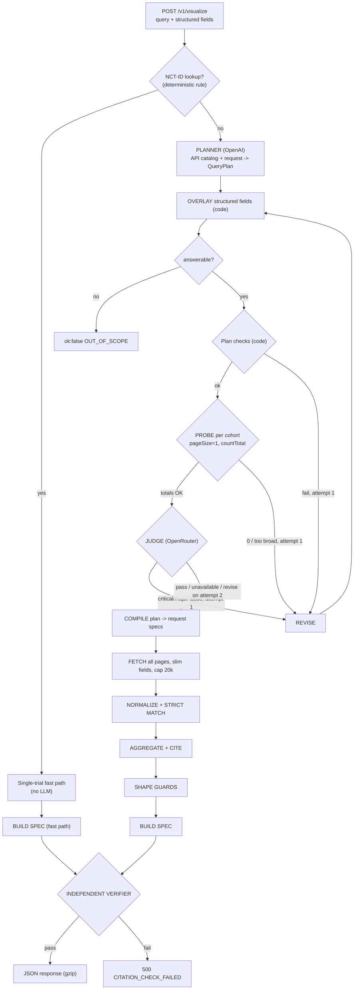

# ctviz design

This document explains how `ctviz` turns a natural-language ClinicalTrials.gov question into a cited
JSON visualization spec, and why it is built that way. The README covers running it and the
schemas; this covers the architecture and the decisions behind it.

Numbers quoted from the ClinicalTrials.gov API (record counts, timings, percentages) were measured
against the live API while designing the system and are *point-in-time*; the registry changes daily.

## 1. Principle

**The LLMs decide what to ask; code decides what is true.**

No count, category label or excerpt is ever written by an LLM. The only LLM-written strings in a
response are the chart title, the one-sentence interpretation and the assumptions, and a digit guard
checks all three (section 6). Everything a viewer can verify against the registry is produced by
deterministic code that computes each number and its evidence in the same loop.

## 2. Pipeline



Source layout (one responsibility per module): `agent/` (planner, overlay, plan checks, digit
guard, probe, judge, orchestrator, fast path), `ctgov/` (fields, compiler, client, normalize),
`analysis/` (dimensions, aggregate, numeric, network, prune, guards, entities), `citations/`
(match, pointer, predicates, witness, verify, verify CLI), `viz/builder.py`, `schemas/`,
`api/` (FastAPI app, error mapping, offline replay), `pipeline*.py` (glue).

### The hallucination boundary

| Stage | LLM? | Failure mode | Guard |
|---|---|---|---|
| Planner | yes (OpenAI) | wrong param, wrong dimension, invented filter, wrong chart | strict JSON schema of menus only, overlay, checks, probe, judge, one revise |
| Overlay | no | - | invariant: every provided structured field lands in the plan |
| Plan checks | no | - | pure, unit-tested functions |
| Probe | no | a valid plan that returns 0 or 200k trials | totals fed back to the planner and shown to the judge |
| Judge | yes (OpenRouter, different family) | rubber-stamp or false alarm | 7-check rubric with evidence; verdict recomputed in code; labeled eval set |
| Compile / fetch | no | timeouts, 5xx, huge sets | allowlists, retries, cap with disclosed truncation, cache |
| Full-text search | no, but fuzzy | records that only mention the term in passing | strict match with match evidence |
| Normalize | no | messy data | explicit documented rules |
| Aggregate + cite | no | bucketing bug | independent verifier recomputes every datum |
| Title / interpretation / assumptions | yes | an invented number | digit guard with template fallback |

The remaining LLM risk is *interpreting the question*. That is why the probe and judge exist, why
`meta.query_interpretation` and `meta.assumptions` are always returned, and why the eval set
measures plan accuracy directly.

## 3. Decisions

| # | Decision | Why | Rejected alternative |
|---|---|---|---|
| D1 | Typed planner + probe + judge + 1 revise; no agent framework (plain OpenAI SDK + Pydantic) | predictable, testable, bounded cost and latency; every step is a fakeable backend | free tool-calling loop: flexible but unbounded, and can emit bad parameters |
| D2 | The planner reads an API *capability catalog* (`catalog/catalog.yaml`) and picks from menus | keeps "reason about what each call provides" while making invalid calls unrepresentable | LLM writes URLs or Essie expressions |
| D3 | Judge from a different model family (`google/gemini-2.5-flash-lite` via OpenRouter, with a tier-2 fallback) | a model should not grade its own homework | same model as judge |
| D4 | Judge rejects: revise once with feedback, then ship the best attempt flagged `rejected_after_revision` | self-correcting at a bounded cost; never hides disagreement | hard fail / ignore |
| D5 | The chart type is chosen in the plan, before fetching; deterministic shape guards adjust for data edge cases | one LLM call; the judge sees everything at once | a second LLM call after fetching |
| D6 | Fetch every page with slim fields, capped at 20,000 records per cohort; over the cap take the most recent 20,000 by start date and disclose it | every plotted number is exact for its disclosed population | arbitrary server-ordered slice |
| D7 | Python 3.12, FastAPI, Pydantic v2, httpx, OpenAI SDK, pytest | best fit for aggregation; Pydantic gives the JSON Schema for free | TypeScript |
| D8 | Custom discriminated-union spec shaped like the assignment's example, borrowing Vega-Lite's `field` + `type` channel idea | Vega-Lite cannot express network graphs | raw Vega-Lite / ECharts options |
| D9 | Always return a visualization; single facts become `metric`/`table`; unanswerable questions return `ok:false` `OUT_OF_SCOPE` | the task says the answer is a visualization | free-text answers |
| D10 | Aggregate client-side | `/stats/field/values` cannot be filtered (HTTP 400) | server-side stats |
| D11 | Digit guard on LLM text | closes the last channel for invented numbers | trust the LLM, or ban all digits |
| D12 | Cite every contributing trial by default (`options.citations="full"`), gzip on | the spec says each reference carries an excerpt | top-k sample + bare ID list |
| D13 | Citation = primary `field`/`excerpt` plus `match`/`filter` evidence, addressed by JSON Pointer (RFC 6901) | 11.2% of `query.intr=pembrolizumab` hits do not list the drug in any intervention field | bucket evidence only |
| D14 | Structured request fields are applied by code (overlay); the LLM never re-emits them | removes a class of copy errors and revise loops | ask the LLM to copy fields |
| D15 | Condition/drug strings are sent to the API as given (no auto-quoting) and disclosed | matches the ClinicalTrials.gov website; quoting shifts counts by up to ~11% | always quote multi-word values |

Product-scope calls made while building:

- **Strict match for drugs and sponsors; conditions stay lenient.** Measured strict-match rates for
  conditions were 94.97% (glioblastoma), 87.91% (recruiting multiple sclerosis) and 99.22%
  (Phase 2 psoriasis), under the 97% bar, so `CONDITIONS_STRICT = False`.
- **Sponsor names can collide** (Merck & Co. vs Merck KGaA). The API result is kept and a warning
  with the lead-sponsor name census is attached, rather than guessing.
- **Combined phase buckets:** a trial listing two phases falls in its own bucket ("Phase 2/Phase 3"),
  so buckets sum to the plotted total.
- **The HTML viewer is out of the core scope** of the backend; see the README for its status.

## 4. The ClinicalTrials.gov API: what shaped the design

Base `https://clinicaltrials.gov/api/v2`. Facts that drive the code:

- **One data endpoint.** `GET /studies` serves every fetch and the probe. Stats endpoints cannot be
  filtered, so all aggregation is ours.
- **Pagination:** `pageSize` silently caps at 1000; `countTotal` is honored only on the first page;
  `pageToken` is an opaque sequential cursor. Only date and numeric fields are sortable, and
  `sort=StartDate:desc` is deterministic (used for truncation). Error bodies are `text/plain`.
- **`fields=` projects leaves, not modules.** The compiler requests the union of everything
  aggregation *and* citations need; array indices survive projection, so a pointer from a slim
  fetch resolves in the full record.
- **Search params.** `query.cond`, `query.intr`, `query.lead` (lead sponsor only), `query.spons`
  (lead or collaborator), `query.locn`, `query.titles`, `query.outc`, `query.term`; all AND
  together. `query.intr` also searches description text, which is where passing mentions come from.
- **Filters** go in `filter.advanced` as Essie `AREA[...]` clauses (phase, start-date range, sponsor
  class, study type, country) or typed params (`filter.overallStatus`, `filter.ids`). There is no
  site-level status filter; that is applied client-side.
- **Drug synonyms expand server-side; conditions do not**, and quoting changes counts (D15).
- **Messy data:** `phases` is an array (up to two values) and is missing on non-interventional
  studies (a different null from `["NA"]`); dates are often `YYYY-MM` and often untyped on legacy
  records; locations repeat per site; site status is often null and differs from trial status.

The capability catalog (`catalog.yaml`) is validated at startup and feeds three consumers from one
source of truth: the planner prompt (a static, cacheable prefix), the Pydantic enums of the
`QueryPlan`, and the judge's catalog summary. Adding a dimension is a YAML entry plus an extractor
function, with no prompt surgery.

## 5. Request

`VisualizeRequest` (`schemas/request.py`): only `query` (3-500 chars) is required. Structured
fields (`drug_name`, `condition`, `sponsor`, `sponsor_role`, `trial_phase`, `status`, `country`,
`start_year`, `end_year`, `study_type`, `nct_ids`, `options`) are forgiving: "Phase 2/3", "3",
"recruiting", "USA" are coerced to canonical enums. Unknown fields are rejected (HTTP 422 in the
error envelope, listing the valid values).

**Structured fields are applied by code (D14).** The planner is told which fields exist and not to
re-emit them. After parsing, `agent/overlay.py` writes each field into its plan slot; a structured
field replaces any LLM value in that slot and the replacement is recorded in `meta.assumptions`. The
judge receives the overrides and treats those slots as authoritative.

## 6. QueryPlan and the planner

The planner's only output is a `QueryPlan`: `answerable`, `interpretation`, `search_terms`
(`param` + `value` + `rationale`), `filters` (enums and years), optional `comparison` (2-4 values of
exactly one varied param), `analysis` (kind and its slots), `visualization` (type, title,
rationale) and `assumptions`. It is strict-structured-output compatible (every field present,
`X | None` for optional); domain validation happens in Python afterwards.

Analysis kinds and the charts each allows (enforced in code):

| `analysis.kind` | Allowed chart types |
|---|---|
| `count_by` | `bar_chart`; `grouped_bar_chart` (with a comparison or `series_by`); `table` |
| `time_trend` | `time_series`; `bar_chart` |
| `histogram` | `histogram` |
| `scatter` | `scatter_plot` |
| `network` | `network_graph` |
| `trial_lookup` | `metric`, `table` |
| `trial_list` | `table` |

**Deterministic plan checks** (pure functions): out-of-scope short-circuit; overlay invariant;
search-term sanity (length, no Essie control syntax such as `AREA[`); sane years; canonical
countries; the compatibility table above; comparison shape; top-N bounds; and the **digit guard**
(D11): digits in the title, interpretation or assumptions must trace to the question, the fields,
the filters or the entities, otherwise the text is replaced by a template and the change is logged
in `meta.adjustments`. The digit guard never triggers a revise.

**Model configuration.** Planner `gpt-5.4-mini` through the Responses API with strict structured
output and `reasoning_effort=low`; `temperature` is never passed to gpt-5.x models. Truncated
output is retried once; refusals map to `OUT_OF_SCOPE`; transport failures map to HTTP 503
`LLM_UNAVAILABLE`. Model IDs come from the environment.

**Single-trial fast path (no LLM).** When NCT IDs are present and the rest of the query is short and
contains no analysis words (by, per, compare, vs, network, distribution, trend, over time), the
system fetches those records and returns a `metric`/`table` of key facts, every cell cited.

## 7. Probe and judge

**Probe.** After plan checks pass, one `pageSize=1&countTotal=true` request per cohort returns the
real total. Zero results (single cohort) or a total above the fetch cap feeds back into a revise
with the numbers; a second zero returns `NO_MATCHING_TRIALS`. The totals are also shown to the
judge, so a drug placed on `query.cond` is flagged with evidence.

**Judge.** Input: the query, fields, field overrides, the plan with rationales, the probe totals and
a catalog summary. It never sees fetched records. Output: a verdict with all seven checks always
present (filter fidelity, no invented filters, dimension match, viz fit, time range, comparison
cohorts, ambiguity handled), each with a quoted piece of evidence, plus typed issues with
severities. Code, not the model, decides: issues pointing at slots filled from structured fields are
discarded, then **revise if and only if a critical or major issue remains**.

**Revise loop (single source of truth):**

```
attempt 1: plan1 = overlay(planner(req))
  answerable=false               -> OUT_OF_SCOPE
  checks fail                    -> revise with the errors
  probe 0 / too broad            -> revise with the totals
  judge critical/major issue     -> revise with the issues
  judge pass / unreachable       -> execute plan1 (passed | unavailable)
attempt 2: plan2 = overlay(planner(req, previous=plan1, feedback))
  checks fail                    -> plan1 passed checks and probe ? execute plan1 (executed_previous_plan)
                                                                   : PLAN_INVALID
  probe 0 (single cohort)        -> NO_MATCHING_TRIALS
  judge pass                     -> execute plan2 (passed_after_revision)
  judge revise                   -> execute plan2 (rejected_after_revision, issues attached)
  judge unreachable              -> execute plan2 (unavailable)
```

At most 2 planner and 2 judge calls. `meta.validation.judge.status` is one of `passed`,
`passed_after_revision`, `rejected_after_revision`, `executed_previous_plan`, `unavailable`,
`skipped`, and every step is in `meta.validation.trace`.

**Judge tiers and failure.** Tier 1 is `JUDGE_MODEL` on OpenRouter; tier 2 is
`JUDGE_FALLBACK_MODEL` (empty disables it). All judge time in one request shares a fixed budget. If
no tier answers, the judge **fails open** (`unavailable`): the deterministic checks and the probe
still protect correctness, and the response says so.

## 8. Execution engine (deterministic)

**Compiler** (`ctgov/compiler.py`): one `RequestSpec` per cohort. Search terms map to their
`query.*` param as given; enum filters become one `filter.advanced` expression (or typed params);
`fields=` is computed from the analysis and never from LLM text; over the cap, the request adds
`sort=StartDate:desc`. `ctgov/fields.py` declares, for each dimension, measure, network type and
search param, the leaf fields needed for aggregation, match evidence and bucket evidence.

**Fetcher** (`ctgov/client.py`): pooled `httpx` client, gzip, bounded retries with jittered backoff
and capped `Retry-After`, sequential pagination, a bounded LRU cache, and typed failures
(`UPSTREAM_API_ERROR`). Truncation is disclosed in `meta.data_coverage` and `meta.assumptions`.

**Normalizer** (`ctgov/normalize.py`): raw study to a frozen `Trial`. Notable rules:

| Field | Rule |
|---|---|
| Phase (`combined`) | sorted canonical label ("Phase 1/Phase 2", "Phase N/A", "Early Phase 1"); missing `phases` becomes "Non-interventional", cited via `studyType` |
| Dates | `YYYY`, `YYYY-MM`, `YYYY-MM-DD` with precision; type kept including *absent*; the current year's bucket is `partial_period`, later years `projected` |
| Countries | one count per trial per country; with a recruiting filter a country counts only if a site there is recruiting, falling back to trial status when all site statuses are null |
| Interventions | type counted once per trial; drug names normalized by a pure `normalize_drug` |
| Enrollment | count and type kept; histograms exclude `count=0` withdrawn trials (counted as analysis exclusions) |
| Duration | from ACTUAL or untyped dates (flagged); ESTIMATED excluded; sub-month gaps between two month-only dates excluded as artifacts |
| Missing values | never coerced: an explicit cited bucket, or an excluded trial with a per-trial reason. There are no uncited buckets |

**Entity resolution:** drug normalization strips prefixes, placebo/standard-of-care names,
parentheticals and trailing doses; the label is the most frequent raw spelling. Aliases come from
*co-reference inside a single intervention object* (accepted at 3 or more trials, never a separate
intervention in the same trial), which yields Keytruda for pembrolizumab without letting a frequent
partner drug become an alias. Sponsor searches report a name census and known-collision warnings.

**Aggregators** (`analysis/`): every extractor returns `(key, evidence)` pairs, and a trial is
appended to a datum's citation list in the same statement that increments its count; `trial_count`
is computed from the citations.

| Kind | Behavior |
|---|---|
| `count_by` | distinct trials per key; top-N plus an explicit "Other (N categories)" row that is also cited |
| cross-tab | tidy rows keyed by cohort or `series_by` |
| `time_trend` | year (or month) buckets with empty years filled with 0 |
| `histogram` | log-spaced edges when skewed, otherwise Freedman-Diaconis bins; bins chosen from the *plotted* values only |
| `scatter` | one point per trial with both measures present |
| `network` | nodes and edges as below |

**Networks.** `sponsor_drug` (directed), `drug_drug` (undirected, both drugs in the same arm) and
`condition_drug`. Node weight is the number of distinct trials containing the node; edge weight is
the number of distinct trials containing *both* endpoints (an intersection, in the same record).
Pruning is ordered and reported in `meta.network_summary`: drop placebo/placeholder nodes, minimum
edge weight 2, keep the top-N nodes by weighted degree, raise the minimum weight until at most 150
edges, drop isolated nodes. Only shown elements are cited. A known caveat: "same arm" can mean
"investigator's choice" between alternatives.

**Shape guards** (`analysis/guards.py`) replace a second LLM call and are recorded in
`meta.adjustments`: a time series with fewer than 3 buckets becomes a bar chart; a single-category
bar becomes a metric; a histogram with fewer than 5 values becomes a table; a network with fewer
than 2 edges after pruning relaxes its threshold or falls back to a bar chart of node degrees; an
empty cohort in a comparison is kept as zeros with a warning; nothing plottable returns
`NO_MATCHING_TRIALS`.

## 9. Deep citations

A bar is `GROUP BY key, COUNT(*)`, so its provenance is the *witness set*: the records that passed
every filter and have that key. Two rules follow: `count == |witness set|`, and nodes/buckets use
union while edges use intersection. Because citations come from the same loop and record as the
number, citation precision and recall are 1.0 by construction; a separate verifier proves it.

**Two kinds of evidence.** A citation must say why the trial is in the chart at all and why it is in
this bar. Since `query.intr` also matches description text, each citation carries one evidence item
per condition the trial had to satisfy:

| Role | Proves |
|---|---|
| `bucket` (the citation's top-level `field`/`excerpt`) | the trial belongs to this datum |
| `match` | the trial genuinely involves the searched entity |
| `filter` | the trial satisfies each enum filter (phase, status, country, year) |
| `context` | human-friendly prose (optional) |

**Strict match** (`citations/match.py`): case-insensitive normalized substring of the term or a
co-referenced alias in a priority list of fields per search param (`query.intr`: intervention name,
other names, arm intervention names, intervention MeSH; `query.lead`: lead sponsor name;
`query.spons`: lead sponsor then collaborators; `query.cond`: conditions, keywords, condition MeSH
and ancestors). Titles are deliberately not match evidence. Under `strict_match="auto"` drugs and
sponsors are strict and conditions lenient. A trial failing a strict match is excluded at the
`match` stage and listed in `meta.data_coverage.excluded_trials`; the API's raw `totalCount` is kept
next to `records_matched`. This is the one place counts intentionally differ from the
ClinicalTrials.gov website.

**The citation object.** `{nct_id, field, excerpt, evidence[]}`. `field` is an RFC 6901 JSON Pointer
into the study JSON; `excerpt` is the exact scalar value there (strings verbatim; numbers as JSON
text). Arrays are cited one element at a time ("Phase 2/Phase 3" is `phases/0` plus a bucket item
`phases/1`). Every datum also carries a machine-readable `predicate`; each cohort's inclusion rule is
stated once in `meta.cohorts[].base_predicate`. No per-citation URL: use
`meta.citation_policy.url_template`.

**Independent verifier** (`citations/verify*.py`, runs on every response, never imports
`analysis/`). It re-derives membership from the raw records using the predicates:

1. every pointer resolves and its excerpt equals the value there;
2. **soundness:** each cited record satisfies `cohort.base_predicate AND datum.predicate`, evaluated
   on the raw record (so a nivolumab trial in a pembrolizumab bar fails);
3. **relevance:** bucket pointers lie under a path the predicate references;
4. **completeness:** recompute each datum's witness set from the cohort's plotted population and
   require set equality with the cited IDs;
5. **structure:** for exclusive dimensions the counts sum to `records_plotted` per cohort; edge
   endpoints are nodes; no non-zero datum lacks citations;
6. **fail closed:** any violation is HTTP 500 `CITATION_CHECK_FAILED`; 
7. the result is reported in `meta.citation_check`.

Predicate operations: `equals`, `in`, `set_equals`, `contains`, `exists`, `year_equals`,
`year_in_range`, `in_range`, `any_element`, `normalizes_to`, `text_matches`, and `all`/`any`/`not`.

**Payload.** Default `options.citations="full"` cites every contributing trial up to the cap; gzip
is always on above 1 KB. `sample` and `none` are opt-in.

**Reproducibility.** `meta.provenance` records the API version, the data timestamp, every request URL
with fetch time and record count, the code version (git SHA) and model IDs. Each shipped example
includes its raw records, so `python -m ctviz.citations.verify examples/NN.response.json` re-runs the
full verifier with no server and no network.

## 10. Response

`{schema_version, ok, visualization, meta, error}`. A frontend has one parse path: check `ok`. HTTP
status is reserved for transport-level problems.

| Situation | HTTP | `ok` | `error.code` |
|---|---|---|---|
| Success | 200 | true | |
| Out of scope | 200 | false | `OUT_OF_SCOPE` (with `details.suggested_reframing`) |
| No matching trials | 200 | false | `NO_MATCHING_TRIALS` |
| Plan invalid after revise | 200 | false | `PLAN_INVALID` |
| Invalid request body | 422 | false | `INVALID_REQUEST` |
| ClinicalTrials.gov unreachable / 5xx | 502 | false | `UPSTREAM_API_ERROR` |
| No LLM reachable for the planner | 503 | false | `LLM_UNAVAILABLE` |
| Citation verifier failed | 500 | false | `CITATION_CHECK_FAILED` |
| Anything else | 500 | false | `INTERNAL_ERROR` (no stack traces) |

`visualization` is a discriminated union on `type` with eight members: `bar_chart`,
`grouped_bar_chart`, `time_series`, `histogram`, `scatter_plot`, `network_graph`, `table`, `metric`.
Every member has `type`, `title`, `encoding`, `data`, `options`. `encoding` maps channels to
`{field, type, title?, unit?, format?, time_unit?, sort?, bin?}` (Vega-Lite-style), where `field` is
the exact key in each data row. **Data is always pre-aggregated and its order is the render order;
a frontend never re-aggregates.** When compared cohorts differ in size by more than 2x, `y`
defaults to `share` with the raw `trial_count` kept in every row.

`meta` explains the answer: `query_interpretation`, the executed `plan`, `filters`, `grouping`,
`sort`, `units`, `assumptions`, `warnings`, `adjustments`, `entity_resolution`, `data_coverage`
(fetched / matched / plotted / excluded with per-trial reasons, truncation), `cohorts`, `overlap`,
`network_summary`, `citation_policy`, `citation_check`, `validation` (attempts, probe, judge, trace),
`provenance` and `timing_ms`.

`GET /v1/schema` returns the JSON Schema of the request and response (Pydantic v2, the union as
`oneOf` + `discriminator`); a contract test fails if any shipped example stops validating.

## 11. Defense in depth

1. Request validation and coercion (422 with valid values).
2. Strict structured-output schema for the planner (menus only).
3. Overlay of structured fields by code.
4. Deterministic plan checks.
5. Digit guard on LLM-authored text.
6. Count probe before any real fetch.
7. Cross-family judge with a code-computed verdict.
8. Allowlisted compiler; `fields=` and Essie syntax never come from LLM text.
9. Bounded, retried, cached fetch with disclosed truncation.
10. Strict match against passing mentions.
11. Explicit rules for missing and partial data; no uncited buckets.
12. Shape guards.
13. Independent citation verifier, failing closed.
14. Offline re-verification of shipped examples from their raw records.

## 12. Limits and non-goals

See the README's limitations section. In short: client-side aggregation over at most 20,000 records
per cohort (most recent by start date, disclosed), strict matching that intentionally differs from
the website, rule-based drug normalization, registry facts only (no efficacy, safety or pricing),
a single-shot planner with one revision rather than an open-ended agent, and citations that pin a
snapshot in time (`data_timestamp`).
