# Plan Overview — ClinicalTrials.gov Query-to-Visualization Agent

> **The short version: 15 pages, about 15 minutes.** Each page covers one idea: a diagram plus the few points that matter. The full plan (`PLAN.pdf`) has every number, schema and rule behind these pages. **Date:** 2026-09-28 · **Time box:** ~24h · **Stack:** Python 3.12 · FastAPI · Pydantic v2 · OpenAI + OpenRouter
>
> Colors used throughout: LLM deterministic code ClinicalTrials.gov API input / output error outcome

## Table of Contents

<ol class="toc-plain"><li><a href="#v0--one-page-summary">V0 · One-page summary</a></li><li><a href="#v1--the-system-in-one-picture">V1 · The system in one picture</a></li><li><a href="#v2--one-request-end-to-end">V2 · One request, end to end</a></li><li><a href="#v3--the-revise-loop-every-planning-outcome">V3 · The revise loop (every planning outcome)</a></li><li><a href="#v4--what-the-planner-is-allowed-to-say-queryplan">V4 · What the planner is allowed to say (QueryPlan)</a></li><li><a href="#v5--from-question-shape-to-chart">V5 · From question shape to chart</a></li><li><a href="#v6--the-eight-chart-types">V6 · The eight chart types</a></li><li><a href="#v7--where-every-trial-goes-the-data-funnel">V7 · Where every trial goes (the data funnel)</a></li></ol>

<ol class="toc-plain"><li><a href="#v8--anatomy-of-a-deep-citation">V8 · Anatomy of a deep citation</a></li><li><a href="#v9--the-verifier-trust-but-recount">V9 · The verifier: trust, but recount</a></li><li><a href="#v10--what-the-response-looks-like">V10 · What the response looks like</a></li><li><a href="#v11--how-the-code-is-organized">V11 · How the code is organized</a></li><li><a href="#v12--the-24-hour-build-plan">V12 · The 24-hour build plan</a></li><li><a href="#v13--what-questions-it-answers">V13 · What questions it answers</a></li><li><a href="#v14--four-decisions-for-you">V14 · Four decisions for you</a></li></ol>

> **The one rule behind every design choice:** *LLMs decide **what to ask**; code decides **what is true**.*

## V0 · One-page summary

| | |
|---|---|
| **What** | A FastAPI backend that turns a natural-language clinical-trial question (plus optional fields) into a JSON **visualization spec** backed by ClinicalTrials.gov, with a **citation for every trial behind every datum**. |
| **How** | OpenAI **plans**, choosing from menus only. Code **checks** the plan and **probes** real counts. OpenRouter **judges** the plan. Then code **fetches, counts, cites and verifies**. |
| **Why it's trustworthy** | No number, category label or excerpt is written by an LLM. An independent verifier recounts every datum and refuses to answer if anything is off. |
| **Coverage** | 8 chart types (bar, grouped bar, time series, histogram, scatter, network, table, metric) and 19 query types (18 core + 1 stretch), covering every class in the assignment's appendix. API totals were measured live for 17 of them. |
| **Schedule** | About 24 h. A working end-to-end slice by hour 6.5, deep citations by hour 13.5, and 2.5 h reserved. The deliverables phase is protected. |
| **What I need from you** | Four quick decisions (page V14). |

**The one rule behind every design choice:** *LLMs decide **what to ask**; code decides **what is true**.*

## V1 · The system in one picture

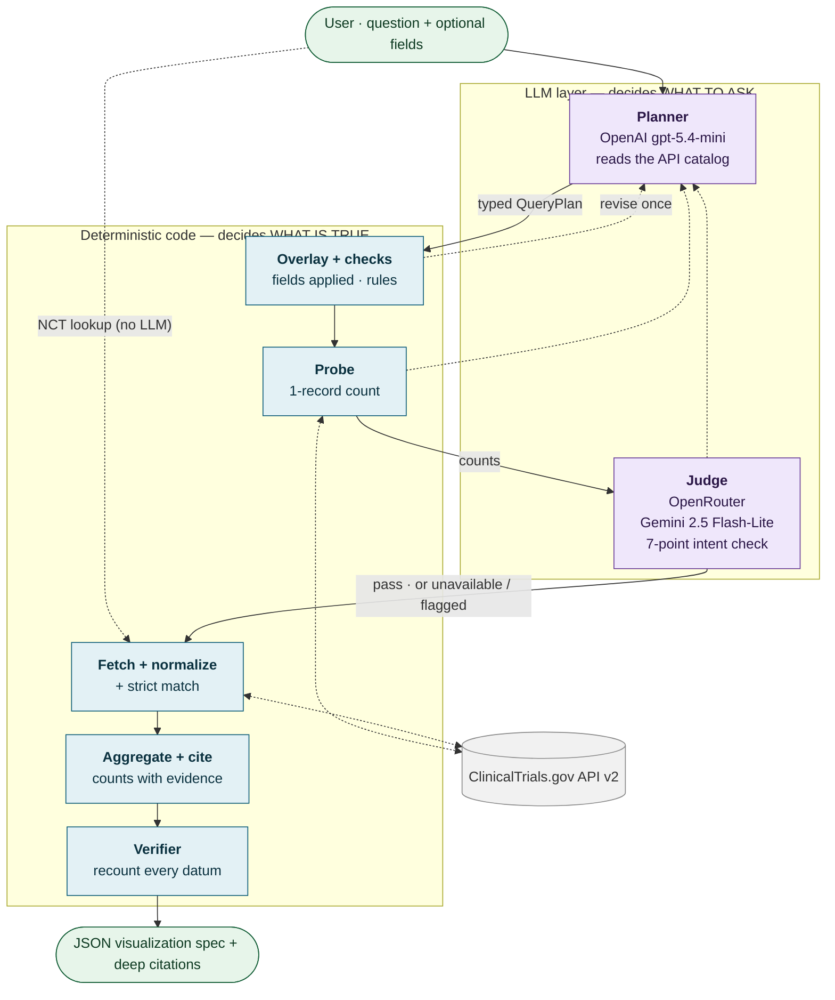

- **The LLMs only produce a typed plan:** menu choices plus entity names such as "pembrolizumab". They never write URLs, numbers or excerpts.
- **The plan is tested three ways before any real data is fetched:** code checks, a live count probe, and a judge from a *different* model family.
- **Any of the three checks can send the plan back, but only once** (dotted arrows), so latency is bounded: typically 3–9 s.
- **Everything after the judge is plain, testable Python.**

## V2 · One request, end to end

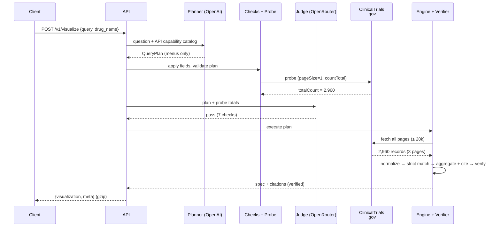

- The example is the assignment's own request: *"How has the number of trials for this drug changed over time?"* with `drug_name = Pembrolizumab`.
- **Typical timings:** planner 1–3 s · probe < 0.5 s · judge 0.5–1.5 s · fetch ~3–4 s for 2,960 records · verify < 0.5 s.
- **LLM cost is about $0.01 per request.**

## V3 · The revise loop (every planning outcome)

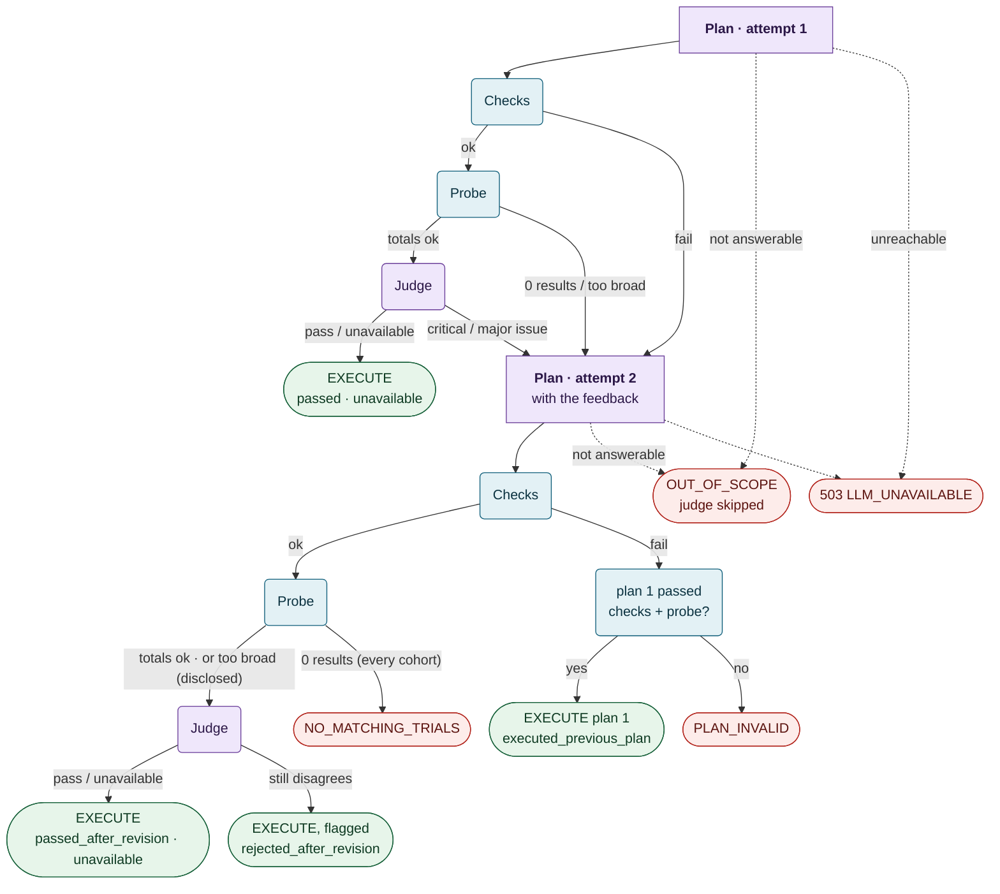

- **At most 2 planner calls + 2 judge calls.** The loop can't spin.
- **Every ending is named.** Executed answers carry `meta.validation.judge.status` (passed · passed_after_revision · rejected_after_revision · executed_previous_plan · unavailable). The rest return `ok:false` with an `error.code` (OUT_OF_SCOPE · PLAN_INVALID · NO_MATCHING_TRIALS · LLM_UNAVAILABLE).
- **The judge can't block forever:** if it still disagrees after the revision, the answer ships *flagged*, with its objections attached.
- **If the judge is unreachable, the plan still runs (fail open), flagged `unavailable`.** Correctness is protected by the code checks, not by the judge.
- **Simple NCT-ID lookups bypass this loop entirely** (`judge.status = skipped`).

## V4 · What the planner is allowed to say (QueryPlan)

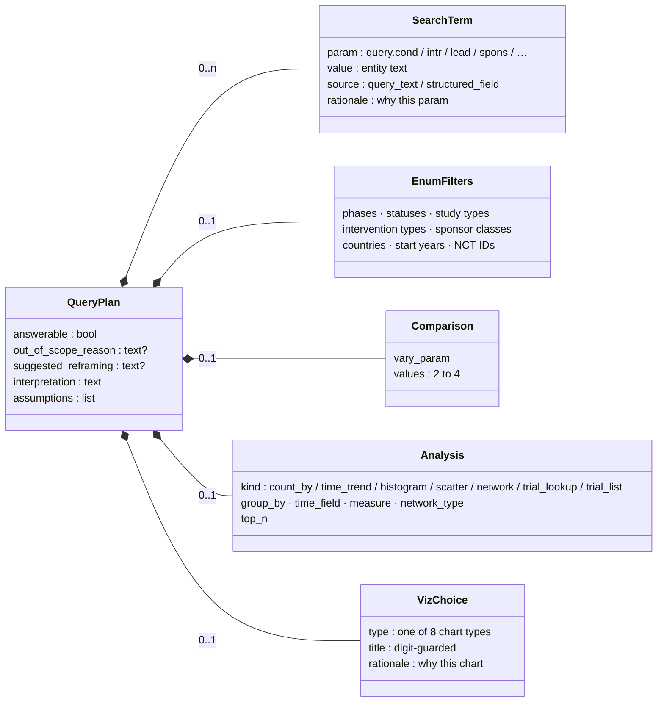

- **Every search, filter, analysis and chart field is a menu choice or an entity name.** OpenAI's strict JSON-schema mode enforces this, then the §7.4 code checks. The only free text (title, interpretation, assumptions, rationales) is digit-guarded or shown for transparency, and is never used to query.
- **The `rationale` fields are the planner's reasoning** over the API catalog ("what does each call provide?"). The judge reads them.
- **Structured request fields (e.g. `drug_name`) are written in by code** afterwards, never copied by the LLM.

## V5 · From question shape to chart

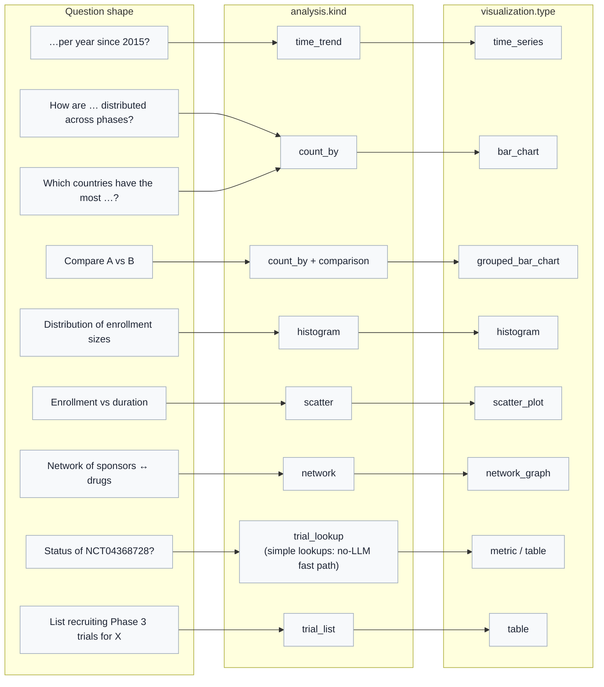

- **The planner picks both the kind and the chart; code enforces that they're compatible.** For example, a `time_trend` can't become a network.
- **After the data arrives, deterministic *shape guards* adjust degenerate cases:**
  - 1 bucket → metric
  - < 3 years → bar chart
  - too many nodes → pruning
- **Simple NCT-ID lookups** (the IDs plus ≤ 6 words, with no 'by / vs / trend…') take a no-LLM fast path. Other NCT questions go to the planner with the IDs pre-filled.

## V6 · The eight chart types

<svg viewBox="0 0 120 64"><line x1="6" y1="58" x2="114" y2="58" stroke="#9aa7b8"/><rect x="12" y="20" width="14" height="38" fill="#0f5e7a"/><rect x="32" y="8" width="14" height="50" fill="#0f5e7a"/><rect x="52" y="30" width="14" height="28" fill="#0f5e7a"/><rect x="72" y="40" width="14" height="18" fill="#0f5e7a"/><rect x="92" y="48" width="14" height="10" fill="#0f5e7a"/></svg>
bar_chart

x: category · y: trial_count

Breast cancer trials by phase

<svg viewBox="0 0 120 64"><line x1="6" y1="58" x2="114" y2="58" stroke="#9aa7b8"/><rect x="12" y="18" width="10" height="40" fill="#0f5e7a"/><rect x="23" y="28" width="10" height="30" fill="#c77d1a"/><rect x="44" y="10" width="10" height="48" fill="#0f5e7a"/><rect x="55" y="22" width="10" height="36" fill="#c77d1a"/><rect x="76" y="38" width="10" height="20" fill="#0f5e7a"/><rect x="87" y="44" width="10" height="14" fill="#c77d1a"/></svg>
grouped_bar_chart

x · y · color = cohort

Phases: pembrolizumab vs nivolumab

<svg viewBox="0 0 120 64"><line x1="6" y1="58" x2="114" y2="58" stroke="#9aa7b8"/><polyline points="10,50 25,40 40,30 55,32 70,24 85,20 100,16" fill="none" stroke="#0f5e7a" stroke-width="2.5"/><polyline points="100,16 112,36" fill="none" stroke="#0f5e7a" stroke-width="2.5" stroke-dasharray="4 3"/></svg>
time_series

x: year · y: trial_count · partial year dashed

Pembrolizumab trials per year

<svg viewBox="0 0 120 64"><line x1="6" y1="58" x2="114" y2="58" stroke="#9aa7b8"/><rect x="10" y="30" width="14" height="28" fill="#0f5e7a"/><rect x="24" y="12" width="14" height="46" fill="#0f5e7a"/><rect x="38" y="8" width="14" height="50" fill="#0f5e7a"/><rect x="52" y="20" width="14" height="38" fill="#0f5e7a"/><rect x="66" y="36" width="14" height="22" fill="#0f5e7a"/><rect x="80" y="50" width="14" height="8" fill="#0f5e7a"/><rect x="94" y="55" width="14" height="3" fill="#0f5e7a"/></svg>
histogram

bins: bin_start / bin_end · y: trial_count

Enrollment sizes, Phase 2 psoriasis

<svg viewBox="0 0 120 64"><line x1="6" y1="58" x2="114" y2="58" stroke="#9aa7b8"/><line x1="8" y1="4" x2="8" y2="58" stroke="#9aa7b8"/><circle cx="20" cy="46" r="3" fill="#0f5e7a"/><circle cx="32" cy="40" r="3" fill="#0f5e7a"/><circle cx="41" cy="44" r="3" fill="#0f5e7a"/><circle cx="52" cy="30" r="3" fill="#0f5e7a"/><circle cx="60" cy="36" r="3" fill="#0f5e7a"/><circle cx="72" cy="22" r="3" fill="#0f5e7a"/><circle cx="84" cy="28" r="3" fill="#0f5e7a"/><circle cx="98" cy="12" r="3" fill="#0f5e7a"/></svg>
scatter_plot

one point = one trial · x · y

Enrollment vs duration, Crohn's P3

<svg viewBox="0 0 120 64"><g stroke="#9aa7b8" stroke-width="1.5"><line x1="22" y1="16" x2="60" y2="32"/><line x1="22" y1="48" x2="60" y2="32"/><line x1="60" y1="32" x2="98" y2="14"/><line x1="60" y1="32" x2="98" y2="50"/><line x1="98" y1="14" x2="98" y2="50"/></g><circle cx="22" cy="16" r="7" fill="#c77d1a"/><circle cx="22" cy="48" r="5" fill="#c77d1a"/><circle cx="60" cy="32" r="9" fill="#0f5e7a"/><circle cx="98" cy="14" r="6" fill="#0f5e7a"/><circle cx="98" cy="50" r="5" fill="#0f5e7a"/></svg>
network_graph

nodes · edges · weight = shared trials

Sponsors ↔ drugs, glioblastoma

<svg viewBox="0 0 120 64"><rect x="8" y="6" width="104" height="52" fill="none" stroke="#9aa7b8"/><rect x="8" y="6" width="104" height="12" fill="#eef2f6"/><line x1="8" y1="31" x2="112" y2="31" stroke="#d9dee7"/><line x1="8" y1="44" x2="112" y2="44" stroke="#d9dee7"/><line x1="44" y1="6" x2="44" y2="58" stroke="#d9dee7"/><line x1="80" y1="6" x2="80" y2="58" stroke="#d9dee7"/></svg>
table

columns[] · one row per item

Recruiting Phase 3 trials for X

<svg viewBox="0 0 120 64"><text x="60" y="37" text-anchor="middle" font-size="16" font-weight="700" fill="#0f5e7a" font-family="Helvetica, Arial">COMPLETED</text><text x="60" y="54" text-anchor="middle" font-size="9" fill="#5b6475" font-family="Helvetica, Arial">NCT04368728 · status</text></svg>
metric

label · value · unit (data is always an array)

Status of NCT04368728?

- **Every type has the same five keys:** `type`, `title`, `encoding`, `data`, `options`.
- **`encoding` names exactly which data field drives which visual channel,** so a frontend never guesses.
- **Data is already aggregated.** The frontend only draws; it never recounts.

## V7 · Where every trial goes (the data funnel)

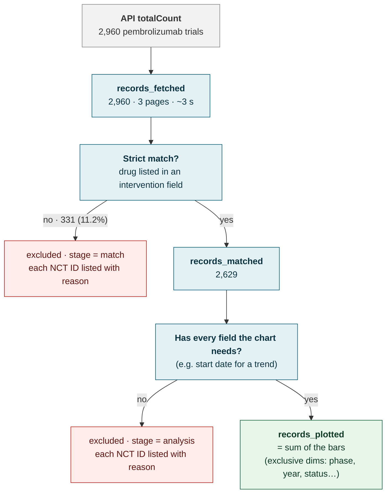

- **The API's text search is fuzzy:** it also matches trials that only *mention* the drug in a description. 331 of 2,960 pembrolizumab hits don't actually list it [VERIFIED].
- **Nothing disappears silently.** Every excluded trial is listed with its stage and reason in `meta.data_coverage`.
- **Over 20,000 matches?** The probe asks the planner to narrow the question first. Otherwise the most recent 20,000 are analyzed, and the response says so.

## V8 · Anatomy of a deep citation

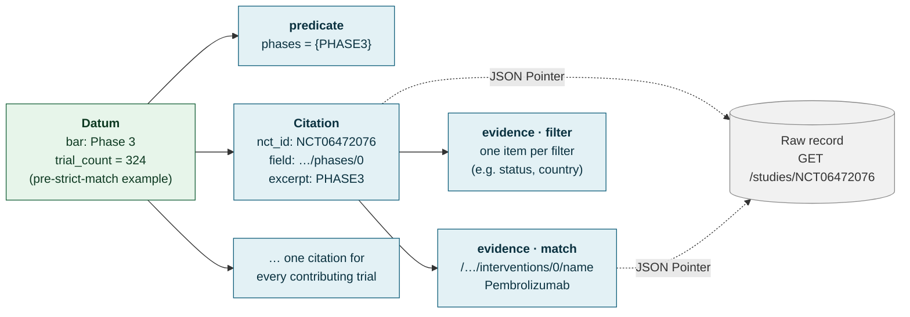

- Each citation answers two questions: **why is this trial in this bar** (`field`/`excerpt`), and **why is it in the chart at all** (`match` evidence).
- **Excerpts are exact values straight from the API**, one array element at a time, never paraphrased.
- **`trial_count` equals the number of citations**, so the bar height *is* its citation list.
- **Anyone can check a citation** with any JSON Pointer library, or with `python -m ctviz.verify`.

## V9 · The verifier: trust, but recount

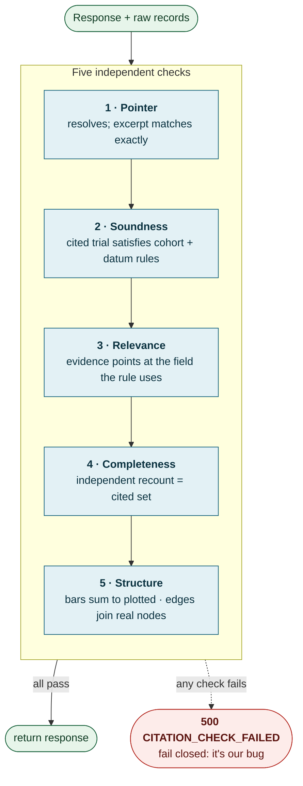

- **The verifier never imports the counting code.** It re-derives every bar from the raw records using each datum's predicate, so a bucketing bug can't hide.
- **It catches the failure the first prototype missed:** a Phase 1 trial filed under the Phase 3 bar.
- **Nine deliberate-corruption tests prove it fails when it should.**

## V10 · What the response looks like

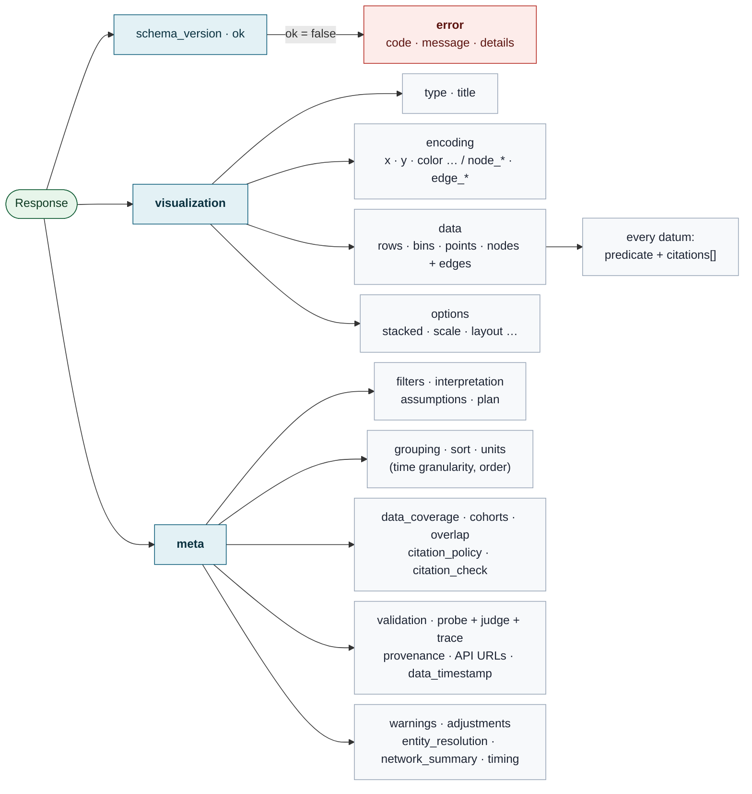

- **One parse path for any frontend:** check `ok`, then render `visualization` using `encoding`.
- **`meta` explains the answer:** what was asked, which trials were counted or dropped and why, what the judge said, and which exact API calls produced the data.

## V11 · How the code is organized

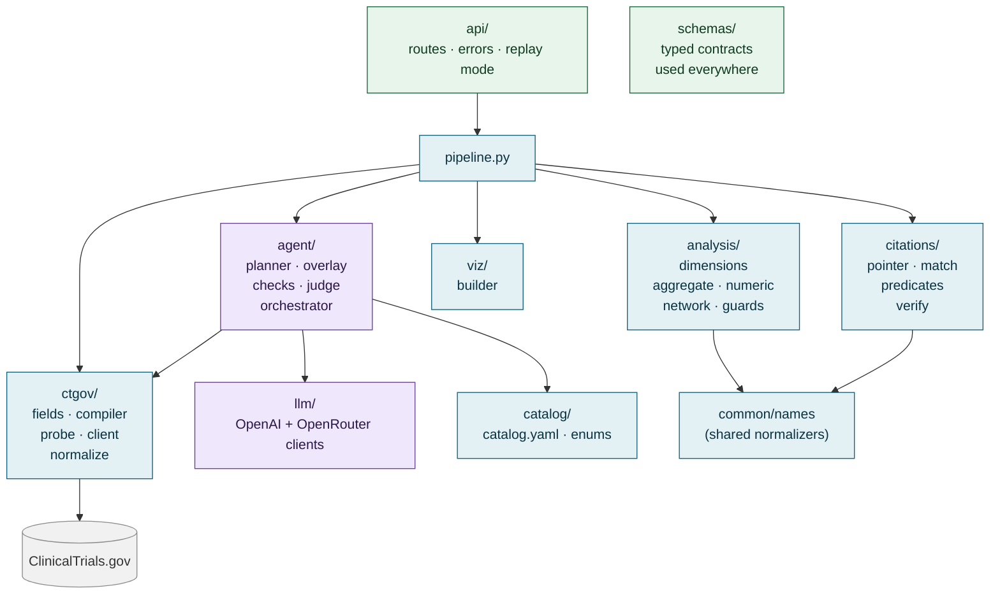

- **Small typed modules** (~200–400 lines each), with one-way dependencies.
- **`citations/` never imports `analysis/`.** That independence is what makes the verifier meaningful.
- **LLM code is isolated in `agent/` + `llm/`.** Everything else is testable offline with recorded API fixtures.

## V12 · The 24-hour build plan

```mermaid
gantt
    dateFormat HH:mm
    axisFormat %H:%M
    todayMarker off
    section Foundation
    P0 Setup + smoke tests   :p0, 00:00, 30m
    P1 Contracts             :p1, after p0, 2h
    P2 Data layer + probe    :p2, after p1, 150m
    section Slice
    P2.5 End-to-end slice    :crit, p25, after p2, 90m
    section Core
    P3 Analysis + evidence   :p3, after p25, 4h
    P4 Citations + verifier  :p4, after p3, 3h
    P5 Agent + judge         :p5, after p4, 3h
    P6 API + replay mode     :p6, after p5, 1h
    section Ship
    P7 Evals                 :p7, after p6, 90m
    P8 Deliverables          :crit, p8, after p7, 150m
    Reserve                  :done, rs, after p8, 150m
```

- **A real end-to-end answer exists by hour 6.5**, so problems surface early.
- **The 2.5 h reserve covers a short review after each phase, plus slack.**
- **If behind at hour 16, cut in this order:** stretch items → judge eval size → condition↔drug network → scatter → table lists. **P8 (deliverables) is never cut.**
- **Stretch, only after P8:** site and investigator networks, then the demo UI (only if ≥ 2 h remain).

## V13 · What questions it answers

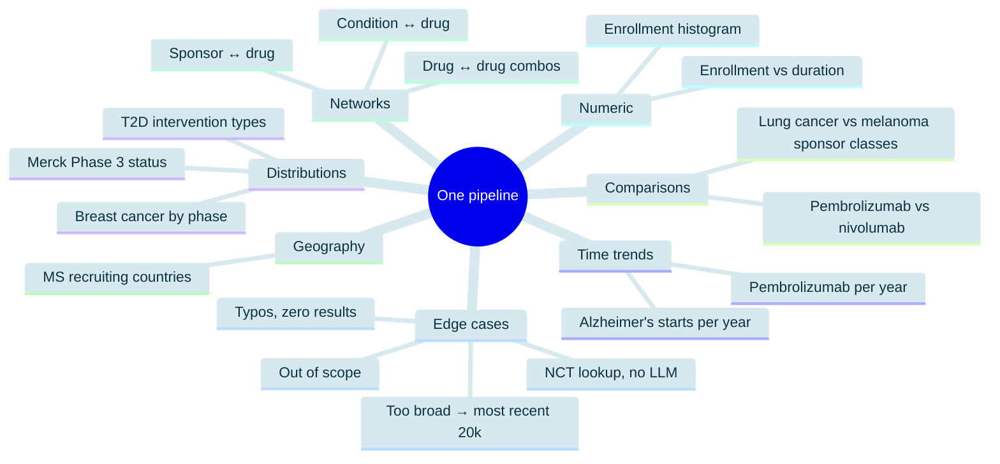

- **18 core query types (+1 stretch: the site network) run through the same pipeline**, with no per-question code. API totals for 17 were measured live (full plan §14); the Pfizer condition↔drug total is still an [ASSUMPTION].
- **Every class in the assignment's appendix is covered,** including the unscoped *"Which drugs frequently co-occur in combination studies?"*.

## V14 · Four decisions for you

| # | Question | My recommendation |
|---|---|---|
| **Q1** | Exclude trials the API matched only by *mentioning* the drug or sponsor in passing (11% for pembrolizumab)? | **Yes for drugs and sponsors.** Conditions stay lenient until P2 measures their match rate (switch to strict if ≥ 97%). Every excluded trial is listed. |
| **Q2** | "Merck" matches two unrelated companies (MSD and Merck KGaA). Warn, or auto-split? | **Warn and show the matched names**, without guessing. |
| **Q3** | Build a small HTML demo viewer? | **Only if ≥ 2 h remain** after the deliverables are done. |
| **Q4** | Should a "Phase 2/Phase 3" trial be its own bar (sums to the total, like ClinicalTrials.gov) or count in both? | **Its own bar.** (Counting in both stays available as stretch S5.) |

Answers are needed before P2 / P4, so P0–P1 can start right away. Reply with your answers, or "go with your recommendations".
