# Implementation Plan — ClinicalTrials.gov Query-to-Visualization Agent

> **Status:** Draft v2 for your review; revised after a 3-reviewer adversarial pass (Appendix C) · **Date:** 2026-09-28 · **Time box:** ~24h · **Stack:** Python 3.12 · FastAPI · Pydantic v2 · httpx · OpenAI SDK
>
> Every number marked **[VERIFIED]** was measured against the live ClinicalTrials.gov API on 2026-09-28 (API `v2.0.5`, `dataTimestamp 2026-09-28T12:00:05`). **[DECISION]** marks a choice we made on purpose, **[ASSUMPTION]** marks something to confirm while building, and **[ESTIMATE]** marks a number that wasn't measured.

---

## Table of Contents

<div class="toc"><div class="toc-col"><div class="toc-head">Part I — Visual overview <span>(read first · ~15 min)</span></div><ol class="toc-plain"><li><a href="#v0--one-page-summary">V0 · One-page summary</a></li><li><a href="#v1--the-system-in-one-picture">V1 · The system in one picture</a></li><li><a href="#v2--one-request-end-to-end">V2 · One request, end to end</a></li><li><a href="#v3--the-revise-loop-every-planning-outcome">V3 · The revise loop (every planning outcome)</a></li><li><a href="#v4--what-the-planner-is-allowed-to-say-queryplan">V4 · What the planner is allowed to say (QueryPlan)</a></li><li><a href="#v5--from-question-shape-to-chart">V5 · From question shape to chart</a></li><li><a href="#v6--the-eight-chart-types">V6 · The eight chart types</a></li><li><a href="#v7--where-every-trial-goes-the-data-funnel">V7 · Where every trial goes (the data funnel)</a></li><li><a href="#v8--anatomy-of-a-deep-citation">V8 · Anatomy of a deep citation</a></li><li><a href="#v9--the-verifier-trust-but-recount">V9 · The verifier: trust, but recount</a></li><li><a href="#v10--what-the-response-looks-like">V10 · What the response looks like</a></li><li><a href="#v11--how-the-code-is-organized">V11 · How the code is organized</a></li><li><a href="#v12--the-24-hour-build-plan">V12 · The 24-hour build plan</a></li><li><a href="#v13--what-questions-it-answers">V13 · What questions it answers</a></li><li><a href="#v14--four-decisions-for-you">V14 · Four decisions for you</a></li></ol></div><div class="toc-col"><div class="toc-head">Part II — Full plan <span>(reference)</span></div><ol class="toc-plain"><li><a href="#0-how-to-read-this-doc">0. How to read this doc</a></li><li><a href="#1-tldr">1. TL;DR</a></li><li><a href="#2-the-assignment-decoded">2. The assignment, decoded</a></li><li><a href="#3-decisions-log">3. Decisions log</a></li><li><a href="#4-architecture">4. Architecture</a></li><li><a href="#5-the-clinicaltrialsgov-api--what-we-verified">5. The ClinicalTrials.gov API — what we verified</a></li><li><a href="#6-request-schema-input">6. Request schema (input)</a></li><li><a href="#7-queryplan--the-planners-output-contract">7. QueryPlan — the planner's output contract</a></li><li><a href="#8-planner-openai">8. Planner (OpenAI)</a></li><li><a href="#9-probe--judge-openrouter">9. Probe + Judge (OpenRouter)</a></li><li><a href="#10-execution-engine-deterministic">10. Execution engine (deterministic)</a></li><li><a href="#11-deep-citations-bonus">11. Deep citations (bonus)</a></li><li><a href="#12-response-schema-output">12. Response schema (output)</a></li><li><a href="#13-validation-layers--defense-in-depth">13. Validation layers — defense in depth</a></li><li><a href="#14-query-coverage-matrix">14. Query coverage matrix</a></li><li><a href="#15-project-structure">15. Project structure</a></li><li><a href="#16-testing--evaluation">16. Testing & evaluation</a></li><li><a href="#17-implementation-phases">17. Implementation phases</a></li><li><a href="#18-risks--mitigations">18. Risks & mitigations</a></li><li><a href="#19-security--configuration">19. Security & configuration</a></li><li><a href="#20-deliverables">20. Deliverables</a></li><li><a href="#21-known-limitations-readme-ready">21. Known limitations (README-ready)</a></li><li><a href="#22-open-questions-for-you--implementation-time-defaults">22. Open questions for you + implementation-time defaults</a></li><li><a href="#appendix-a--verified-measurements">Appendix A — Verified measurements</a></li><li><a href="#appendix-b--glossary">Appendix B — Glossary</a></li><li><a href="#appendix-c--adversarial-review-log">Appendix C — Adversarial review log</a></li></ol></div></div>

---

# Part I — Visual overview

> **Read this part first (~15 minutes).** Each page covers one idea: a diagram plus the few points that matter. Part II is the full reference, with every number, schema and rule. Colors used throughout: <span class="swatch llm">LLM</span> <span class="swatch code">deterministic code</span> <span class="swatch ext">ClinicalTrials.gov API</span> <span class="swatch io">input / output</span> <span class="swatch err">error outcome</span>

## V0 · One-page summary

| | |
|---|---|
| **What** | A FastAPI backend that turns a natural-language clinical-trial question (plus optional fields) into a JSON **visualization spec** backed by ClinicalTrials.gov, with a **citation for every trial behind every datum**. |
| **How** | OpenAI **plans**, choosing from menus only. Code **checks** the plan and **probes** real counts. OpenRouter **judges** the plan. Then code **fetches, counts, cites and verifies**. |
| **Why it's trustworthy** | No number, category label or excerpt is written by an LLM. An independent verifier recounts every datum and refuses to answer if anything is off. |
| **Coverage** | 8 chart types (bar, grouped bar, time series, histogram, scatter, network, table, metric) and 19 query types (18 core + 1 stretch), covering every class in the assignment's appendix. API totals were measured live for 17 of them. |
| **Schedule** | About 24 h. A working end-to-end slice by hour 6.5, deep citations by hour 13.5, and 2.5 h reserved. The deliverables phase is protected. |
| **What I need from you** | Four quick decisions (page V14). |

**The one rule behind every design choice:** *LLMs decide **what to ask**; code decides **what is true**.*

## V1 · The system in one picture

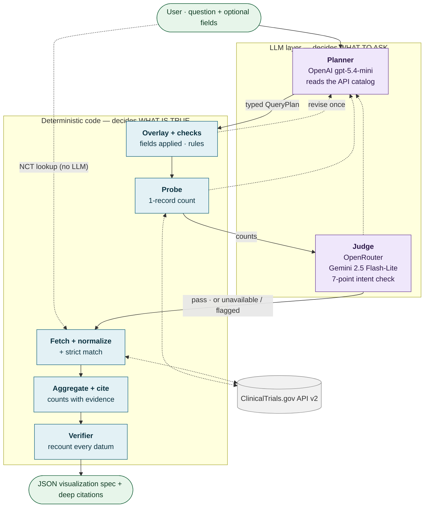

- **The LLMs only produce a typed plan:** menu choices plus entity names such as "pembrolizumab". They never write URLs, numbers or excerpts.
- **The plan is tested three ways before any real data is fetched:** code checks, a live count probe, and a judge from a *different* model family.
- **Any of the three checks can send the plan back, but only once** (dotted arrows), so latency is bounded: typically 3–9 s.
- **Everything after the judge is plain, testable Python.**

## V2 · One request, end to end

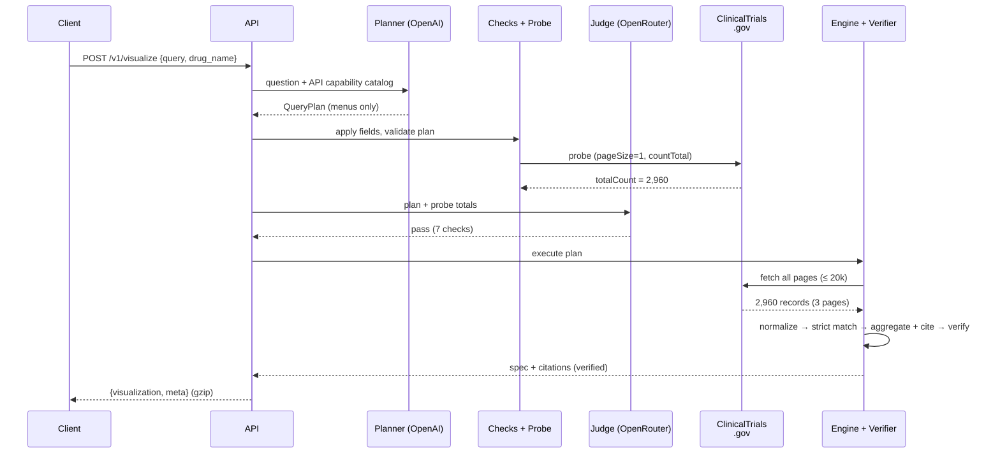

- The example is the assignment's own request: *"How has the number of trials for this drug changed over time?"* with `drug_name = Pembrolizumab`.
- **Typical timings:** planner 1–3 s · probe < 0.5 s · judge 0.5–1.5 s · fetch ~3–4 s for 2,960 records · verify < 0.5 s.
- **LLM cost is about $0.01 per request.**

## V3 · The revise loop (every planning outcome)

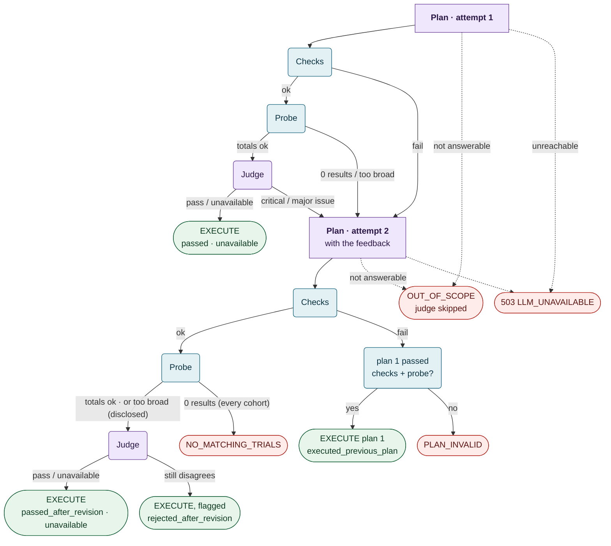

- **At most 2 planner calls + 2 judge calls.** The loop can't spin.
- **Every ending is named.** Executed answers carry `meta.validation.judge.status` (passed · passed_after_revision · rejected_after_revision · executed_previous_plan · unavailable). The rest return `ok:false` with an `error.code` (OUT_OF_SCOPE · PLAN_INVALID · NO_MATCHING_TRIALS · LLM_UNAVAILABLE).
- **The judge can't block forever:** if it still disagrees after the revision, the answer ships *flagged*, with its objections attached.
- **If the judge is unreachable, the plan still runs (fail open), flagged `unavailable`.** Correctness is protected by the code checks, not by the judge.
- **Simple NCT-ID lookups bypass this loop entirely** (`judge.status = skipped`).

## V4 · What the planner is allowed to say (QueryPlan)

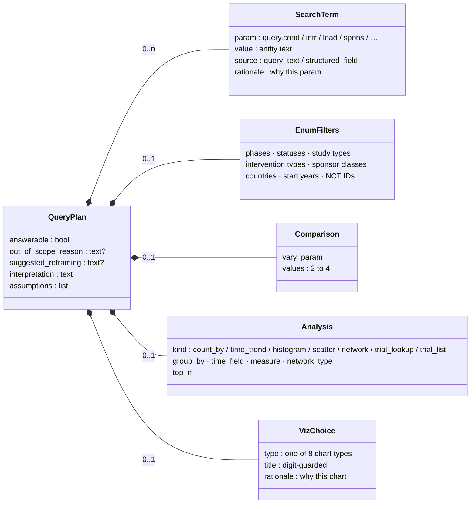

- **Every search, filter, analysis and chart field is a menu choice or an entity name.** OpenAI's strict JSON-schema mode enforces this, then the §7.4 code checks. The only free text (title, interpretation, assumptions, rationales) is digit-guarded or shown for transparency, and is never used to query.
- **The `rationale` fields are the planner's reasoning** over the API catalog ("what does each call provide?"). The judge reads them.
- **Structured request fields (e.g. `drug_name`) are written in by code** afterwards, never copied by the LLM.

## V5 · From question shape to chart

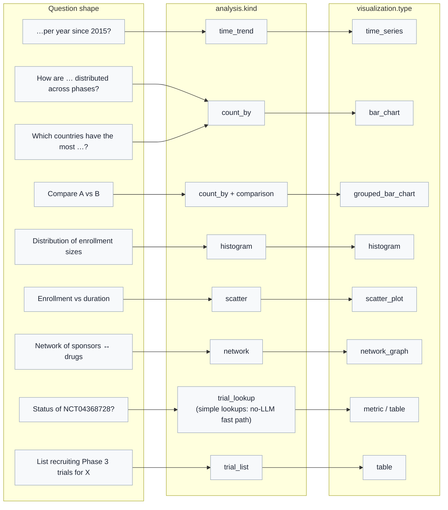

- **The planner picks both the kind and the chart; code enforces that they're compatible.** For example, a `time_trend` can't become a network.
- **After the data arrives, deterministic *shape guards* adjust degenerate cases:**
  - 1 bucket → metric
  - < 3 years → bar chart
  - too many nodes → pruning
- **Simple NCT-ID lookups** (the IDs plus ≤ 6 words, with no 'by / vs / trend…') take a no-LLM fast path. Other NCT questions go to the planner with the IDs pre-filled.

## V6 · The eight chart types

<div class="cards">
<div class="card"><svg viewBox="0 0 120 64"><line x1="6" y1="58" x2="114" y2="58" stroke="#9aa7b8"/><rect x="12" y="20" width="14" height="38" fill="#0f5e7a"/><rect x="32" y="8" width="14" height="50" fill="#0f5e7a"/><rect x="52" y="30" width="14" height="28" fill="#0f5e7a"/><rect x="72" y="40" width="14" height="18" fill="#0f5e7a"/><rect x="92" y="48" width="14" height="10" fill="#0f5e7a"/></svg><div class="card-title">bar_chart</div><div class="card-enc">x: category · y: trial_count</div><div class="card-eg">Breast cancer trials by phase</div></div>
<div class="card"><svg viewBox="0 0 120 64"><line x1="6" y1="58" x2="114" y2="58" stroke="#9aa7b8"/><rect x="12" y="18" width="10" height="40" fill="#0f5e7a"/><rect x="23" y="28" width="10" height="30" fill="#c77d1a"/><rect x="44" y="10" width="10" height="48" fill="#0f5e7a"/><rect x="55" y="22" width="10" height="36" fill="#c77d1a"/><rect x="76" y="38" width="10" height="20" fill="#0f5e7a"/><rect x="87" y="44" width="10" height="14" fill="#c77d1a"/></svg><div class="card-title">grouped_bar_chart</div><div class="card-enc">x · y · color = cohort</div><div class="card-eg">Phases: pembrolizumab vs nivolumab</div></div>
<div class="card"><svg viewBox="0 0 120 64"><line x1="6" y1="58" x2="114" y2="58" stroke="#9aa7b8"/><polyline points="10,50 25,40 40,30 55,32 70,24 85,20 100,16" fill="none" stroke="#0f5e7a" stroke-width="2.5"/><polyline points="100,16 112,36" fill="none" stroke="#0f5e7a" stroke-width="2.5" stroke-dasharray="4 3"/></svg><div class="card-title">time_series</div><div class="card-enc">x: year · y: trial_count · partial year dashed</div><div class="card-eg">Pembrolizumab trials per year</div></div>
<div class="card"><svg viewBox="0 0 120 64"><line x1="6" y1="58" x2="114" y2="58" stroke="#9aa7b8"/><rect x="10" y="30" width="14" height="28" fill="#0f5e7a"/><rect x="24" y="12" width="14" height="46" fill="#0f5e7a"/><rect x="38" y="8" width="14" height="50" fill="#0f5e7a"/><rect x="52" y="20" width="14" height="38" fill="#0f5e7a"/><rect x="66" y="36" width="14" height="22" fill="#0f5e7a"/><rect x="80" y="50" width="14" height="8" fill="#0f5e7a"/><rect x="94" y="55" width="14" height="3" fill="#0f5e7a"/></svg><div class="card-title">histogram</div><div class="card-enc">bins: bin_start / bin_end · y: trial_count</div><div class="card-eg">Enrollment sizes, Phase 2 psoriasis</div></div>
<div class="card"><svg viewBox="0 0 120 64"><line x1="6" y1="58" x2="114" y2="58" stroke="#9aa7b8"/><line x1="8" y1="4" x2="8" y2="58" stroke="#9aa7b8"/><circle cx="20" cy="46" r="3" fill="#0f5e7a"/><circle cx="32" cy="40" r="3" fill="#0f5e7a"/><circle cx="41" cy="44" r="3" fill="#0f5e7a"/><circle cx="52" cy="30" r="3" fill="#0f5e7a"/><circle cx="60" cy="36" r="3" fill="#0f5e7a"/><circle cx="72" cy="22" r="3" fill="#0f5e7a"/><circle cx="84" cy="28" r="3" fill="#0f5e7a"/><circle cx="98" cy="12" r="3" fill="#0f5e7a"/></svg><div class="card-title">scatter_plot</div><div class="card-enc">one point = one trial · x · y</div><div class="card-eg">Enrollment vs duration, Crohn's P3</div></div>
<div class="card"><svg viewBox="0 0 120 64"><g stroke="#9aa7b8" stroke-width="1.5"><line x1="22" y1="16" x2="60" y2="32"/><line x1="22" y1="48" x2="60" y2="32"/><line x1="60" y1="32" x2="98" y2="14"/><line x1="60" y1="32" x2="98" y2="50"/><line x1="98" y1="14" x2="98" y2="50"/></g><circle cx="22" cy="16" r="7" fill="#c77d1a"/><circle cx="22" cy="48" r="5" fill="#c77d1a"/><circle cx="60" cy="32" r="9" fill="#0f5e7a"/><circle cx="98" cy="14" r="6" fill="#0f5e7a"/><circle cx="98" cy="50" r="5" fill="#0f5e7a"/></svg><div class="card-title">network_graph</div><div class="card-enc">nodes · edges · weight = shared trials</div><div class="card-eg">Sponsors ↔ drugs, glioblastoma</div></div>
<div class="card"><svg viewBox="0 0 120 64"><rect x="8" y="6" width="104" height="52" fill="none" stroke="#9aa7b8"/><rect x="8" y="6" width="104" height="12" fill="#eef2f6"/><line x1="8" y1="31" x2="112" y2="31" stroke="#d9dee7"/><line x1="8" y1="44" x2="112" y2="44" stroke="#d9dee7"/><line x1="44" y1="6" x2="44" y2="58" stroke="#d9dee7"/><line x1="80" y1="6" x2="80" y2="58" stroke="#d9dee7"/></svg><div class="card-title">table</div><div class="card-enc">columns[] · one row per item</div><div class="card-eg">Recruiting Phase 3 trials for X</div></div>
<div class="card"><svg viewBox="0 0 120 64"><text x="60" y="37" text-anchor="middle" font-size="16" font-weight="700" fill="#0f5e7a" font-family="Helvetica, Arial">COMPLETED</text><text x="60" y="54" text-anchor="middle" font-size="9" fill="#5b6475" font-family="Helvetica, Arial">NCT04368728 · status</text></svg><div class="card-title">metric</div><div class="card-enc">label · value · unit (data is always an array)</div><div class="card-eg">Status of NCT04368728?</div></div>
</div>

- **Every type has the same five keys:** `type`, `title`, `encoding`, `data`, `options`.
- **`encoding` names exactly which data field drives which visual channel,** so a frontend never guesses.
- **Data is already aggregated.** The frontend only draws; it never recounts.

## V7 · Where every trial goes (the data funnel)

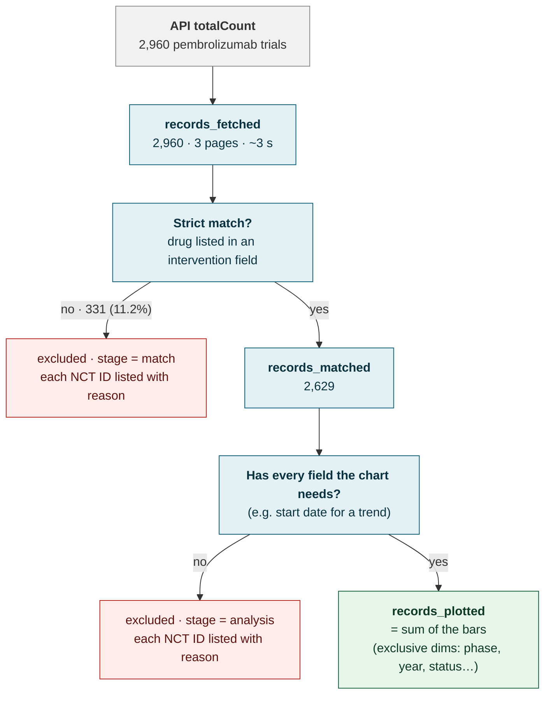

- **The API's text search is fuzzy:** it also matches trials that only *mention* the drug in a description. 331 of 2,960 pembrolizumab hits don't actually list it [VERIFIED].
- **Nothing disappears silently.** Every excluded trial is listed with its stage and reason in `meta.data_coverage`.
- **Over 20,000 matches?** The probe asks the planner to narrow the question first. Otherwise the most recent 20,000 are analyzed, and the response says so.

## V8 · Anatomy of a deep citation

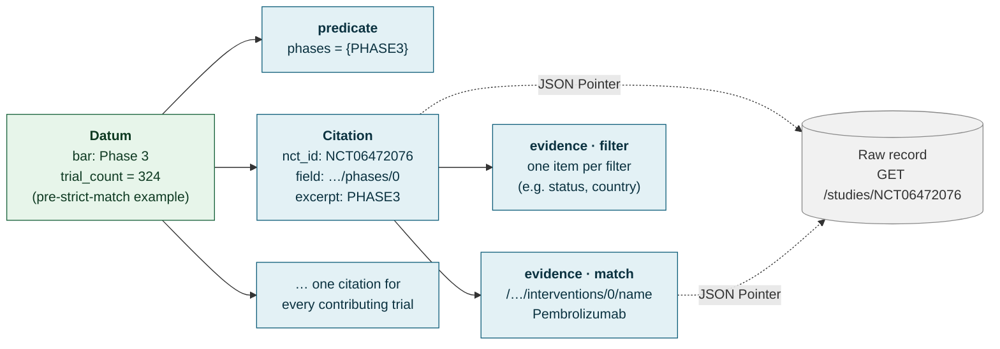

- Each citation answers two questions: **why is this trial in this bar** (`field`/`excerpt`), and **why is it in the chart at all** (`match` evidence).
- **Excerpts are exact values straight from the API**, one array element at a time, never paraphrased.
- **`trial_count` equals the number of citations**, so the bar height *is* its citation list.
- **Anyone can check a citation** with any JSON Pointer library, or with `python -m ctviz.verify`.

## V9 · The verifier: trust, but recount

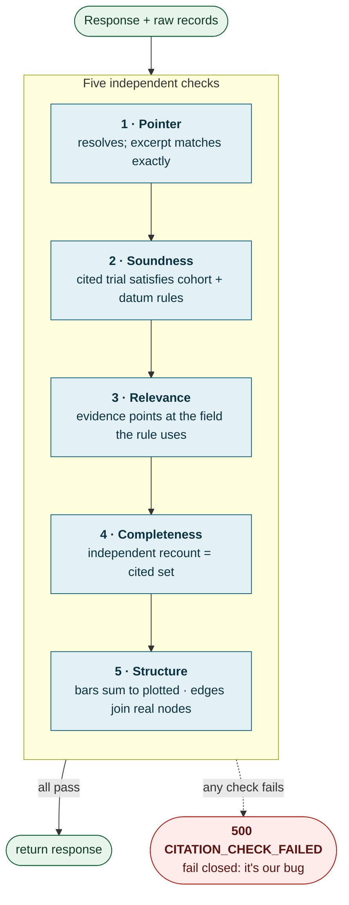

- **The verifier never imports the counting code.** It re-derives every bar from the raw records using each datum's predicate, so a bucketing bug can't hide.
- **It catches the failure the first prototype missed:** a Phase 1 trial filed under the Phase 3 bar.
- **Nine deliberate-corruption tests prove it fails when it should.**

## V10 · What the response looks like

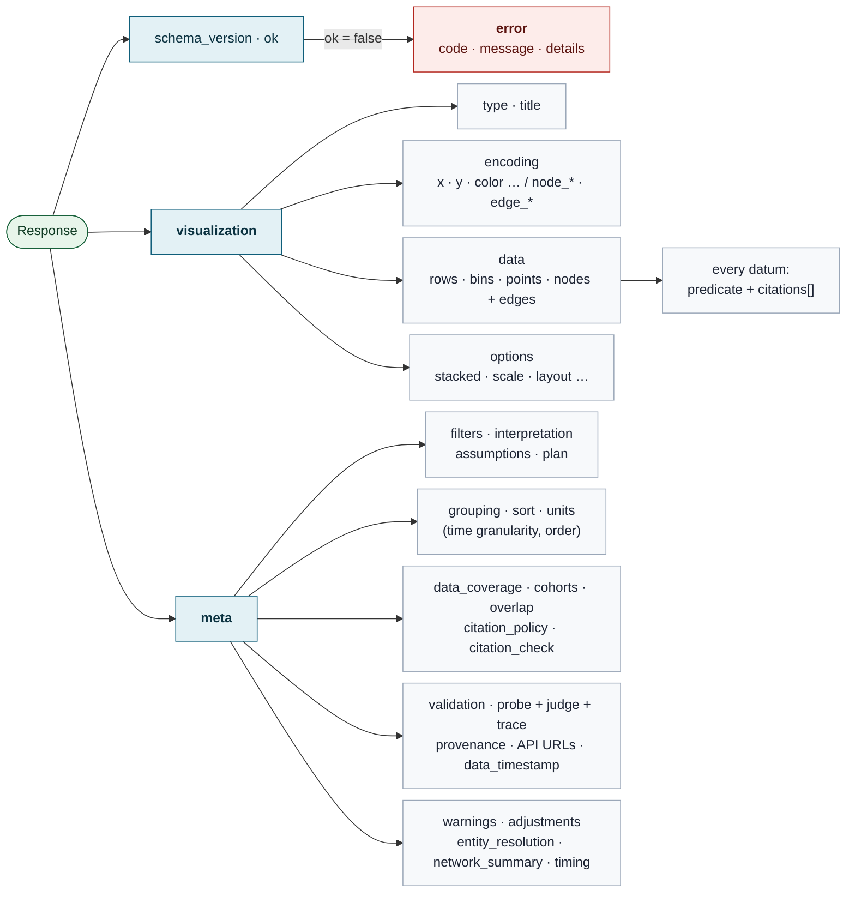

- **One parse path for any frontend:** check `ok`, then render `visualization` using `encoding`.
- **`meta` explains the answer:** what was asked, which trials were counted or dropped and why, what the judge said, and which exact API calls produced the data.

## V11 · How the code is organized

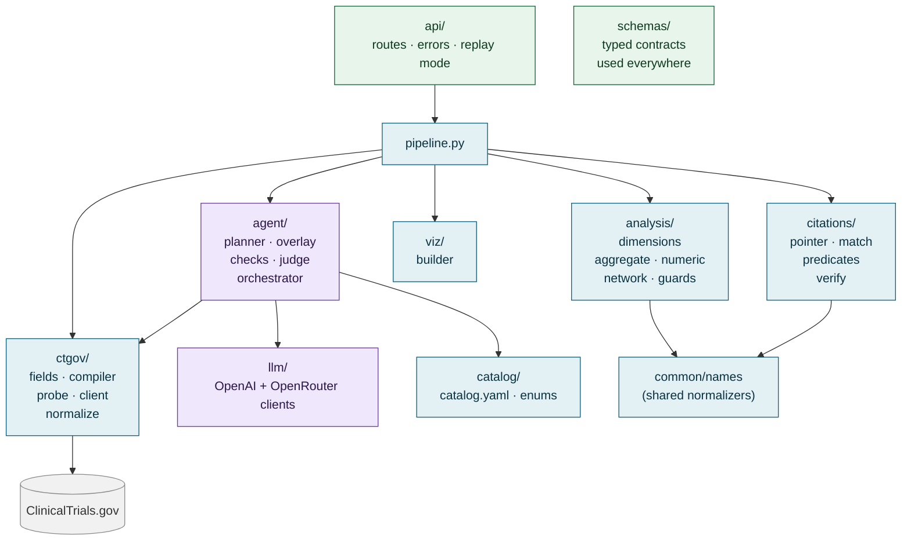

- **Small typed modules** (~200–400 lines each), with one-way dependencies.
- **`citations/` never imports `analysis/`.** That independence is what makes the verifier meaningful.
- **LLM code is isolated in `agent/` + `llm/`.** Everything else is testable offline with recorded API fixtures.

## V12 · The 24-hour build plan

```mermaid
gantt
    dateFormat HH:mm
    axisFormat %H:%M
    todayMarker off
    section Foundation
    P0 Setup + smoke tests   :p0, 00:00, 30m
    P1 Contracts             :p1, after p0, 2h
    P2 Data layer + probe    :p2, after p1, 150m
    section Slice
    P2.5 End-to-end slice    :crit, p25, after p2, 90m
    section Core
    P3 Analysis + evidence   :p3, after p25, 4h
    P4 Citations + verifier  :p4, after p3, 3h
    P5 Agent + judge         :p5, after p4, 3h
    P6 API + replay mode     :p6, after p5, 1h
    section Ship
    P7 Evals                 :p7, after p6, 90m
    P8 Deliverables          :crit, p8, after p7, 150m
    Reserve                  :done, rs, after p8, 150m
```

- **A real end-to-end answer exists by hour 6.5**, so problems surface early.
- **The 2.5 h reserve covers a short review after each phase, plus slack.**
- **If behind at hour 16, cut in this order:** stretch items → judge eval size → condition↔drug network → scatter → table lists. **P8 (deliverables) is never cut.**
- **Stretch, only after P8:** site and investigator networks, then the demo UI (only if ≥ 2 h remain).

## V13 · What questions it answers

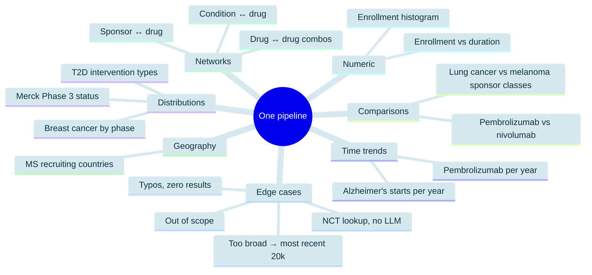

- **18 core query types (+1 stretch: the site network) run through the same pipeline**, with no per-question code. API totals for 17 were measured live (Part II §14); the Pfizer condition↔drug total is still an [ASSUMPTION].
- **Every class in the assignment's appendix is covered,** including the unscoped *"Which drugs frequently co-occur in combination studies?"*.

## V14 · Four decisions for you

| # | Question | My recommendation |
|---|---|---|
| **Q1** | Exclude trials the API matched only by *mentioning* the drug or sponsor in passing (11% for pembrolizumab)? | **Yes for drugs and sponsors.** Conditions stay lenient until P2 measures their match rate (switch to strict if ≥ 97%). Every excluded trial is listed. |
| **Q2** | "Merck" matches two unrelated companies (MSD and Merck KGaA). Warn, or auto-split? | **Warn and show the matched names**, without guessing. |
| **Q3** | Build a small HTML demo viewer? | **Only if ≥ 2 h remain** after the deliverables are done. |
| **Q4** | Should a "Phase 2/Phase 3" trial be its own bar (sums to the total, like ClinicalTrials.gov) or count in both? | **Its own bar.** (Counting in both stays available as stretch S5.) |

Answers are needed before P2 / P4, so P0–P1 can start right away. Reply with your answers, or "go with your recommendations".

---

# Part II — Full plan (reference)

## 0. How to read this doc

> **At a glance:** Part I (15 diagram pages) is enough to review the design. Part II, starting here, is the complete reference.

- **Reviewing the design:** Part I, V0–V14. Each page is one diagram plus its key points.
- **Checking requirement coverage:** §2 maps every requirement and grading criterion to the section that covers it.
- **Checking correctness:** §5 (API facts), §11 (deep citations), §13 (validation layers), §14 (every query type, with real counts) and Appendix C (what the reviewers caught and how it was fixed).
- **Before coding starts:** §17 (phases, cut order) and §22 (the four decisions, also on page V14).

---

## 1. TL;DR

We're building a backend that takes a question like *"How has the number of pembrolizumab trials changed per year since 2015?"* plus optional structured fields, and returns a JSON **visualization spec** (`type`, `title`, `encoding`, `data`, `meta`). A frontend can render it without guessing. Every bar, point, node and edge cites the exact ClinicalTrials.gov records and fields behind it.

**Design principle: the LLMs decide *what to ask*; code decides *what is true*.**

```
question + fields
  → PLANNER  (OpenAI gpt-5.4-mini): reasons over an "API capability catalog" → typed QueryPlan (menus only)
  → OVERLAY  (code): structured request fields are applied deterministically, never copied by the LLM
  → CHECKS   (code): enums valid, years sane, viz fits the analysis
  → PROBE    (code, the agent's tool): 1-record count query per cohort → catches 0-result or too-broad plans
  → JUDGE    (OpenRouter, cheap/fast, different model family): "does this plan answer the question?" → pass / revise (1 retry)
  → COMPILE → FETCH (every page, slim fields, ≤20k, cache) → NORMALIZE + STRICT MATCH
  → AGGREGATE + CITE (code): numbers and evidence come from the same loop
  → GUARDS + VERIFY (code): shape guards; an independent verifier re-checks every citation and recounts every datum
  → JSON response
```

Why this scores well:

- **Hallucination-proof numbers.** No count, category label or excerpt is written by an LLM. The only LLM-written strings are the title, the interpretation and the assumptions, and a number guard checks all three.
- **The agent tests its own plan before committing.** Deterministic checks and a live **count probe** run first. Then a judge from a different model family checks intent, *before* any real data is fetched.
- **Deep citations are provenance, not decoration.** A trial can't be counted into a bar without its evidence being recorded in the same step. A *separate* verifier then re-derives every count from the raw records.
- **Broad coverage from one pipeline.** One schema drives time trends, distributions, comparisons, geography, numeric distributions, scatter plots and network graphs, with no special-casing per query.

---

## 2. The assignment, decoded

> **At a glance:** Every requirement (R1–R10) and every grading criterion maps to a section. Nothing in the spec is left without an owner.

### 2.1 Requirements → where they're handled

| # | Requirement (from spec) | Where | How we prove it |
|---|---|---|---|
| R1 | Accept `query` (string, required) + optional structured fields we define and **document** | §6 | Pydantic `VisualizeRequest` with lenient coercion, JSON Schema at `GET /v1/schema`, README table |
| R2 | Interpret the question | §7, §8 | Typed `QueryPlan`, `meta.query_interpretation` |
| R3 | Retrieve data from ClinicalTrials.gov | §5, §10 | Deterministic compiler + fetcher; `meta.provenance.api_requests` lists exact URLs |
| R4 | Decide *whether* a viz is needed and *which type* | §7.3, §8.4 | Compatibility matrix; single-trial fast path; out-of-scope short-circuit |
| R5 | Output `type`, `title`, `encoding`, `data` | §12 | Discriminated union on `type`; `encoding` required on **every** type |
| R6 | Response metadata (units, sorting, time granularity, grouping, assumptions, filters) | §12.6 | `meta` schema (`meta.filters`, matching the spec's example) |
| R7 | **Document the response schema** so a frontend engineer needn't guess | §12, README | JSON Schema export, renderer mapping, inline abridged examples |
| R8 | Support **multiple** viz types; rich ones like **network graphs** score higher | §10.5, §12.4 | 8 types; 3 network variants core + 2 stretch |
| R9 | *Bonus:* deep citations (`nct_id` + exact excerpt per datum) | §11 | Every contributing trial cited as `{nct_id, field, excerpt, evidence}` + an independent verifier |
| R10 | Zip: code, README (run, schemas, design, limitations, AI-tool usage), **3–5 real example runs**, optional demo | §20 | `scripts/package_zip.sh`, `examples/*.json` showing 5 different chart types |

### 2.2 Grading weights → strategy

| Criterion | Weight | What wins it | Where |
|---|---|---|---|
| System design | **35%** | Clear stage boundaries, extensibility (add a viz type or dimension without touching the planner), sensible handling of messy real data | §4, §10, §15 |
| AI / agent design | **20%** | "Avoid hallucination-prone steps", validation/constraints, sensible planning **+ appropriate tools** (catalog, probe, fetcher) | §4.2, §8, §9, §13 |
| Code quality | **20%** | Small modules, typed boundaries, tests (80%+), readable docs | §15, §16 |
| Query & viz coverage | **15%** | Breadth without one-off hacks; meaningful networks | §14 |
| Input/output design | **10%** | Unambiguous, frontend-friendly schemas; forgiving inputs | §6, §12 |
| Bonus | — | Deep citations | §11 |

### 2.3 Deliverables checklist

- [ ] Source code that runs locally with one command (and runs **without** API keys in replay mode)
- [ ] README: install/configure/run · request/response schemas · design decisions and tradeoffs · limitations and future work · AI tools used, how correctness was validated, what was designed vs generated
- [ ] 3–5 example queries with **actual** JSON outputs (committed in `examples/`, abridged inline in the README)
- [ ] Optional: tiny HTML renderer demo (stretch, only if ≥ 2h remain)
- [ ] Zip that **excludes `.env`**, caches, virtualenvs and this internal plan

---

## 3. Decisions log

> **At a glance:** 15 decisions. The load-bearing ones: the typed plan (D1–D2), the cross-family judge (D3), full citations (D12–D13), the code overlay (D14), and sending values as given (D15).

| # | Decision | Choice | Why | Rejected alternative |
|---|---|---|---|---|
| D1 | Agent style | **Typed planner + probe + judge + 1 revise** | Predictable, testable; directly answers "avoid hallucination-prone steps" | Free tool-calling loop: flexible, but slower and harder to test, and it can emit bad params |
| D2 | Who reasons about API calls | **OpenAI planner reads an API capability catalog** (params, what each returns, limits) and picks from menus | Keeps your "reason about what each call provides" idea while making invalid calls impossible | LLM writes raw URLs or Essie expressions |
| D3 | Judge | **OpenRouter, cheap/fast, non-OpenAI family** (`google/gemini-2.5-flash-lite`) | A different family avoids the model grading its own homework; $0.10/1M input tokens | Same model judging itself |
| D4 | Judge rejects | **Revise once with feedback**, then ship the best attempt with `meta.validation.judge.status = "rejected_after_revision"` | Self-correcting at ≤2 extra LLM calls; never silently hides disagreement | Hard fail (frustrating) / ignore (unsafe) |
| D5 | When the viz type is chosen | **In the plan, before fetching**; code-side shape guards adjust for data edge cases | One LLM call; the judge sees everything at once | Second LLM call after fetching |
| D6 | Big result sets | **Fetch all pages with slim fields, cap 20k.** Over the cap, fetch **the most recent 20k by start date** (`sort=StartDate:desc`) and disclose it. The probe lets the planner narrow first. | Every plotted number is exact for its disclosed population. Measured: 16,859 records in 12.75s (2-field projection) | Arbitrary server-ordered slice / low cap |
| D7 | Stack | **Python 3.12 + FastAPI + Pydantic v2 + httpx + OpenAI SDK + pytest** | Best fit for data aggregation; Pydantic gives free JSON Schema docs | TypeScript/Node |
| D8 | Viz spec format | **Custom discriminated union** shaped like the assignment's example, borrowing Vega-Lite's `field`+`type` channel idea | Vega-Lite can't express network graphs; one schema family is easier for a frontend | Raw Vega-Lite / ECharts options |
| D9 | "Is a viz needed?" | **Always return a viz.** Single facts become `metric`/`table`; unanswerable questions return `ok:false` with `OUT_OF_SCOPE` | §4 of the spec says the answer must be a visualization | Free-text answers |
| D10 | Where aggregation happens | **Always client-side (our Python)** | `/stats/field/values` **cannot be filtered** (HTTP 400 [VERIFIED]) | Server-side stats |
| D11 | Numbers in LLM text | **Guarded.** Digits in the title, interpretation or assumptions must come from the query, the fields, the filters or the entities. Anything else → a template or code-rendered text, logged. | Closes the last channel for hallucinated numbers without breaking titles like "Phase 3" or "Type 2 Diabetes" | Trust the LLM / ban all digits |
| D12 | Citation completeness | **Every contributing trial is cited by default** (`options.citations="full"`), with gzip on. Sampling is **opt-in only**. | The spec says *each* reference includes an excerpt. Measured: 2,960 single-evidence citations ≈ 16–27 KB gzip | Top-k sample + bare ID list by default |
| D13 | Citation evidence | **A primary `field`/`excerpt` per citation (the spec's shape) plus `match`/`filter` evidence**, addressed with **JSON Pointer (RFC 6901)** | **331 of 2,960 (11.2%)** `query.intr=pembrolizumab` hits don't list the drug in any intervention field [VERIFIED] | Bucket evidence only |
| D14 | Structured request fields | **Applied by code after planning (overlay)**; the LLM never re-emits them | Removes a whole class of copy errors and revise loops | Asking the LLM to copy fields verbatim |
| D15 | Condition/drug strings | **Sent as given, no auto-quoting** (the user's own quotes are kept); the exact string is disclosed | All verified counts were measured unquoted, and unquoted matches ClinicalTrials.gov's website search | Always quote multi-word values (changes counts by up to ~11%) |

---

## 4. Architecture

> **At a glance:** The pipeline, the hallucination-boundary table, a walkthrough with real numbers, and the latency/cost budget (~3–9 s and ~$0.01 per request).

### 4.1 Pipeline

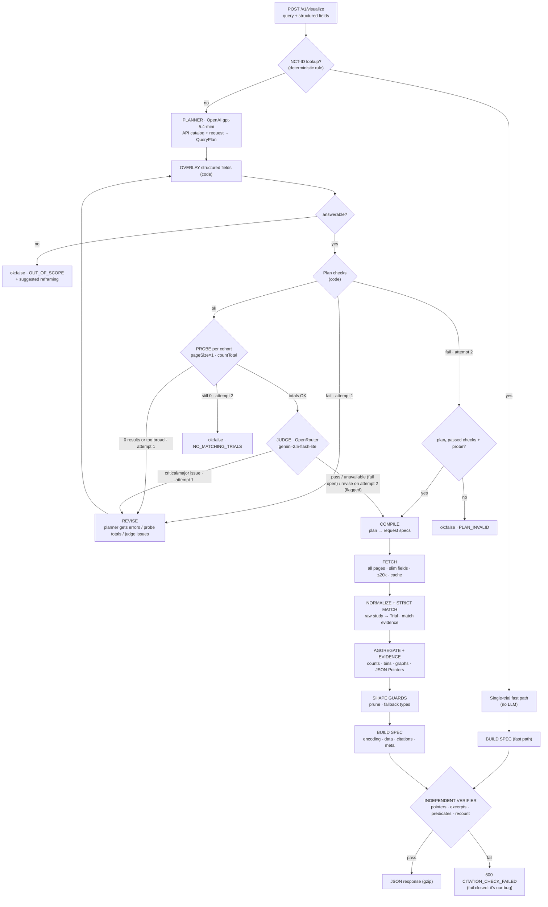

### 4.2 The hallucination boundary

This is the core of the AI-design story. The table shows, for every stage, whether an LLM is involved and what stops a mistake from reaching the user.

| Stage | LLM? | Input | Output | How it could fail | Guard |
|---|---|---|---|---|---|
| Planner | **Yes** (OpenAI) | query, fields, catalog | `QueryPlan` (enums + entity strings) | Wrong param (drug in `query.cond`), wrong dimension, invented filter, wrong viz | Strict JSON schema (menus only) → overlay → checks → probe → judge → 1 revise |
| Overlay | No | plan + request | plan with structured fields applied | — | Unit-tested invariant: every provided field is in the plan |
| Plan checks | No | `QueryPlan` | ok / errors | — | Pure functions, unit-tested |
| **Probe** | No | compiled params | total count per cohort | A plan that's syntactically fine but returns 0, or 200k, trials | Revise with the totals as feedback; totals are shown to the judge |
| Judge | **Yes** (OpenRouter) | query, fields, overrides, plan, probe totals, catalog summary | `JudgeVerdict` | Rubber-stamps a bad plan / false alarm | 7-point checklist with evidence; verdict recomputed in code; labeled eval set (§9.6) |
| Compile / Fetch | No | plan | raw records | Timeouts, 5xx, huge sets | Allowlists, retries, cap + disclosed truncation rule, cache |
| **API full-text search** | No, but fuzzy | search terms | records that may not truly match | Records that only mention the term in passing (11.2% for pembrolizumab) | **Strict match check** with match evidence (§11.3) |
| Normalize | No | raw JSON | `Trial` | Messy data (partial dates, multi-phase, missing fields) | Explicit, documented rules (§10.3) |
| Aggregate + cite | No | Trials | rows / graph + evidence | Bucketing bug | Independent verifier recomputes every datum from predicates (§11.6) |
| Title / interpretation / assumptions | **Yes** (from the planner) | — | strings | A number nobody computed | Digit guard (D11): template or code-rendered fallback, logged |

**Where an LLM can still be wrong:** interpreting the question. That's why the probe and the judge exist, why `meta.query_interpretation` and `meta.assumptions` are always shown, and why the eval set (§16.4) measures plan accuracy directly.

### 4.3 Walkthrough of one request (real numbers)

Request: `{"query": "How has the number of trials for this drug changed per year since 2015?", "drug_name": "Pembrolizumab"}`

1. **Planner** →
   - `filters.start_year_min=2015`
   - `analysis={kind:"time_trend", time_field:"start_date", granularity:"year"}`
   - `visualization.type="time_series"`
2. **Overlay** (code) → adds `search_terms=[{param:"query.intr", value:"Pembrolizumab", source:"structured_field"}]`.
3. **Checks:** params allowed, 2015 is a sane year, `time_trend` ↔ `time_series` compatible → pass.
4. **Probe** → `totalCount=2895` (under the 20k cap) → pass. [VERIFIED count]
5. **Judge:** the drug is on the right param, "since 2015" maps to `start_year_min`, a trend chart fits → pass.
6. **Compile** → `GET /studies?query.intr=Pembrolizumab&filter.advanced=AREA[StartDate]RANGE[2015-01-01,MAX]&fields=NCTId,BriefTitle,StartDate,StartDateType,InterventionName,InterventionOtherName,InterventionMeshTerm,ArmGroupInterventionName&pageSize=1000&countTotal=true`
7. **Fetch:** 3 pages. Measured at **3.14s** with a 2-field projection; the real field set will be somewhat slower [ESTIMATE ~3–4s].
8. **Strict match:** each trial must list pembrolizumab (or a co-referenced alias such as `MK-3475`) in an intervention field. Across all 2,960 pembrolizumab trials, 331 (11.2%) fail this check [VERIFIED]. They're excluded and listed in `meta.data_coverage.excluded_trials`.
9. **Aggregate:** buckets by year (2015: 120 · 2016: 195 · … · 2022: 298 · … · 2026: 211 · 2027: 6) [VERIFIED, before strict match]. 2026 is flagged `partial_period`; 2027 is `projected` (estimated starts).
10. **Cite:** every trial in every bucket gets `{nct_id, field: "/protocolSection/statusModule/startDateStruct/date", excerpt: "2019-06-12", evidence: [match → /…/interventions/i/name]}`.
11. **Verify:** re-resolve every pointer, re-evaluate every bucket predicate, recount each bucket from the raw records → return.

### 4.4 Why not a free tool-calling agent?

A ReAct-style loop with `search_studies` / `count_studies` tools *can* handle odd questions, but it has three problems:

1. The LLM chooses raw parameters, which is exactly the hallucination-prone step the rubric penalizes.
2. The number of steps is unbounded, so latency and cost are too.
3. Tests become transcript-dependent.

Our agent still uses **tools**, but deterministically:

- the **catalog** gives it every param's semantics and limits, and it records a rationale for each choice;
- the **probe** reports real counts back into the revise loop;
- the **fetcher** executes the plan.

Its output is a finite menu selection that code can check exhaustively. If the eval set shows real coverage gaps, a bounded tool loop (≤3 steps) is a documented future extension (§21).

### 4.5 Latency and cost budget per request

| Step | Typical | Worst case | Source |
|---|---|---|---|
| Planner (gpt-5.4-mini, reasoning_effort=low) | 1–3 s | 6 s | [ESTIMATE] |
| Probe (pageSize=1 per cohort) | 0.2–0.5 s | 1 s | [ESTIMATE] from the 0.26 s 127-record fetch |
| Judge (gemini-2.5-flash-lite) | 0.5–1.5 s | 3 s | [ESTIMATE] |
| Revise loop (only if triggered) | +2–4 s | +10 s | [ESTIMATE] |
| Fetch | 0.3–4 s (≤5k records) | **15–25 s** (17–20 pages, real field sets) | [VERIFIED] 0.72–1.04 s per 1000-record page depending on fields; worst case extrapolated |
| Normalize + aggregate + verify | < 0.5 s | ~2 s (20k records) | [ESTIMATE] |
| **Total** | **~3–9 s** | **~30 s** | |

LLM cost per request is about **$0.005–0.01** [ESTIMATE]. That's about 6k planner input tokens at $0.75/1M plus about 600 output tokens at $4.50/1M; the judge costs about $0.0005. Prices [VERIFIED] via OpenAI and OpenRouter model pages.

---

## 5. The ClinicalTrials.gov API — what we verified

> **At a glance:** What the live API really does: one data endpoint, no filtered stats, 1,000-record pages, leaf-level field projection, synonym quirks, and 16 gotchas.

Base: `https://clinicaltrials.gov/api/v2`. The machine-readable OpenAPI spec is live at `https://clinicaltrials.gov/api/oas/v2` [VERIFIED]. The docs page is a JS app with no server-rendered reference text. The corpus holds **604,733** studies [VERIFIED].

### 5.1 Endpoints

| Endpoint | Accepts query/filter? | Our use |
|---|---|---|
| `GET /studies` | **Yes**: `query.*`, `filter.*`, `fields`, `sort`, `countTotal`, `pageSize`, `pageToken` | **Every data fetch, and the probe** (`pageSize=1`) |
| `GET /studies/{nctId}` | No (path + `fields` only) | Single-trial fast path; live citation verification |
| `GET /studies/metadata` | — | **Build time:** generates the field catalog |
| `GET /studies/search-areas` | — | **Build time:** documents what each `query.*` searches |
| `GET /studies/enums` | — | **Build time:** source of truth for planner enums |
| `GET /stats/field/values` | **No**: with a filter it returns HTTP 400 `Invalid prefix in parameter name: query.cond` [VERIFIED] | **Build time only:** unfiltered value lists (e.g. the 226 `LocationCountry` spellings for input coercion) |
| `GET /stats/field/sizes`, `/stats/size` | No | Not used |
| `GET /version` | — | Health check; `dataTimestamp` goes into `meta` and cache keys |

### 5.2 Search params (`query.*`), all verified live

| Param | Searches (weights from `/studies/search-areas`) | Example → totalCount |
|---|---|---|
| `query.cond` | Condition (.95), BriefTitle (.60), OfficialTitle (.55), ConditionMeshTerm (.50), ancestors, Keyword | `breast cancer` → **16,859** |
| `query.intr` | InterventionName (.95), InterventionType, ArmGroupType, **InterventionOtherName (.75)**, titles, ArmGroupLabel, InterventionMeshTerm, Keyword, **InterventionDescription (.40)**, **ArmGroupDescription (.40)** | `pembrolizumab` → **2,960** |
| `query.spons` | LeadSponsorName (1.0), **CollaboratorName (.90)**, OrgFullName | `Merck` → **5,222** (lead *or* collaborator) |
| `query.lead` | LeadSponsorName **only** | `Merck` → **2,746** |
| `query.locn` | LocationCity/State/Country/Facility (.95), Zip | `Boston` → **21,489** |
| `query.titles` | Acronym, BriefTitle, OfficialTitle | `KEYNOTE` → **40** |
| `query.outc` | Primary/secondary outcome measures and descriptions | `overall survival` → **45,074** |
| `query.id` | NCTId, aliases, acronym, org/secondary IDs | `NCT02760485` → **1** |
| `query.term` | ~35-field union (broadest) | `headache` → **8,337** |
| `query.patient` | Patient-facing union | not used by us |

All `query.*` params AND together. Note that `query.intr` also searches **description** fields, which is how "mentions in passing" get in (§11.3).

### 5.3 Filters and Essie syntax (verified with counts)

| Purpose | Expression (inside `filter.advanced` unless noted) | Scope of the count | Count |
|---|---|---|---|
| Phase | `AREA[Phase]PHASE3` | + `query.intr=pembrolizumab` | 367 |
| Phase + start-date range | `AREA[Phase]PHASE3 AND AREA[StartDate]RANGE[2015-01-01,MAX]` | + pembrolizumab | 360 |
| Lead sponsor class | `AREA[LeadSponsorClass]INDUSTRY` | + pembrolizumab (whole corpus: 132,634) | 1,179 |
| Study type | `AREA[StudyType]INTERVENTIONAL` | + pembrolizumab | 2,789 |
| Intervention type | `AREA[InterventionType]DRUG` | + pembrolizumab (whole corpus: 212,652) | 2,518 |
| Country | `AREA[LocationCountry]Japan` | + pembrolizumab | 277 |
| Boolean + grouping | `AREA[Phase]PHASE3 AND (AREA[OverallStatus]RECRUITING OR AREA[OverallStatus]COMPLETED)` | + pembrolizumab | 213 |
| Negation | `NOT AREA[OverallStatus]COMPLETED` | + pembrolizumab | 2,122 |
| Exact phrase | `AREA[BriefTitle]"advanced solid tumor"` | not recorded; re-measure in P2 | 225 |
| Default synonym expansion vs none | `AREA[InterventionName]pembrolizumab` vs `AREA[InterventionName]EXPANSION[None]pembrolizumab` | whole corpus | 2,559 vs 304 |
| Status (typed param) | `filter.overallStatus=RECRUITING,COMPLETED` (same as the AREA OR form) | + pembrolizumab | 1,544 |
| Specific trials | `filter.ids=NCT02760485,NCT04475523` | whole corpus | 2 |
| Geo radius | `filter.geo=distance(40.7128,-74.0060,50mi)` | whole corpus | 39,738 |
| Pre-1990 starts | `AREA[StartDate]RANGE[MIN,1989-12-31]` | whole corpus | 625 |

**Not usable:** `filter.synonyms` and `aggFilters` need opaque internal IDs with no discovery endpoint. There is **no** `filter.locationStatus`; it returns HTTP 400 [VERIFIED], so site-level status has to be filtered client-side. `postFilter.*` gives us nothing extra, so we always use `filter.*`.

### 5.4 Pagination, sorting, format

- `pageSize` hard cap is **1000**. Asking for 1001 or 5000 silently returns 1000.
- `countTotal=true` is honored **only on the first page** (the request without `pageToken`), so the total comes from page 1. The same holds for the probe.
- `pageToken` is an opaque cursor, fetched sequentially. Concurrent page fetching is untested, so we don't do it.
- **Only DATE and NUMERIC fields are sortable.** `sort=Phase` or `BriefTitle` returns HTTP 400. `sort=StartDate:desc` works and is deterministic [VERIFIED]. Without `sort`, the order is arbitrary.
- All 4xx errors are **`text/plain`**, never JSON. Never call `.json()` on an error response.
- Gzip cuts the wire size by about **82%** (1.72 MB → 301 KB) at the same latency. httpx turns it on by default.

### 5.5 Field catalog (dimension → `fields=` piece → JSON path)

> **Critical gotcha [VERIFIED]:** `fields=` projects individual *leaf fields*, not whole modules. Requesting `InterventionName` does **not** bring `InterventionType` with it. The compiler must request the complete set of fields that aggregation *and* citations need (§10.1). Array indices are preserved under projection (verified 108/108 sites on NCT06472076), so JSON Pointers from a slim fetch also resolve in the full record.

| Dimension | `fields=` piece(s) | JSON path (under the study) | Quirk |
|---|---|---|---|
| NCT ID | `NCTId` | `protocolSection.identificationModule.nctId` | matches `^NCT\d{8}$` |
| Titles | `BriefTitle`, `OfficialTitle` | `…identificationModule.briefTitle / officialTitle` | official title sometimes missing |
| Overall status | `OverallStatus` | `…statusModule.overallStatus` | enum |
| Why stopped | `WhyStopped` | `…statusModule.whyStopped` | prose; present on 97.9% of TERMINATED pembro trials |
| Start date (+type) | `StartDate`, `StartDateType` | `…statusModule.startDateStruct.{date,type}` | **partial dates** (`"2016-01"`); `type` **absent on many legacy records** (80 of 127 in one Crohn's cohort) |
| Completion dates | `PrimaryCompletionDate`, `CompletionDate` (+`Type`) | `…primaryCompletionDateStruct`, `…completionDateStruct` | same; **ESTIMATED** for ongoing trials |
| Phases | `Phase` | `…designModule.phases` | **array**; can hold 2 values; **missing on non-interventional studies** |
| Study type | `StudyType` | `…designModule.studyType` | enum |
| Enrollment | `EnrollmentCount`, `EnrollmentType` | `…designModule.enrollmentInfo.{count,type}` | `ESTIMATED` can remain on completed trials; `0` usually means WITHDRAWN (14/14 in psoriasis Phase 2) but also appears on not-yet-enrolled trials |
| Lead sponsor | `LeadSponsorName`, `LeadSponsorClass` | `…sponsorCollaboratorsModule.leadSponsor.{name,class}` | class is 0% missing (cleanest field) |
| Collaborators | `CollaboratorName`, `CollaboratorClass` | `…sponsorCollaboratorsModule.collaborators[]` | often empty |
| Interventions | `InterventionName`, `InterventionType`, `InterventionOtherName` | `…armsInterventionsModule.interventions[].{name,type,otherNames,armGroupLabels}` | names are noisy (doses, casing; 470 distinct raw spellings contain "pembrolizumab") |
| Arm groups | `ArmGroupLabel`, `ArmGroupType`, `ArmGroupInterventionName` | `…armsInterventionsModule.armGroups[].{label,type,interventionNames}` | `interventionNames` look like **`"Drug: Name"`** |
| Conditions | `Condition`, `Keyword` | `…conditionsModule.{conditions,keywords}` | free text |
| Condition MeSH | `ConditionMeshTerm`, `ConditionAncestorTerm` | `derivedSection.conditionBrowseModule.{meshes,ancestors}[].term` | server-derived |
| Intervention MeSH | `InterventionMeshTerm`, `InterventionAncestorTerm` | `derivedSection.interventionBrowseModule.{meshes,ancestors}[].term` | absent on 28.8% of glioblastoma trials; study-level, not per intervention; mixes in non-drugs ("Radiotherapy") |
| Locations | `LocationFacility`, `LocationCity`, `LocationCountry`, `LocationStatus`, `LocationGeoPoint` | `…contactsLocationsModule.locations[]` | **one row per site** (one trial has 1,655 US sites); `status` often null; `geoPoint` often missing; 226 distinct country spellings (e.g. "United States", "Turkey (Türkiye)", "South Korea") |
| Investigators | `OverallOfficialName`, `…Affiliation`, `…Role` | `…contactsLocationsModule.overallOfficials[]` | absent on 35.6% of CAR-T trials; industry lists the *company* as `STUDY_DIRECTOR` |
| Has results | `HasResults` | **top-level** `hasResults` | not under `protocolSection` |
| Design | `DesignAllocation`, `DesignPrimaryPurpose`, `DesignMasking` | `…designModule.designInfo.*` | enums |
| Record version | `LastUpdatePostDate` | `…statusModule.lastUpdatePostDateStruct.date` | 100% present; per-record change marker (§11.8) |

### 5.6 Enums (from `/studies/enums`)

- **Phase:** `NA, EARLY_PHASE1, PHASE1, PHASE2, PHASE3, PHASE4`
- **OverallStatus:** `ACTIVE_NOT_RECRUITING, COMPLETED, ENROLLING_BY_INVITATION, NOT_YET_RECRUITING, RECRUITING, SUSPENDED, TERMINATED, WITHDRAWN, AVAILABLE, NO_LONGER_AVAILABLE, TEMPORARILY_NOT_AVAILABLE, APPROVED_FOR_MARKETING, WITHHELD, UNKNOWN`
- **StudyType:** `INTERVENTIONAL, OBSERVATIONAL, EXPANDED_ACCESS`
- **InterventionType:** `BEHAVIORAL, BIOLOGICAL, COMBINATION_PRODUCT, DEVICE, DIAGNOSTIC_TEST, DIETARY_SUPPLEMENT, DRUG, GENETIC, PROCEDURE, RADIATION, OTHER`
- **AgencyClass (sponsor class):** `NIH, FED, OTHER_GOV, INDIV, INDUSTRY, NETWORK, AMBIG, OTHER, UNKNOWN`
- **EnrollmentType / DateType:** `ACTUAL, ESTIMATED`
- **ArmGroupType:** `EXPERIMENTAL, ACTIVE_COMPARATOR, PLACEBO_COMPARATOR, SHAM_COMPARATOR, NO_INTERVENTION, OTHER`
- **OfficialRole:** `STUDY_CHAIR, STUDY_DIRECTOR, PRINCIPAL_INVESTIGATOR, SUB_INVESTIGATOR`

We'll **snapshot** these into `catalog/enums.py` with a script, together with the 226 country spellings, so a live API change can't silently break the planner schema.

### 5.7 Performance (verified)

All timings below were measured with **2-field projections** (e.g. `NCTId,Phase`). Real field sets cost up to ~1.04 s per page.

| Query (unquoted `query.cond` / `query.intr`) | Records | Pages | Fetch time |
|---|---|---|---|
| Multiple sclerosis, recruiting | 430 | 1 | 0.41 s |
| Pembrolizumab | 2,960 | 3 | 3.1–3.3 s |
| Alzheimer's disease | 4,257 (quoted: 4,209) | 5 | 3.34 s (quoted) |
| non-small cell lung cancer | 8,572 | 9 | 6.70 s |
| Type 2 diabetes | 11,952 | 12 | 10.10 s |
| Lung cancer | 14,578 | 15 | 12.74 s |
| Breast cancer | 16,859 | 17 | **12.75 s** |

Per page (1000 records): 0.72–0.87 s slim, ~1.02 s with full location fields. Payload per record: ~1.1 KB with slim fields, ~6.9 KB with long text fields (**6.2× more**). That's why we never fetch long text fields for aggregation.

### 5.8 Synonym and phrasing behavior (big deal for correctness)

- **Drugs expand fully:** `query.intr=pembrolizumab`, `Keytruda` and `MK-3475` all return **2,960**.
- **Conditions don't:**
  - NSCLC variants: `NSCLC` → 8,769; `"non-small cell lung cancer"` (quoted) → 8,050; unquoted → 8,572.
  - Quoting shifts other counts too: `"breast cancer"` → 16,680 vs 16,859 unquoted; `"multiple sclerosis"` + recruiting → 382 vs 430 unquoted [VERIFIED].
  - **[DECISION] D15:** values are sent **as given**, which matches the ClinicalTrials.gov website and every number in this plan. If the user typed quotes, they're kept. The exact string sent goes into `meta.provenance.api_requests`, with a `meta.assumptions` note.
- **Fuzzy near-misses:** `query.intr=pembrolizumb` (one letter dropped) returns **5** records, one of which only mentions the drug in its title. `pembrolizumap` returns 0. "Results > 0" doesn't prove the entity matched; the strict match check (§11.3) does.

### 5.9 Gotchas the code must handle (top 16)

1. Stats endpoints can't be filtered; aggregate in Python.
2. `pageSize` silently caps at 1000.
3. `countTotal` is only honored on page 1.
4. Only date and numeric fields are sortable.
5. Error bodies are plain text.
6. `phases` is an array and can hold two values.
7. Missing `phases` (non-interventional) ≠ `["NA"]` (interventional with no phase). They're **two different nulls**.
8. Dates can be partial (`YYYY-MM`): from 7% of dates (pembrolizumab) to ~62% (Crohn's Phase 3 completed). Date `type` is often absent on legacy records.
9. Locations repeat per site; count countries once per trial.
10. Site status ≠ trial status (11.4% of "recruiting" MS trials have non-recruiting sites), and site status is often null.
11. `armGroups[].interventionNames` is formatted `"Type: Name"`.
12. `fields=` projects leaves, so request every leaf you need.
13. `query.lead` ≠ `query.spons` (lead only vs lead or collaborator).
14. Sponsor substrings can merge **different companies** (Merck & Co. vs Merck KGaA).
15. Condition phrasing and quoting change counts, so send values as given and disclose the string used.
16. `query.intr` also matches **description text**: 11.2% of pembrolizumab hits don't list the drug in any intervention field.

### 5.10 The API capability catalog (what the planner reads)

The catalog is a hand-curated `catalog/catalog.yaml` that's validated at startup. It holds everything the planner may choose from, **with a "provides" note for each entry**. That note is what lets the model "reason about what each call provides":

```yaml
search_params:
  query.intr:
    provides: "Trials whose interventions (name, other names, arm labels), keywords, intervention MeSH terms
               or titles mention the term. Drug synonyms are expanded server-side (Keytruda = pembrolizumab =
               MK-3475). ALSO matches intervention/arm description text, so results can include passing
               mentions — these are removed by the strict match check."
    use_for: [drug, device, procedure, biological]
    avoid_for: [condition, sponsor]
  query.lead:
    provides: "Trials whose LEAD sponsor name matches. Excludes collaborators."
    use_for: ["sponsor when the question means 'run by' / 'sponsored by'"]
  query.spons:
    provides: "Trials where the organization is lead sponsor OR collaborator (~2x broader)."
    use_for: ["'involving' / 'partnered with' an organization"]
  # … query.cond, query.locn, query.titles, query.outc, query.term (last resort only)
dimensions:            # categorical group-by menu
  phase:            {provides: "Trial phase; multi-phase trials form their own bucket (e.g. 'Phase 1/Phase 2')."}
  overall_status:   {provides: "Recruitment status of the trial as a whole."}
  lead_sponsor_class: {provides: "INDUSTRY / NIH / OTHER / … — sponsor category."}
  lead_sponsor:     {provides: "Lead sponsor organization (top-N)."}
  intervention_type: {provides: "DRUG / DEVICE / BEHAVIORAL / … counted once per trial."}
  intervention:     {provides: "Normalized drug/intervention names (top-N)."}
  condition:        {provides: "Conditions studied (top-N)."}
  country:          {provides: "Countries with ≥1 site; counted once per trial; site-status aware."}
  study_type:       {provides: "INTERVENTIONAL / OBSERVATIONAL / EXPANDED_ACCESS."}
  start_year:       {provides: "Year the trial started."}
measures:              # numeric menu (histogram / scatter)
  enrollment:       {provides: "Participants (actual or estimated; type is carried through)."}
  duration_months:  {provides: "Completion minus start, in months (actual or legacy-untyped dates; estimated excluded)."}
  site_count:       {provides: "Number of distinct sites."}
time_fields: [start_date, primary_completion_date, completion_date]
networks:
  sponsor_drug:     {provides: "Lead sponsors linked to drugs they test; edge = # shared trials."}
  drug_drug:        {provides: "Drugs listed together in the same arm (combination therapy)."}
  condition_drug:   {provides: "Conditions linked to drugs tested for them."}
  # stretch (S1): site_site, investigator_site — listed only if built
limits:
  - "Server-side stats cannot be filtered; all counts are computed by us."
  - "No pricing, efficacy rankings, or adverse-event rates in this API → out of scope."
  - "If a question is unscoped and matches >20,000 trials, prefer a narrowing filter the user implied
     (e.g. intervention type DRUG, interventional studies); otherwise the most recent 20,000 are analyzed."
```

The catalog feeds **three consumers from one source of truth**:

1. The planner prompt, rendered as compact text and placed as a **static prefix** so OpenAI's automatic prompt caching kicks in.
2. The Pydantic enums in the `QueryPlan` schema.
3. The judge's catalog summary.

Adding a dimension means adding a YAML entry plus an extractor function (§10.5), with no prompt surgery.

---

## 6. Request schema (input)

> **At a glance:** Only `query` is required. Every other field is forgiving (coerced) and is applied by code, not by the LLM.

`POST /v1/visualize` — `Content-Type: application/json`

Inputs are **forgiving**. Values are coerced case-insensitively before validation, and a 422 is returned only if coercion fails. The 422 lists the valid values.

| Field | Type | Req? | Accepted values / coercion | Applied as (by code, §6.1) |
|---|---|---|---|---|
| `query` | string | **yes** | 3–500 chars, trimmed, non-blank | Planner input |
| `drug_name` | string | no | 1–100 chars | `SearchTerm(query.intr)` |
| `condition` | string | no | 1–100 chars | `SearchTerm(query.cond)` |
| `sponsor` | string | no | 1–120 chars | `SearchTerm(query.lead)`, or `query.spons` if `sponsor_role="any"` |
| `sponsor_role` | `"lead"` \| `"any"` | no | default `"lead"` | Picks lead vs lead-or-collaborator |
| `trial_phase` | string or list | no | `"Phase 3"`, `"phase3"`, `"3"`, `"PHASE3"` → `PHASE3`; `"Phase 2/3"` → `[PHASE2, PHASE3]`; `"early phase 1"` → `EARLY_PHASE1`; `"N/A"` → `NA` | `filters.phases` |
| `status` | string or list | no | case/space-insensitive: `"recruiting"` → `RECRUITING`; `"active, not recruiting"` → `ACTIVE_NOT_RECRUITING` | `filters.overall_statuses` |
| `country` | string | no | one of the 226 API spellings (snapshot) or an alias: `US`/`USA` → `United States`, `UK` → `United Kingdom`, `Turkey` → `Turkey (Türkiye)`, `Korea` → `South Korea` | `filters.countries=[…]` |
| `start_year` | int | no | 1900 ≤ y ≤ current + 5 | `filters.start_year_min` |
| `end_year` | int | no | ≥ `start_year`; means the **latest START year** (inclusive), not a completion-date filter | `filters.start_year_max` |
| `study_type` | string | no | coerced to the StudyType enum | `filters.study_types` |
| `nct_ids` | list[string] | no | each `^NCT\d{8}$`, max 50 | `filters.nct_ids` → `filter.ids` |
| `options.max_records` | int | no | 100–20,000; default 20,000 | Fetch cap |
| `options.citations` | `"full"` \| `"sample"` \| `"none"` | no | default **`"full"`** | Citation payload mode (§11.7) |
| `options.top_n` | int | no | 3–50 | Category / node cap; **takes precedence** over the planner's `analysis.top_n`, which takes precedence over the type default (bar 15, network 50) |
| `options.include_collaborators` | bool | no | default false | Network sponsor nodes |
| `options.strict_match` | `"auto"` \| `"all"` \| `"off"` | no | default `"auto"` = strict for drugs and sponsors, lenient for conditions (§22 Q1) | Strict match check (§11.3) |

### 6.1 Structured fields are applied by code, not by the LLM (D14)

1. The planner is told which structured fields exist ("these are applied automatically; do not re-emit them"). It plans only what's in the text.
2. After parsing, `agent/overlay.py` writes each field into its plan slot using the mapping above. A structured field **replaces** any LLM value in the same slot, and the replacement is logged as a `field_override` (field, text value, applied value) in `meta.assumptions`.
3. Example: `"since 2018"` in the text with `start_year: 2015` → the plan uses 2015, and the note says so. The judge receives `field_overrides` and is told that those slots are authoritative (§9.3).
4. "Every provided field is present in the plan" is then a **unit-tested invariant of the overlay**, not something that can fail at runtime.

Example requests:

```json
{ "query": "How has the number of trials for this drug changed over time?", "drug_name": "Pembrolizumab" }
```
```json
{ "query": "Compare phases for trials involving pembrolizumab vs nivolumab" }
```
```json
{ "query": "Show a network of sponsors and drugs", "condition": "glioblastoma", "trial_phase": "Phase 3", "options": { "top_n": 40 } }
```

Invalid requests (after coercion) get HTTP **422** in our error envelope (§12.2).

---

## 7. QueryPlan — the planner's output contract

> **At a glance:** The planner's only output: menu choices plus entity names, validated by 9 pure-function checks.

### 7.1 Schema (Pydantic, strict-structured-output compatible)

OpenAI strict mode requires every field to be present (optionality is expressed as `X | None`) and `additionalProperties: false`. Keywords such as `minLength`, `pattern` and `minimum` are reported as unsupported [ASSUMPTION, confirmed by the schema-lint and P0 smoke tests], so **domain validation happens in Python after parsing** (§7.4). Object nesting stays **≤ 4 levels**, the same limit the schema lint enforces.

```python
class SearchTerm(BaseModel):
    param: Literal["query.cond", "query.intr", "query.lead", "query.spons",
                   "query.locn", "query.titles", "query.outc", "query.term"]
    value: str                                   # entity text, e.g. "pembrolizumab" — never Essie syntax
    source: Literal["query_text", "structured_field"]   # the LLM only emits "query_text"; the overlay adds the rest
    rationale: str                               # why this param (the planner's reasoning over the catalog)

class EnumFilters(BaseModel):
    phases: list[Phase] | None
    overall_statuses: list[OverallStatus] | None
    study_types: list[StudyType] | None
    intervention_types: list[InterventionType] | None
    lead_sponsor_classes: list[AgencyClass] | None
    countries: list[str] | None                  # canonical API spellings after coercion
    start_year_min: int | None
    start_year_max: int | None
    nct_ids: list[str] | None                    # usually filled by code from the request or regex

class Comparison(BaseModel):                     # "A vs B": cohorts differ in exactly one search term
    vary_param: SearchParam
    values: list[str]                            # 2–4 values; also the series labels (no LLM-written labels)

class Analysis(BaseModel):
    kind: Literal["count_by", "time_trend", "histogram", "scatter",
                  "network", "trial_lookup", "trial_list"]
    group_by: Dimension | None                   # count_by
    series_by: Dimension | None                  # optional 2nd categorical (single-cohort cross-tab)
    phase_mode: Literal["combined", "membership"] | None   # §10.3; core ships "combined"; "membership" is stretch S5
    time_field: TimeField | None                 # time_trend
    granularity: Literal["year", "month"] | None
    measure_x: Measure | None                    # histogram / scatter
    measure_y: Measure | None                    # scatter
    color_by: Dimension | None                   # scatter
    network_type: NetworkType | None             # network
    top_n: int | None

class VizChoice(BaseModel):
    type: VizType                                # bar_chart | grouped_bar_chart | time_series | scatter_plot
                                                 # | histogram | network_graph | table | metric
    title: str                                   # digit-guarded (D11)
    rationale: str                               # why this chart fits the question

class QueryPlan(BaseModel):
    answerable: bool
    out_of_scope_reason: str | None              # e.g. "asks for efficacy ranking; registry has no such data"
    suggested_reframing: str | None
    interpretation: str                          # one-sentence restatement → meta.query_interpretation
    search_terms: list[SearchTerm]
    filters: EnumFilters | None                  # null when answerable=false
    comparison: Comparison | None
    analysis: Analysis | None                    # null when answerable=false
    visualization: VizChoice | None              # null when answerable=false
    assumptions: list[str]
```

The `rationale` fields are the planner's recorded reasoning. They are **not** chain-of-thought dumps: each is a short justification of one decision. The judge reads them, and they appear in `meta.plan` for transparency.

### 7.2 Menus (enums)

| Enum | Values |
|---|---|
| `SearchParam` | `query.cond, query.intr, query.lead, query.spons, query.locn, query.titles, query.outc, query.term` |
| `Dimension` | `phase, overall_status, study_type, lead_sponsor_class, lead_sponsor, intervention_type, intervention, condition, country, start_year` |
| `Measure` | `enrollment, duration_months, site_count` |
| `TimeField` | `start_date, primary_completion_date, completion_date` |
| `NetworkType` | core: `sponsor_drug, drug_drug, condition_drug` · stretch S1: `site_site, investigator_site` |
| `VizType` | `bar_chart, grouped_bar_chart, time_series, scatter_plot, histogram, network_graph, table, metric` |
| `Phase`, `OverallStatus`, `StudyType`, `InterventionType`, `AgencyClass` | from §5.6 (snapshot) |

### 7.3 Analysis × visualization compatibility (enforced in code)

| `analysis.kind` | Allowed `visualization.type` | Required |
|---|---|---|
| `count_by` | `bar_chart`; `grouped_bar_chart` (if `comparison` or `series_by`); `table` | `group_by` |
| `time_trend` | `time_series` (multi-line if `comparison`); `bar_chart` | `time_field`, `granularity` |
| `histogram` | `histogram` | `measure_x` |
| `scatter` | `scatter_plot` | `measure_x`, `measure_y` |
| `network` | `network_graph` | `network_type` |
| `trial_lookup` | `metric`, `table` | `filters.nct_ids` non-empty |
| `trial_list` | `table` | `filters.nct_ids` **or** ≥1 search term |

### 7.4 Deterministic plan checks (pure functions, unit-tested)

1. **Out-of-scope short-circuit:** `answerable=false` ⇒ `out_of_scope_reason` and `suggested_reframing` are non-null, and `analysis`, `visualization` and `filters` are null. Skip checks 2–8, the probe and the judge, and return `OUT_OF_SCOPE`.
2. **Overlay invariant:** every provided structured field is present in its slot. This is guaranteed by the overlay and asserted, not revised.
3. **Param/entity sanity:** each `SearchTerm.value` is 1–120 chars, isn't blank, and contains no Essie control syntax (`AREA[`, `RANGE[`, `EXPANSION[`). `query.term` is allowed only when no specific param fits, and the judge double-checks.
4. **Years:** 1900 ≤ min ≤ max ≤ current_year + 5.
5. **Countries:** each is one of the 226 canonical spellings (after alias coercion).
6. **Compatibility:** passes the §7.3 matrix; required analysis fields are non-null; unrelated ones are null.
7. **Comparison:** 2–4 distinct values; `vary_param` isn't also a fixed search term.
8. **Top-N:** 3 ≤ top_n ≤ 50 when set.
9. **Digit guard (D11):** allowed digit tokens =
   - years in filters,
   - phase numbers in `filters.phases` or bucket labels,
   - tokens inside any search-term or structured-field value (e.g. "Type 2 Diabetes", "COVID-19", "MK-3475"),
   - tokens that appear verbatim in the user's query,
   - request NCT IDs,
   - the effective top_n.

   On failure, the title is replaced by a template (`"{Measure} by {dimension}: {entity}"`), the interpretation by a code-rendered sentence, and any offending assumption sentence is dropped. Each change is logged in `meta.adjustments`. **This check never triggers a revise.**

Checks 3–8 failing on **attempt 1** trigger a revise with the error list (the judge is skipped because the problem is mechanical). On **attempt 2**, see the state machine in §9.4: if attempt 1 passed its checks and its probe, plan₁ is executed (status `executed_previous_plan`); otherwise the result is `ok:false · PLAN_INVALID`.

### 7.5 Example plans (abridged)

**"Compare phases for trials involving pembrolizumab vs nivolumab"**

```json
{
  "answerable": true,
  "interpretation": "Distribution of trial phases for pembrolizumab trials compared with nivolumab trials.",
  "search_terms": [],
  "comparison": { "vary_param": "query.intr", "values": ["pembrolizumab", "nivolumab"] },
  "analysis": { "kind": "count_by", "group_by": "phase", "phase_mode": "combined" },
  "visualization": {
    "type": "grouped_bar_chart",
    "title": "Trial Phases: Pembrolizumab vs Nivolumab",
    "rationale": "Categorical distribution compared across two cohorts → grouped bars."
  },
  "assumptions": [
    "Trials testing both drugs appear in both cohorts; the overlap is reported in meta."
  ]
}
```

**"Show a network of sponsors ↔ drugs for glioblastoma trials"**

```json
{
  "search_terms": [
    {
      "param": "query.cond",
      "value": "glioblastoma",
      "source": "query_text",
      "rationale": "Condition → query.cond"
    }
  ],
  "analysis": { "kind": "network", "network_type": "sponsor_drug" },
  "visualization": { "type": "network_graph", "title": "Sponsor–Drug Network: Glioblastoma Trials" }
}
```

**"What's the best cancer drug?"** (strict mode requires every key, so the unused ones are explicit nulls)

```json
{
  "answerable": false,
  "out_of_scope_reason": "The registry records trial facts (counts, phases, sponsors, timelines), not comparative efficacy.",
  "suggested_reframing": "Which drugs have the most Phase 3 cancer trials?",
  "interpretation": "Asks which cancer drug is best.",
  "search_terms": [],
  "filters": null,
  "comparison": null,
  "analysis": null,
  "visualization": null,
  "assumptions": []
}
```

---

## 8. Planner (OpenAI)

> **At a glance:** gpt-5.4-mini with strict structured outputs, a cached catalog prompt, no temperature, and a deterministic fast path for NCT lookups.

### 8.1 Model configuration

| Setting | Value | Note |
|---|---|---|
| Primary | `gpt-5.4-mini` via `client.responses.parse(text_format=QueryPlan)` | $0.75 / $4.50 per 1M tokens [VERIFIED]. Strict structured-output + `reasoning_effort` support are [ASSUMPTION], confirmed by the P0 smoke test |
| Reasoning effort | `low` (try `medium` if evals show planning errors) | We never pass `temperature` to gpt-5.x: base gpt-5 models reject it, and 5.1+ accept it only with `reasoning_effort="none"` |
| Fallback (stretch) | `gpt-4.1-mini` via `client.chat.completions.parse(response_format=QueryPlan)`, `temperature=0` | Different model class, so a different failure mode; cut first if behind |
| Timeout | 30 s per call; `max_retries=2` (SDK default backoff on 408/409/429/5xx) | The default 10-minute timeout is far too long |
| Truncation guard | Check `response.status == "incomplete"` **before** reading `output_parsed` | Known SDK edge case: raises a raw `ValidationError` otherwise |

All model IDs live in `.env` (`PLANNER_MODEL`, `PLANNER_FALLBACK_MODEL`), so switching models needs no code change.

### 8.2 Prompt structure

```
[SYSTEM — static, cached prefix]
  1. Role: "You translate clinical-trial questions into a QueryPlan. You never compute data."
  2. The API capability catalog (rendered from catalog.yaml): params + "provides", dimensions,
     measures, networks, limits.
  3. Rules:
     - Structured fields listed in the request are applied automatically; do not re-emit them.
     - One search term per entity; pick the param whose "provides" best matches.
     - Prefer specific params over query.term.
     - Comparisons vary exactly one param.
     - Numbers in title/interpretation/assumptions only if they appear in the question,
       the fields or the entity names.
     - Out-of-scope → answerable=false with nulls.
  4. The analysis×viz compatibility table (§7.3).
  5. 6–8 few-shot examples covering each analysis kind, including one out-of-scope and one comparison.
[USER — dynamic]
  query + names of structured fields present + today's date (for "recent", "this year")
  (+ on revise: previous plan + check errors / probe totals / judge issues)
```

### 8.3 Failure handling

| Failure | Detection | Action |
|---|---|---|
| Safety refusal | `refusal` content item | `ok:false · OUT_OF_SCOPE` (no retry) |
| Truncated output | `status == "incomplete"` | Retry once with a higher `max_output_tokens` |
| Schema-valid but domain-invalid | §7.4 checks | Revise loop |
| Transport / 429 / 5xx | SDK exceptions after retries | Fallback model if built; otherwise HTTP 503 `LLM_UNAVAILABLE` |

### 8.4 Special routes (no LLM)

- **Single-trial fast path** (deterministic rule):
  - **Trigger:** NCT IDs are present (the `nct_ids` field, or `NCT\d{8}` found in the query), **and** the query with the IDs removed is ≤ 6 words, **and** it contains none of {by, per, compare, vs, versus, network, distribution, trend, over time}.
  - **Result:** `GET /studies/{id}` (or `filter.ids` for several) → a `metric` or `table` of key facts, with every cell cited. `meta.validation.judge.status = "skipped"`.
  - **Otherwise:** the request goes to the planner with `filters.nct_ids` pre-filled.
- **Health:** `GET /health` → `/version` of ClinicalTrials.gov plus which LLM providers are configured (booleans, never the keys).

---

## 9. Probe + Judge (OpenRouter)

> **At a glance:** A 1-record count probe and a 7-check judge gate the plan before any real fetch. At most one revise; every outcome has a named status.

### 9.1 The probe: the agent's cheapest, most objective tool

After the plan checks pass, `ctgov/probe.py` sends `GET /studies?<compiled params>&pageSize=1&countTotal=true&fields=NCTId` once per cohort (~0.3 s each) [ESTIMATE].

| Probe result | Attempt 1 | Attempt 2 |
|---|---|---|
| total = 0 (single cohort) | Revise with feedback, e.g. *"0 trials for query.cond='Keytruda'. Is this a drug?"* | `ok:false · NO_MATCHING_TRIALS` + filters to drop |
| total = 0 for one cohort in a comparison | Revise asking to double-check that value | Proceed: zero bars + `meta.warnings` |
| total > `max_records` | Revise asking to narrow, *if the question implies a narrower scope* | Proceed: sorted by start date, most recent `max_records` analyzed, disclosed (§10.2) |
| 0 < total ≤ `max_records` | Pass totals to the judge | same |

The totals are also shown to the judge, so a drug placed on `query.cond` (which usually yields 0 or a tiny count) gets flagged with evidence.

### 9.2 The judge: input and output

**Input:**
- verbatim query and structured fields,
- `field_overrides` (from §6.1),
- the `QueryPlan` (including rationales),
- the probe totals,
- a compact catalog summary (menus plus one-line "provides"),
- today's date.

It never sees fetched records, and it doesn't need to, because the numbers are guaranteed by construction.

```python
class CheckResult(BaseModel):
    check: Literal["filter_fidelity", "no_invented_filters", "dimension_match", "viz_fit",
                   "time_range", "comparison_cohorts", "ambiguity_handled"]
    passed: bool
    evidence: str               # a quote from the query/fields/plan/probe backing the verdict

class JudgeIssue(BaseModel):
    severity: Literal["critical", "major", "minor"]
    category: Literal["invented_filter", "missing_filter", "wrong_param", "dimension_mismatch",
                      "viz_mismatch", "time_range_error", "cohort_error", "ambiguity_unhandled", "other"]
    plan_path: str              # e.g. "search_terms[0].param"
    explanation: str
    suggested_fix: str          # concrete: 'set search_terms[0].param = "query.intr"'

class JudgeVerdict(BaseModel):
    checks: list[CheckResult]   # all 7, always — forces engagement (anti-rubber-stamp)
    issues: list[JudgeIssue]
    verdict: Literal["pass", "revise"]
    confidence: Literal["high", "medium", "low"]
```

**Rule applied in code, not left to the model:**

- Code first discards any issue whose `plan_path` points at a slot filled from a structured field, since the user's field is authoritative.
- Then: **revise ⇔ at least one remaining `critical` or `major` issue.**
- A failed check with no critical/major issue is logged as minor and doesn't trigger a revise. This keeps false alarms from wasting calls.
- The model's own `verdict` string is recorded but not trusted.

### 9.3 Rubric (in the judge prompt)

1. **Filter fidelity:** every entity in the query is mapped to the *right* param (drug → `query.intr`, condition → `query.cond`, "run by X" → `query.lead`, "involving X" → `query.spons`). The probe totals are evidence.
2. **No invented filters:** every filter traces back to the text or the fields.
3. **Dimension match:** the group-by is the thing the user asked to break down or compare by.
4. **Viz fit:** the chart suits the analysis (trend → time series; relationships → network; distribution of a numeric → histogram).
5. **Time range:** "since 2015" → `start_year_min=2015`, **unless** `field_overrides` shows a structured field set it. "Recent" → a stated default in `assumptions`.
6. **Comparison cohorts:** "A vs B" varies exactly the right param with the right values.
7. **Ambiguity:** real ambiguities are resolved *and stated* in `assumptions`. A documented substitution (e.g. an unsupported network type replaced by a supported one) passes.

### 9.4 Revise loop (the single source of truth)

```
attempt 1: plan₁ = overlay(planner(req))
  answerable=false                     → OUT_OF_SCOPE                    (judge.status = skipped)
  checks fail                          → feedback = errors       → attempt 2
  probe: 0 / too broad (per §9.1)      → feedback = totals       → attempt 2
  judge: ≥1 critical/major issue       → feedback = issues       → attempt 2
  judge pass / unreachable             → EXECUTE plan₁           (passed | unavailable)

attempt 2: plan₂ = overlay(planner(req, previous=plan₁, feedback))
  answerable=false                     → OUT_OF_SCOPE
  checks fail                          → plan₁ passed checks & probe ? EXECUTE plan₁ (executed_previous_plan)
                                                                      : PLAN_INVALID
  probe: 0 (single cohort)             → NO_MATCHING_TRIALS
  judge pass                           → EXECUTE plan₂           (passed_after_revision)
  judge revise                         → EXECUTE plan₂           (rejected_after_revision, issues attached)
  judge unreachable                    → EXECUTE plan₂           (unavailable)
```

That's at most **2 planner + 2 judge calls** plus ≤ 2 probes per cohort.

`meta.validation.judge.status` ∈ `{passed, passed_after_revision, rejected_after_revision, executed_previous_plan, unavailable, skipped}`, and every step is recorded in `meta.validation.trace`.

### 9.5 Judge model configuration

| Tier | Model | Via | Status |
|---|---|---|---|
| 1 | `google/gemini-2.5-flash-lite` | OpenRouter | **Core.** $0.10 / $0.40 per 1M; `structured_outputs` supported; different family [VERIFIED listing] |
| 2 | `anthropic/claude-haiku-4.5` | OpenRouter | Stretch: a different vendor from tier 1 |
| 3 | `gpt-4.1-nano` | OpenAI | Stretch: last-resort circuit breaker; flagged `same_family=true` |
| — | none reachable | — | **Fail open:** execute with `judge.status="unavailable"`. Deterministic checks and the probe still protect correctness. |

OpenRouter call details:

- `base_url="https://openrouter.ai/api/v1"`
- `response_format={"type": "json_schema", ...}`
- `extra_body={"provider": {"require_parameters": True}}`, which only routes to providers that support structured output
- `temperature=0`
- `extra_headers` with `HTTP-Referer` / `X-Title`

Error handling:

- **402** (credits): no retry; next tier or fail open.
- **503**: no provider meets the requirements; next tier or fail open.
- **429**: the SDK retries once, honoring `Retry-After`.

### 9.6 Evaluating the judge itself

`evals/judge_cases.yaml` holds **10 core** labeled `(request, plan, probe_totals, expected_verdict)` cases: one per issue category, plus a structured-field-override case that **must pass**, plus 2 clean plans. It grows to ~24 if time allows. Metrics:

- **Catch rate:** bad plans flagged ÷ bad plans. Target ≥ 90%.
- **False-alarm rate:** good plans flagged ÷ good plans. Target ≤ 15%.
- **Per-category breakdown:** shows which rubric line is weak.

The same suite re-runs whenever the judge prompt or model changes. The results go in the README as evidence for "how we validated correctness."

---

## 10. Execution engine (deterministic)

> **At a glance:** Compile → fetch → normalize → aggregate → guards. Every messy-data rule is explicit and backed by a measured example.

### 10.1 Compiler: `QueryPlan → list[RequestSpec]`

One `RequestSpec` per cohort (one without `comparison`, 2–4 with). Mapping:

| Plan element | API param |
|---|---|
| `SearchTerm(param, value)` | `param = escape(value)`, **as given** (D15) |
| `filters.phases` | `AREA[Phase]PHASE2 OR AREA[Phase]PHASE3`, parenthesized |
| `filters.overall_statuses` | `filter.overallStatus=A,B` |
| `filters.study_types` / `intervention_types` / `lead_sponsor_classes` | `AREA[StudyType]…` / `AREA[InterventionType]…` / `AREA[LeadSponsorClass]…` |
| `filters.countries` | `AREA[LocationCountry]"Name"` OR-group (+ site-level check in aggregation) |
| `start_year_min/max` | `AREA[StartDate]RANGE[YYYY-01-01,YYYY-12-31]` (with `MIN`/`MAX` for open ends) |
| `filters.nct_ids` | `filter.ids=NCT…,NCT…` |
| `comparison` | A copy of the base spec per value, setting `vary_param=value` |
| All AREA clauses | Joined with ` AND ` into one `filter.advanced` |
| always | `pageSize=1000`, `countTotal=true` (page 1), `format=json` |
| probe total > `max_records` | add `sort=StartDate:desc` (deterministic, disclosed) |
| `fields` | Computed from the analysis (see below). **Never from LLM text.** |

**Field selection** (`ctgov/fields.py`): each dimension, measure, network type and search param declares the leaf pieces it needs for aggregation, **match evidence** and **bucket evidence**. The spec requests the union plus `NCTId`, `BriefTitle`, `StudyType`, `LastUpdatePostDate`. For example:

- `phase` → `Phase`, `StudyType`
- `country` → `LocationCountry`, `LocationStatus`, `OverallStatus`
- `query.intr` match evidence → `InterventionName`, `InterventionOtherName`, `InterventionMeshTerm`, `ArmGroupInterventionName`
- `drug_drug` → `InterventionName`, `InterventionType`, `ArmGroupLabel`, `ArmGroupInterventionName`

**Escaping:** strip `"` (unless the user supplied a quoted phrase), `[`, `]` and control characters, and cap the length. Values are always passed through `httpx` `params=` (bracket encoding verified to work).

### 10.2 Fetcher and probe (`ctgov/client.py`, `ctgov/probe.py`)

- `httpx.AsyncClient` with gzip (default), `timeout=httpx.Timeout(20, connect=5)`, and HTTP keep-alive.
- **Probe:** `pageSize=1&countTotal=true&fields=NCTId` per cohort (§9.1).
- **Pagination:** sequential `pageToken` loop; `totalCount` is read from page 1; stops at `min(total, max_records)`.
- **Truncation:** if total > `max_records`, the request carries `sort=StartDate:desc`. `meta.data_coverage` gets `truncated=true` and `truncation_rule="most recent 20,000 by start date"`, and the rule is repeated in `meta.assumptions`. Rankings and networks then describe that disclosed population.
- **Concurrency:** cohorts are fetched **in parallel** (`asyncio.gather`), with a semaphore of 4 as good-citizen behavior (no documented rate limit was found [VERIFIED absent]).
- **Retries:** 3 attempts with exponential backoff and jitter on connection errors, 429 and 5xx. A 4xx error body is read as **text**, then raised as `UpstreamError`, which becomes HTTP 502 `UPSTREAM_API_ERROR`.
- **Cache:** an in-process TTL cache (1 h) keyed on `(sorted params, api dataTimestamp)`.
- **Raw retention:** the raw study dicts are kept for the request. The citation verifier resolves pointers against them, and the example-run script saves them next to each example so citations can be re-verified offline (§11.8).
- **Recorded fixtures:** `scripts/record_fixtures.py` saves real responses for the tests (§16.2).
- **P2 measurements:**
  - time a 20k fetch with the real field sets (the worst case is currently an [ESTIMATE]);
  - measure the strict-match rate for conditions (§22 Q1).

### 10.3 Normalizer (`ctgov/normalize.py`): raw study → `Trial`

```python
@dataclass(frozen=True)
class Trial:
    nct_id: str
    title: str
    phase_label: str                 # canonical bucket label (rules below)
    status: str
    study_type: str | None
    start: PartialDate | None        # (year, month|None, day|None) + type ACTUAL/ESTIMATED/None(untyped)
    completion: PartialDate | None
    enrollment: int | None
    enrollment_type: str | None
    lead_sponsor: str | None
    lead_sponsor_class: str | None
    collaborators: tuple[str, ...]
    interventions: tuple[Intervention, ...]      # (name, type, other_names, arm_labels, index)
    arms: tuple[Arm, ...]                        # (label, type, drug_keys, index)
    conditions: tuple[str, ...]
    sites: tuple[Site, ...]                      # (facility, city, country, status, index)
    raw: Mapping                                 # the raw record (read-only) for evidence + verification
```

| Field | Rule | Why (verified data) |
|---|---|---|
| **Phase (`combined`, core)** | Sort `phases` into canonical order. `["PHASE1","PHASE2"]` → `"Phase 1/Phase 2"`; `["NA"]` → `"Phase N/A"`; `EARLY_PHASE1` → `"Early Phase 1"`. **Missing `phases` → `"Non-interventional"`**, cited via `studyType`. Exactly one bucket per trial, so **buckets sum to the plotted total**. Fixed display order. | Pembro: all 171 phase-less trials are 166 OBSERVATIONAL + 5 EXPANDED_ACCESS. Breast cancer: 22.0% phase-less, 29.4% `NA`, **6.1% multi-phase** (877 Phase 1/2 + 147 Phase 2/3) |
| **Phase (`membership`, stretch S5)** | A trial counts in *every* phase it lists. Buckets can sum to more than the total, and `meta` says so. | Pembro: 516 of 2,960 trials (17.4%) list >1 phase |
| **Dates** | Parse `YYYY`, `YYYY-MM`, `YYYY-MM-DD` → `PartialDate(precision=…)`. Year buckets use the year. Durations assume day 15 when the day is missing, and set a precision flag. The date `type` is kept, including **absent** (`untyped`). | Month-only dates: 7% (pembro) to ~62% (Crohn's P3 completed) |
| **Current / future years** | The bucket for the year of `data_timestamp` gets `flags:["partial_period"]`; later years get `["projected"]` (estimated starts). | Pembro 2026 = 211 (partial), 2027 = 6 (planned) |
| **Countries** | One count per trial per country. If the plan filters `overall_statuses=[RECRUITING]`, a country counts only if **≥1 site in it has `status=RECRUITING`**. If *all* of a trial's site statuses are null, fall back to the trial-level status (cited as such). | MS: US 159 (any site) vs 157 (recruiting site); 11.4% of trials have mixed site statuses; NCT06472076 has 108 sites, all with null status |
| **Interventions** | Keep `type` for `intervention_type` counts, **deduped per trial**. For drug nodes keep `DRUG`/`BIOLOGICAL`, drop placebo/SOC/saline, normalize names (§10.4). | T2D: per-trial DRUG = 48.0% vs per-row = 57.1% (a 9-point inflation) |
| **Enrollment** | Keep count and type. For histograms, **exclude `count=0 AND status=WITHDRAWN`** (analysis exclusion, counted). Other zeros fall into the first bin `[0,10)`. Each bin carries its ACTUAL vs ESTIMATED split. | Psoriasis P2: 14/14 zero-enrollment trials were WITHDRAWN; NCT05809895 shows a not-yet-enrolled zero |
| **Duration** | From start and completion dates whose type is **ACTUAL or untyped**. Untyped legacy dates are included and flagged `date_type:"untyped"`. **ESTIMATED dates are excluded** (projections aren't durations). Durations under 1 month from month-only dates are excluded as implausible. | Crohn's P3 completed: 119 of 127 usable (120 have both measures; 1 same-month duration is excluded as implausible); only 47 start dates are typed ACTUAL, and 80 are untyped legacy records |
| **Sponsor** | Exact lead name + class; the name-variant census goes into meta (§10.4). | Class has 0% missing |
| **Missing values** | Never coerced. Either an explicit, **cited** bucket (e.g. "Non-interventional"), or the record is excluded with a per-trial reason at the **analysis** stage (`data_coverage.excluded.analysis`). **There are no uncited buckets.** | Missingness ranges from 0% (lead sponsor class) to ~36% (overall officials) |

### 10.4 Entity resolution

- **Name normalization** lives in a neutral module, `ctviz/common/names.py`, imported by both `analysis` and `citations`.
- **Drugs**, via a deterministic `normalize_drug(raw) → key`:
  1. Strip the `"Drug: "`/`"Biological: "` prefix (arm-group strings).
  2. Drop exact placebo/generic names (`placebo`, `standard of care`, `best supportive care`, `saline`, …).
  3. Strip parentheticals and bracketed aliases.
  4. Strip trailing dose phrases (`\b\d[\d,.]*\s*(mg|mcg|g|ml|iu|units?|mg/m2|mg/kg)\b.*$`).
  5. Collapse whitespace and lowercase to get the key.
  6. **The label is the most frequent raw spelling.**

  Because it's a pure function, the verifier re-runs it (predicate op `normalizes_to`). Nothing fuzzy is hidden.
- **Alias discovery by co-reference, not frequency:**
  - Aliases come only from **inside a single intervention object**. If `interventions[i].name` or one of its `otherNames` contains the search term, the object's *other* normalized names become alias candidates.
  - A candidate is accepted once seen in ≥ 3 trials.
  - A name that is a *separate* intervention object in the same trial is never accepted.
  - In comparisons, an alias equal to another cohort's value is rejected.
  - This yields Keytruda → pembrolizumab via `otherNames`, without ever letting a frequent partner drug (e.g. paclitaxel for carboplatin) become an "alias". Aliases are reported in `meta.entity_resolution`.
- **Sponsor disambiguation:** after a sponsor search, compute the **census of distinct `LeadSponsorName` values** (e.g. 24 names for "Merck"). Put the top 10 in `meta.entity_resolution`. If the names include known distinct organizations from a small curated table (seeded with Merck & Co./MSD vs Merck KGaA), add a warning (§22 Q2).
- **Sites** (stretch S1): lowercase and collapse whitespace; exclude placeholders (`"research site"`, `"* investigative site"`). Fuzzy merging (e.g. `City of Hope` vs `City of Hope Medical Center`) is future work.

### 10.5 Aggregators (`analysis/`)

Every extractor returns `(key, evidence)` pairs **from day one**, so evidence isn't bolted on later. A trial is appended to a datum's citation list *in the same statement* that increments the count, and `trial_count` is computed from the citations (full mode), never tracked separately.

| Kind | Algorithm | Output |
|---|---|---|
| `count_by` | For each trial, `extract(dimension)` → one or more `(key, evidence)` pairs (single-valued dims give one; `country`/`intervention`/`condition` give a set, deduped per trial). Count distinct trials per key. Sort descending (or fixed order for `phase`/`start_year`). Top-N plus an explicit **"Other (N categories)"** row that cites its trials too. | bar rows |
| cross-tab | Same, over `(cohort or series_by, key)` pairs. Tidy/long rows with a `cohort` key. | grouped bar rows |
| `time_trend` | Key = `time_field` year (or year-month). **Fill empty years with 0** between min and max, so no gaps are hidden. Flags `partial_period`/`projected`. | time-series rows |
| `histogram` | Numeric measure. If skewness > 2 → **log-spaced edges** `[0,10,25,50,100,200,500,1000,2000,5000]` plus an open last bin (`bin_end: null`, label `"≥5000"`); otherwise Freedman–Diaconis clamped to 8–30 bins. Exclusions are counted. | bins |
| `scatter` | One point per trial with both measures present; `color_by` optional. | points (each is a trial) |
| `network` | See below | nodes + edges |
| `trial_list` | Filter and sort (by start date desc by default), top-N | table rows |

**Network construction (`analysis/network.py`):**

| Type | Nodes | Edge exists when (witness = intersection) | Edge evidence (same record) |
|---|---|---|---|
| `sponsor_drug` (directed) | lead sponsors (+ collaborators if `include_collaborators`), drugs | a trial has lead sponsor S **and** drug D | `…/leadSponsor/name` + `…/interventions/i/name` |
| `drug_drug` (undirected) | drugs | **both drugs are in the same arm** | `…/armGroups/j/interventionNames/a` + `…/interventionNames/b` + `…/armGroups/j/label` |
| `condition_drug` | conditions, drugs | a trial lists condition C **and** drug D | `…/conditions/i` + `…/interventions/j/name` |
| `site_site` (S1) | facilities (placeholders excluded) | both are sites of the same trial | `…/locations/i/facility` + `…/locations/j/facility` |
| `investigator_site` (S1) | PIs (`role == PRINCIPAL_INVESTIGATOR` only), affiliations | an official's name and affiliation in one record | `…/overallOfficials/i/name` + `…/overallOfficials/i/affiliation`, with a coverage warning |

- **Node IDs** are namespaced and normalized (`drug:temozolomide`); labels are for display only.
- **Node weight** is the number of distinct trials the node appears in, and it's cited.
- **Edge weight** is the number of **distinct trials** in the edge's witness set (never arm or row occurrences).
- **Arm-level vs trial-level co-occurrence [VERIFIED on NSCLC]:** trial-level produces 9,079 distinct pairs versus 5,578 at arm level, because multi-arm comparator trials manufacture false triangles.
- **Known caveat:** same-arm listing can mean "investigator's choice": carboplatin ↔ cisplatin appears in 339 arm co-listings (≤ 221 distinct trials). A curated interchangeable-pair list marking such edges `possibly_alternatives: true` is stretch S3.

**Pruning** is ordered, happens **before** citations are generated (only shown elements are cited), and is always reported in `meta.network_summary`:

0. *(site/investigator networks)* Pre-select the top 200 nodes by weight **before** generating pairs. Trials with > 300 sites contribute to node weight but not to pair generation, and the count goes in `meta.adjustments`. This prevents the ~1.37M pairs a single 1,655-site trial would create.
1. Drop excluded, placebo and placeholder nodes.
2. Minimum edge weight ≥ 2.
3. Keep the top N nodes by weighted degree (N = effective `top_n`, default 50) and take the induced subgraph.
4. Raise the minimum weight until edges ≤ 150.
5. Drop isolated nodes.

Research measured **threshold-only** pruning, which is not the shipped rule: glioblastoma sponsor↔drug went from 2,046 nodes / 2,345 edges to 304 nodes / 288 edges at min-weight 2. The shipped pipeline's golden values are therefore the **caps**: ≤ 50 nodes and ≤ 150 edges, with every edge weight ≥ 2. The exact numbers are re-measured on fixtures in P3.

### 10.6 Visualization-shape guards (`analysis/guards.py`)

These are deterministic adjustments that replace a second LLM call (D5). Every one is recorded in `meta.adjustments`.

| Condition | Adjustment |
|---|---|
| `time_series` with < 3 time buckets | → `bar_chart` |
| `bar_chart` with exactly 1 category | → `metric` |
| > `top_n` categories | top-N + "Other" row |
| Network over the node or edge caps | pruning (§10.5) |
| Network with < 2 edges after pruning | lower the min weight to 1; if still < 2 → `bar_chart` of node degrees |
| Histogram with < 5 values | → `table` of the values |
| Comparison where one cohort is empty | keep it (zero bars) + warning |
| Everything excluded (0 plottable records in every cohort) | `ok:false · NO_MATCHING_TRIALS` |

---

## 11. Deep citations (bonus)

> **At a glance:** Each datum cites every contributing trial (why it's in the chart + why it's in this bar), and an independent verifier recounts everything.

This section combines three research tracks: the database-provenance literature, citation systems for LLM-generated text, and a **live prototype over all 2,960 pembrolizumab trials**. An adversarial critique of the first design then reported 5 HIGH and 5 MEDIUM findings. This is where each one landed:

| Critique finding | Fix | Where |
|---|---|---|
| H1: citations prove "in this bar", not "in the chart at all" | `match` evidence + strict match check | §11.3 |
| H2: top-3 samples don't meet "each reference includes an excerpt" | Every contributing trial is cited by default | §11.7 |
| H3: verifier was tautological (it could never fail) | Predicate-based verifier with an independent recount | §11.6 |
| H4: "Unknown" phase bucket had no citations and was mislabeled | "Non-interventional" bucket cited via `studyType` | §10.3, §11.5 |
| H5: phase semantics undecided | `combined` (core) vs `membership` (stretch) | §10.3 |
| M1: array excerpts weren't exact API text | One scalar per element | §11.4 |
| M2: hidden fuzzy name matching | Pure `normalize_drug`, re-run by the verifier | §10.4, §11.6 |
| M3: filter conditions uncited | `filter` evidence items | §11.3 |
| M4: estimated values cited as facts | Date/enrollment type always carried; ESTIMATED excluded from durations | §10.3, §11.5 |
| M5: array-index drift over time | `index_drifted` status in the live verifier (stretch) | §11.8 |

### 11.1 What the assignment asks

> "Each visualized datum (e.g., a bar, time bucket, node/edge weight) includes references to the underlying trial records that contributed to it. Each reference includes: `nct_id`; an **exact text excerpt** from the API response (or a specific field/value) that supports the datum."

### 11.2 The key idea: a citation list is the datum's *witness set*

A bar is a `GROUP BY key, COUNT(*)`, so its provenance is the set of records that passed every filter and have that key. Database theory calls this the *witness set* (lineage / why-provenance; the README gets a one-line footnote to Cui & Widom, Buneman et al., and Green et al.). Two rules follow:

- **count = |witness set|:** `trial_count` is derived from the citations, never counted separately.
- **Buckets and nodes use union; edges use intersection:** an edge's witnesses are trials containing **both** endpoints.

Citations are produced by the *same loop over the same record* that produces the number, so citation precision and recall are 1.0 by construction. That's unlike LLM citation systems, where papers such as ALCE have to *measure* them. We still **prove** it with an independent verifier (§11.6).

### 11.3 Two kinds of evidence: *why is the trial in the chart* and *why is it in this bar*

The adversarial review's most important finding [VERIFIED]: `query.intr` also searches intervention and arm **descriptions**. Under our match rule (below), **331 of 2,960 (11.2%)** `query.intr=pembrolizumab` results don't list the drug in any intervention field.

- **NCT03307785** is a TSR-042 trial. "Pembrolizumab" appears only as background text inside another intervention's description.
- **NCT06205732** is an observational study that mentions pembrolizumab once in a list.

A citation that only says `phases/0 = "PHASE1"` would pass verification while counting a trial that isn't about the drug. So every citation carries **one evidence item per condition the trial had to satisfy**:

| Role | Proves | Example pointer → excerpt |
|---|---|---|
| `bucket` (the citation's top-level `field`/`excerpt`) | The trial belongs to *this* datum | `/protocolSection/designModule/phases/0` → `"PHASE3"` |
| `match` | The trial genuinely involves the searched entity | `/protocolSection/armsInterventionsModule/interventions/0/name` → `"Pembrolizumab (+) Berahyaluronidase alfa"` (NCT06504394) |
| `filter` | The trial satisfies each enum filter (phase / status / country / year …) | `/protocolSection/statusModule/overallStatus` → `"RECRUITING"` |
| `context` *(stretch)* | Human-friendly prose | `/protocolSection/identificationModule/officialTitle`, span `[41,48]` → `"Phase 3"` |

If a filter and the bucket point at the same field (e.g. start year), the evidence isn't repeated.

**Strict match check** (`citations/match.py`, runs after normalization):

| Search param | Match fields, in priority order | Default under `strict_match="auto"` |
|---|---|---|
| `query.intr` | `interventions[].name` → `interventions[].otherNames[]` → `armGroups[].interventionNames[]` → intervention MeSH `meshes[].term` | **strict** |
| `query.lead` | `leadSponsor.name` | **strict** |
| `query.spons` | `leadSponsor.name` → `collaborators[].name` | **strict** |
| `query.cond` | `conditions[]` → `keywords[]` → condition MeSH `meshes[].term` → `ancestors[].term` | **lenient** until P2 measures ≥ 97% coverage (§22 Q1) |
| `query.term` / `titles` / `outc` / `locn` | — | no check (`match_basis: "broad_search"`) |

Match rule: case-insensitive, normalized substring of the term **or a co-referenced alias** (§10.4). The first matching field becomes the `match` evidence.

**Titles are deliberately not match evidence.** A title like "…in patients previously treated with pembrolizumab" doesn't mean the trial tests the drug. Adding titles would keep ~95 more pembro trials.

- **Strict:** a trial with no match is **excluded at the match stage**, listed in `meta.data_coverage.excluded_trials` as `{nct_id, stage: "match", reason: "api_fulltext_match_only"}`, and the API's raw `totalCount` is kept next to `records_matched`.
- **Lenient:** the trial is kept with `match_basis: "api_search"` and no `match` item, and that clause is dropped from its cohort's inclusion predicate.

This is the one place our counts intentionally differ from the ClinicalTrials.gov website, and it's **question Q1 in §22**.

### 11.4 The citation object

The shape follows the assignment's example `{nct_id, excerpt}`, adding the field it came from and the supporting evidence:

```python
class Evidence(BaseModel):
    role: Literal["match", "filter", "bucket", "context"]
    field: str            # RFC 6901 JSON Pointer into the study JSON returned by GET /api/v2/studies/{nct_id}
    excerpt: str          # the EXACT scalar value at `field`: strings verbatim; numbers as their JSON text ("84")
    span: tuple[int, int] | None = None   # only for role="context" substrings of long text

class Citation(BaseModel):
    nct_id: Annotated[str, Field(pattern=r"^NCT\d{8}$")]
    field: str            # primary bucket evidence pointer
    excerpt: str          # exact value at `field`  ← the spec's "exact text excerpt … or field/value"
    evidence: list[Evidence]   # match + filter items, plus extra bucket items (2nd phase of a combo,
                               # 2nd endpoint of an edge) — all from the SAME record
```

Design rules and why:

1. **JSON Pointer (RFC 6901)**, not dotted paths or JSONPath. It's standardized, resolves to exactly one value, and any grader can resolve it with an off-the-shelf library. Array indices survive the `fields=` projection [VERIFIED].
2. **Excerpts are scalars, one array element at a time.** A "Phase 2/Phase 3" trial is cited as `phases/0 = "PHASE2"` (top level) plus a bucket item `phases/1 = "PHASE3"`. `json.dumps` output (`["PHASE2", "PHASE3"]` with a space) is *not* text the API returns (`["PHASE2","PHASE3"]`) [VERIFIED].
3. **Every datum carries a machine-readable `predicate`**, the rule a trial must satisfy to be in it. Each cohort's inclusion rule (search matches + filters) is stated once in `meta.cohorts[].base_predicate`.
4. **No URL per citation.** `meta.citation_policy.url_template = "https://clinicaltrials.gov/study/{nct_id}"` (history view: `…?tab=history`).

A datum, fully assembled (pembrolizumab, Phase 3 bar):

```json
{
  "phase": "Phase 3",
  "trial_count": 324,
  "predicate": {
    "all": [
      { "path": "/protocolSection/designModule/phases", "op": "set_equals", "value": ["PHASE3"] }
    ]
  },
  "citations": [
    {
      "nct_id": "NCT06472076",
      "field": "/protocolSection/designModule/phases/0",
      "excerpt": "PHASE3",
      "evidence": [
        { "role": "match", "field": "/protocolSection/armsInterventionsModule/interventions/0/name", "excerpt": "Pembrolizumab" }
      ]
    }
  ]
}
```

The bucket count (324) and the pointer are [VERIFIED] (before strict match). The match pointer's index is illustrative; code generates it.

### 11.5 Evidence recipes by datum type

| Datum | Predicate (on the raw record) | Primary `field` → `excerpt` (+ extra bucket items) | Notes |
|---|---|---|---|
| Phase bar (combined) | `phases set_equals {…}` | `/…/designModule/phases/0` (+ `/1`) | 516 of 2,960 pembro trials are multi-phase |
| "Phase N/A" bar | `phases set_equals {NA}` | `/…/phases/0` → `"NA"` | interventional, but phase doesn't apply |
| "Non-interventional" bar | `phases not exists` ∧ `studyType in {OBSERVATIONAL, EXPANDED_ACCESS}` | `/…/designModule/studyType` → `"OBSERVATIONAL"` | all 171 phase-less pembro trials |
| Year bucket | `startDateStruct.date year_equals 2019` | `/…/statusModule/startDateStruct/date` → `"2019-10"` (partial dates cited as-is) | 7.5% partial in pembro |
| Status slice | `overallStatus equals TERMINATED` | `/…/statusModule/overallStatus`; `context`: `/…/whyStopped` → `"The study was terminated due to poor accrual."` (NCT03257722) | whyStopped on 97.9% of terminated pembro trials |
| Sponsor class | `leadSponsor.class equals INDUSTRY` | `/…/leadSponsor/class` | 0% missing |
| Intervention type | `any interventions[].type equals DRUG` | first matching `/…/interventions/i/type` | deduped per trial |
| Country (any site) | `any locations[].country equals Japan` | first match `/…/locations/56/country` → `"Japan"` (NCT06472076) | a trial can have 1,655 US sites; cite one |
| Country (recruiting) | `any_element locations[] {country=Japan, status=RECRUITING}` | **same index i**: `/…/locations/i/country` + bucket item `/…/locations/i/status` | all statuses null → `/…/overallStatus` evidence, noted in meta |
| Histogram bin | `enrollmentInfo.count in_range [100,200)` | `/…/enrollmentInfo/count` → `"104"` + `/…/enrollmentInfo/type` → `"ACTUAL"` | the type is always cited |
| Scatter point | the trial itself | count + type, start date (+ type if present), completion date (+ type if present) | untyped dates flagged on the point |
| Sponsor↔drug edge | `leadSponsor.name equals S` ∧ `any interventions[].name normalizes_to D` | `/…/leadSponsor/name` → `"Merck Sharp & Dohme LLC"` + `/…/interventions/0/name` → `"Pembrolizumab (+) Berahyaluronidase alfa"` (NCT06504394) | intersection, same record |
| Drug↔drug edge | `any_element armGroups[]` lists both A and B | `/…/armGroups/0/interventionNames/0` → `"Drug: Pembrolizumab Injection [Keytruda]"` + `/…/interventionNames/1` → `"Drug: Lenvatinib Oral Product"` + `/…/armGroups/0/label` (NCT04425226) | for pembrolizumab + lenvatinib, arm-level evidence exists in 140/145 trials (96.6%); in NSCLC overall, 833 of 3,480 trial-level pairs have no same-arm combination |
| Condition↔drug edge | `any conditions[] text_matches C` ∧ `any interventions[].name normalizes_to D` | `/…/conditions/i` + `/…/interventions/j/name` | — |
| Network node weight | node membership | the node's own evidence (e.g. `/…/interventions/i/name`) | only nodes shown after pruning are cited |
| "Other (N)" row | `not(any(key_pred for key in top_n))` | each trial's actual bucket evidence | the rollup is cited too |
| Metric / table cell | the cell's field | pointer to that cell's value | single-trial fast path |
| Excluded trial | — | `meta.data_coverage.excluded_trials[] {nct_id, stage, reason}` | never silently dropped |

Only time buckets zero-filled for continuity (a year with no trials) have `trial_count: 0` and no citations. That's correct, because the witness set is empty.

### 11.6 Predicates and the independent verifier

The first prototype's verifier only checked that each excerpt equals the value at its path. The same code produced both, so **it could never fail**. For example, it would happily accept a Phase 1 trial filed under the Phase 3 bar. The verifier we'll build **re-derives membership from the raw records using the predicates**, independently of the aggregation code.

**Predicate operations** (`citations/predicates.py`; pure; imports only `common/names.py`):

| Op | Meaning |
|---|---|
| `equals`, `in` | value at path equals the operand / is in a set |
| `set_equals`, `contains` | array at path equals the operand as a set / contains the operand |
| `exists` | path resolves to a non-null value (`not exists` = missing) |
| `year_equals`, `year_in_range` | on partial-date strings (`"2019-10"` → 2019) |
| `in_range` | `lo ≤ number < hi` (`hi` may be null = open) |
| `any_element` | some element of an array of objects satisfies all sub-predicates (the same element) |
| `normalizes_to` | `normalize_drug(value) == key` (re-runs the shared pure function) |
| `text_matches` | the strict-match rule from `citations/match.py` |
| `all`, `any`, `not` | combinators |

**Verifier algorithm** (`citations/verify.py`, runs on **every** response; it never imports `analysis`):

1. **Pointer + excerpt:** every `field`/evidence pointer resolves in the raw record, and `json_text(value) == excerpt` (for spans, `value[start:end] == excerpt`).
2. **Soundness:** each cited record satisfies `cohort.base_predicate ∧ datum.predicate`, evaluated on the *raw record*, not on the excerpt. The cohort is the row's `cohort` key, so a nivolumab trial in a pembrolizumab bar fails.
3. **Relevance:** each bucket pointer lies under a path the predicate references, so the evidence actually supports the claim.
4. **Completeness (independent recount):** for each datum, recompute the witness set = {records in the cohort's *plotted* population that satisfy the predicate} and assert **set equality** with the cited `nct_id`s. In opt-in `sample` mode, assert `trial_count == |witness| == len(nct_ids)` and that the sample is a subset.
5. **Structure:**
   - For exclusive dimensions (phase-combined, sponsor class, status, year, study type), **Σ trial_count = `records_plotted`, per cohort**. Multi-valued dimensions (country, intervention, condition) are exempt, and meta says so.
   - Per cohort, `records_matched − Σ analysis exclusions = records_plotted`.
   - Edge witness = intersection. Every edge endpoint is a node. No non-zero datum lacks citations.
6. **Fail closed:** any violation → HTTP 500 `CITATION_CHECK_FAILED`, with the violations in `error.details`. It's our bug and must never ship silently.
7. **Report:** `meta.citation_check = {mode, citations_checked, evidence_checked, predicates_checked, recount_ok, passed, ms}`.

**Cost [ESTIMATE]:** O(records_plotted × datums), e.g. 20k × 50 = 1M predicate evaluations, well under 2 s. If profiling shows otherwise, index records by predicate path.

### 11.7 Payload policy

Measured on the real pembrolizumab phase chart with **single-evidence** citations [VERIFIED]:

| Strategy | Raw | Gzip |
|---|---|---|
| Top-3 citations + bare ID list (**rejected**) | 46 KB | 13.8 KB |
| Every trial cited, field path stated once per bar | 141 KB | 15.9 KB |
| Every trial cited, full path + URL on every citation | 457 KB | 27 KB |
| Country chart, every trial cited (9,388 citations, 81 countries) | 310 KB | 46 KB |
| Naive top-level sources table for all 2,960 trials (**rejected**) | 707 KB | 145 KB |

Our shape (top-level field/excerpt + a match item) is about 210 bytes per citation [ESTIMATE]. That's roughly **620 KB raw / 45–70 KB gzip** for 2,960 trials, and **~4 MB raw / ~300–450 KB gzip** at the 20k cap. P4 measures it. If a real response exceeds 1 MB gzipped, datums with a uniform bucket pointer state it once (`citation_field`) and drop it from each citation.

**Policy:**

- `options.citations = "full"` **(default):** every contributing trial is cited, up to the 20k cap. `trial_count == len(citations)`.
- `"sample"` (opt-in; stretch): every row carries all `nct_ids` plus k=5 full citations. `trial_count == len(nct_ids)`, and `meta.citation_policy.mode` says `"sample: not every reference carries an excerpt"`.
- `"none"` (opt-in; stretch): IDs only.
- `GZipMiddleware(minimum_size=1000)` is always on. Networks cite only the elements shown after pruning.

### 11.8 Reproducibility and external verification

- **Provenance anchor:** `meta.provenance` holds:
  - `api_version`, `data_timestamp` (from `/version`)
  - every request URL (probe and fetch) with `fetched_at` and record count
  - `code_version` (git SHA)
  - planner and judge model IDs

  We ignore `versionHolder` because it tracks the MeSH re-derivation date (today), not content changes.
- **Offline check:** each example ships with its raw records (`NN.raw.json.gz`). `python -m ctviz.verify examples/NN.response.json` re-runs the full verifier without our server or the network. Graders don't have to trust our code.
- **Live check (stretch):** `python -m ctviz.verify … --live` re-fetches cited trials in batches of 100 via `filter.ids` and reports each citation as `ok`, `index_drifted` (the value moved within its parent array but the predicate still holds) or `changed`. Records do change after `data_timestamp`; each trial's `lastUpdatePostDate` shows which ones.

### 11.9 How the citation layer is tested

- **Unit tests:**
  - The RFC 6901 resolver, including `~0`/`~1` escaping.
  - Every predicate op.
  - Excerpt stringification (int → `"84"`).
  - `normalize_drug` table tests.
  - Co-reference alias rules.
- **Corruption tests** (all must be caught):
  1. Wrong path.
  2. Altered excerpt.
  3. **Bucket swap**, a Phase 1 trial moved into the Phase 3 bar.
  4. Dropped citation (completeness).
  5. Duplicate citation.
  6. Edge evidence from two *different* trials.
  7. Trial that fails the match check but is included.
  8. Trial misplaced into the Non-interventional bucket.
  9. A nivolumab trial placed in a pembrolizumab cohort row.
- **Property tests:** for every recorded fixture × every applicable analysis kind, the pipeline output passes the verifier, and the counts rebuilt from the citations alone equal the aggregation.
- **Golden numbers:**
  - Pembro combined-phase buckets sum to `records_plotted`.
  - MS country counts reproduce **US = 157** (recruiting-site rule, unquoted fixture).
  - The strict match excludes NCT03307785.

### 11.10 Minimum version vs stretch

| Tier | Contents | Est. |
|---|---|---|
| **Minimum (will ship)** | `pointer.py` + evidence from the extractors (in P3) · `match`/`filter`/`bucket` roles · scalar excerpts · per-datum predicates · per-cohort base predicates · strict match (auto policy) + excluded list · cited Non-interventional/Other buckets · independent verifier with recount, fail closed · full citations + gzip · offline `ctviz.verify` CLI · corruption and property tests | ~3 h in P4 (+ ~1 h inside P3) |
| **Stretch** | `sample`/`none` modes · `context` title spans · `--live` verify with `index_drifted` · MeSH aliasing for drug nodes · `possibly_alternatives` edge flag · ACTUAL/ESTIMATED as separate series | ~3 h |
| **Cut** | Full W3C PROV-O serialization · citation pagination endpoints · a per-trial snapshot store · ALCE-style NLI checks (not needed, because no free-text claims ship unguarded) | — |

---

## 12. Response schema (output)

> **At a glance:** One envelope, 8 chart types, `encoding` on every type, and a rich `meta` that explains coverage, validation and provenance.

### 12.1 Envelope

```jsonc
{
  "schema_version": "1.0.0",       // semver; bump on breaking shape changes
  "ok": true,
  "visualization": { /* discriminated union on "type" — §12.4 */ },   // null when ok=false
  "meta": { /* §12.6 — best-effort even when ok=false */ },
  "error": null                     // { code, message, details } when ok=false
}
```

### 12.2 Status policy

A frontend has **one parse path**: always check `ok`. HTTP status codes are reserved for transport-level problems.

| Situation | HTTP | `ok` | `error.code` |
|---|---|---|---|
| Success | 200 | true | — |
| Out of scope (opinion, pricing, efficacy ranking) | 200 | false | `OUT_OF_SCOPE` (+ `details.suggested_reframing`) |
| No matching trials (every cohort empty after revise) | 200 | false | `NO_MATCHING_TRIALS` (+ filters to drop) |
| Plan still invalid after revise, and attempt 1 invalid too | 200 | false | `PLAN_INVALID` |
| Invalid request body (after coercion) | 422 | false | `INVALID_REQUEST` (+ valid values) |
| ClinicalTrials.gov unreachable / 5xx | 502 | false | `UPSTREAM_API_ERROR` |
| No LLM provider reachable for the planner (or no key configured) | 503 | false | `LLM_UNAVAILABLE` |
| Citation verifier failed | 500 | false | `CITATION_CHECK_FAILED` |
| Anything else | 500 | false | `INTERNAL_ERROR` (no stack traces) |

### 12.3 The encoding channel

This borrows Vega-Lite's `field` + `type` model; ECharts `encode` and Recharts `dataKey` map onto a subset of it.

```ts
interface Channel {
  field: string;                 // exact key in each data row (or node/edge object)
  type: "quantitative" | "nominal" | "ordinal" | "temporal";
  title?: string;                // axis/legend label; present on every axis/legend channel
  unit?: "trials" | "participants" | "months" | "share";
  format?: string;               // d3-format, e.g. ",d" or ".1%"
  time_unit?: "year" | "month";  // informational; bucketing already done server-side
  sort?: "ascending" | "descending" | string[];   // string[] = explicit category order
  bin?: boolean;                 // histogram x channel
}
```

**Data is always pre-aggregated.** The frontend must never re-aggregate. **The order of the `data` array is the render order.**

### 12.4 Visualization types

Every type has **`type`, `title`, `encoding`, `data`, `options`**. `encoding` is required on all eight types, and `options` is a typed per-type object (the Options column below).

| `type` | `encoding` channels | Row shape (`data`) | `options` | Citations on |
|---|---|---|---|---|
| `bar_chart` | `x` nominal/ordinal, `y` quantitative | `{[x]: str, [y]: int, flags?, predicate, citations}` | `orientation`, `sort` | each bar |
| `grouped_bar_chart` | `x`, `y`, `color` (field `cohort` or the series dimension) | **long/tidy**: one row per (x, series); includes `share` | `stacked: bool`, `normalize: "count" \| "share"` | each (x, series) cell |
| `time_series` | `x` temporal (`time_unit`), `y`, optional `color` | `{[x]: "2015", [y]: int, cohort?, flags: ["partial_period"?, "projected"?], …}` | `mark: "line" \| "bar"` | each bucket |
| `histogram` | `x` (`field:"bin_start"`, `bin:true`), `x2` (`field:"bin_end"`), `y` (`trial_count`), `label` (`bin_label`) | `{bin_start: num, bin_end: num \| null, bin_label: "100–199", trial_count, actual_count, estimated_count, predicate, citations}` (last bin: `bin_end: null`, label `"≥5000"`) | `scale: "linear" \| "log"` | each bin |
| `scatter_plot` | `x`, `y`, optional `color`, `size` | `{nct_id, [x]: num, [y]: num, [color]?, date_type?, …}`: **one point = one trial** | `x_scale`, `y_scale` | each point |
| `network_graph` | `node_id`, `node_label`, `node_size`, `node_color`, `edge_source`, `edge_target`, `edge_width` | `{directed, nodes[], edges[]}` (§12.5) | `layout_hint` | each node and edge |
| `table` | `columns: [{field, title, type, format?}]` | `{[field]: value, …, citations}` | — | each row |
| `metric` | `label` (nominal), `value` (quantitative or nominal) | `[{label, value, unit, citations}]` (always an array) | — | each value |

**Comparison rule (deterministic):** when compared cohorts differ in size by more than 2× (e.g. lung cancer 14,578 vs melanoma 3,766), `y` defaults to `share` (fraction of the cohort), and raw `trial_count` stays in every row. `meta.assumptions` says so.

### 12.5 Network shape

The node/edge objects are flat, which `react-force-graph` and `sigma.js` consume directly. Cytoscape needs a one-line wrap: `{data: n}`.

```jsonc
"encoding": {
  "node_id":     { "field": "id",     "type": "nominal" },
  "node_label":  { "field": "label",  "type": "nominal" },
  "node_size":   { "field": "weight", "type": "quantitative", "title": "Trials" },
  "node_color":  { "field": "type",   "type": "nominal",      "title": "Entity type" },
  "edge_source": { "field": "source", "type": "nominal" },
  "edge_target": { "field": "target", "type": "nominal" },
  "edge_width":  { "field": "weight", "type": "quantitative", "title": "Shared trials" }
},
"data": {
  "directed": true,                       // sponsor→drug directed; drug↔drug undirected
  "nodes": [
    { "id": "sponsor:merck sharp & dohme llc", "label": "Merck Sharp & Dohme LLC", "type": "sponsor",
      "weight": 274, "predicate": { /* … */ }, "citations": [ /* … */ ] }
  ],
  "edges": [
    { "id": "e1", "source": "sponsor:merck sharp & dohme llc", "target": "drug:pembrolizumab",
      "type": "sponsor_drug", "weight": 211, "predicate": { /* … */ }, "citations": [ /* … */ ],
      "flags": [] }                        // e.g. "possibly_alternatives" (stretch)
  ]
}
```

The weights are illustrative (the node weight 274 is the prototype's count of MSD-led pembro trials). `meta.network_summary` holds `{node_type_legend, layout_hint, nodes_before_pruning, edges_before_pruning, nodes_kept, edges_kept, pruning_steps[]}`.

### 12.6 `meta`

```jsonc
"meta": {
  "source": "clinicaltrials.gov",
  "query_interpretation": "Number of pembrolizumab trials by start year, 2015 onward.",
  "plan": { /* the executed QueryPlan, incl. rationales */ },
  "filters": { "drug_name": "Pembrolizumab", "start_year": 2015 },      // name matches the spec's example
  "grouping": { "dimension": "start_year", "time_granularity": "year", "phase_mode": null },
  "sort": { "field": "start_year", "direction": "ascending" },
  "units": { "trial_count": "trials" },
  "assumptions": ["Partial start dates (YYYY-MM) are bucketed by year.", "…"],
  "warnings": [], "adjustments": [],
  "entity_resolution": { "Pembrolizumab": { "aliases": ["mk-3475", "keytruda"], "top_matched_names": [/*…*/] } },
  "data_coverage": {                                   // single-cohort summary; comparisons use meta.cohorts
    "api_total_count": 2895, "records_fetched": 2895,
    "truncated": false, "truncation_rule": null,
    "records_matched": 2570, "records_plotted": 2570,
    "excluded": { "match": { "api_fulltext_match_only": 325 }, "analysis": {} },
    "excluded_trials": [ { "nct_id": "NCT03307785", "stage": "match", "reason": "api_fulltext_match_only" } ]
  },
  "cohorts": [                                         // always present; length 1 without a comparison
    { "label": "Pembrolizumab", "value": "Pembrolizumab", "api_total_count": 2895,
      "records_matched": 2570, "records_plotted": 2570, "base_predicate": { /* search matches + filters */ } }
  ],
  "overlap": null,                                     // comparisons: { "shared_trials": 293 }
  "network_summary": null,
  "citation_policy": { "mode": "full", "pointer_format": "RFC6901",
                       "url_template": "https://clinicaltrials.gov/study/{nct_id}" },
  "citation_check": { "passed": true, "citations_checked": 2570, "evidence_checked": 5140,
                      "predicates_checked": 2570, "recount_ok": true, "ms": 180 },
  "validation": {
    "executed_attempt": 1,
    "probe": [ { "cohort": "Pembrolizumab", "total": 2895 } ],
    "judge": { "status": "passed", "model": "google/gemini-2.5-flash-lite", "same_family": false, "issues": [] },
    "trace": [ /* attempt-by-attempt log: checks, probe, judge */ ]
  },
  "provenance": { "api_version": "2.0.5", "data_timestamp": "2026-09-28T12:00:05",
                  "api_requests": [ { "url": "https://clinicaltrials.gov/api/v2/studies?…", "fetched_at": "…", "records": 1000 } ],
                  "planner_model": "gpt-5.4-mini", "code_version": "abc1234" },
  "timing_ms": { "plan": 1400, "probe": 300, "judge": 700, "fetch": 3140, "aggregate": 90, "verify": 180, "total": 5810 }
}
```

`records_matched`, `records_plotted` and the exclusion counts above are illustrative; real values come from the run. `judge.status` ∈ `{passed, passed_after_revision, rejected_after_revision, executed_previous_plan, unavailable, skipped}` (§9.4).

### 12.7 Renderer mapping (proof it's renderable without guessing)

| `type` | React rendering |
|---|---|
| `bar_chart` | Recharts `<BarChart data={data}><XAxis dataKey={encoding.x.field}/><Bar dataKey={encoding.y.field}/></BarChart>` |
| `histogram` | Same as bar, with the x label from `encoding.label.field` (`bin_label`) |
| `grouped_bar_chart` | ECharts `dataset.source = data` + one `series` per distinct `color` value (no reshape); or pivot for Recharts in 3 lines |
| `time_series` | Recharts `<LineChart>`, one `<Line>` per `color` value; dashed segment for `partial_period`/`projected` |
| `scatter_plot` | Recharts `<ScatterChart>`; click a point → `url_template` with `nct_id` |
| `network_graph` | `<ForceGraph2D graphData={{nodes, links: edges}} nodeId={enc.node_id.field} nodeVal={enc.node_size.field} nodeLabel={enc.node_label.field} linkWidth={enc.edge_width.field}/>` |
| `table` / `metric` | Plain HTML from `encoding.columns` / `data[0]` |
| citations (all types) | A side panel lists each citation's `nct_id` (linked via `url_template`) with `field: "excerpt"` and its evidence items |

### 12.8 Schema publication

- `GET /v1/schema` returns the JSON Schema of both the request and the response (Pydantic v2 `model_json_schema()`; the discriminated union exports as `oneOf` + `discriminator`).
- `docs/schemas/*.json` are committed. The README shows how to generate TypeScript types (`npx openapi-typescript`).
- A contract test fails if any file in `examples/` stops validating against the schema.

---

## 13. Validation layers — defense in depth

> **At a glance:** 14 layers from request validation to the citation verifier, each with its own tests.

| # | Layer | Catches | Tested by |
|---|---|---|---|
| L0 | Request validation + coercion (→ 422 only if coercion fails) | bad types, out-of-range years, malformed NCT IDs, unknown countries, oversized input | API contract tests |
| L1 | Strict structured output (OpenAI JSON schema) | free-form or unparseable plans; values outside the menus | schema-lint test (every field present, `additionalProperties:false`, nesting ≤ 4) |
| L2 | Overlay of structured fields (§6.1) | the LLM mis-copying user fields | overlay invariant tests |
| L3 | Deterministic plan checks (§7.4) | incompatible viz/analysis, Essie injection, bad years, OOS inconsistency | unit tests per rule |
| L4 | **Probe** (§9.1) | 0-result plans, wrong param (e.g. drug on `query.cond`), over-broad plans | orchestrator tests with fake probe totals |
| L5 | LLM judge (§9) | wrong param, invented or missing filters, wrong dimension or chart, bad cohorts | judge eval set (catch / false-alarm rates) |
| L6 | Compiler allowlists | unknown params or fields (the API 400s on unknown fields [VERIFIED]); unsafe characters | unit tests |
| L7 | Upstream response checks | non-200, text/plain errors, missing `totalCount`, records without `nctId` | respx-mocked tests |
| L8 | Strict match check (§11.3) | full-text-only matches (11.2% for pembro) | fixture tests incl. NCT03307785 |
| L9 | Normalization rules | partial dates, untyped dates, multi-phase, null site status, estimated values | table-driven unit tests |
| L10 | Shape guards (§10.6) | degenerate charts | unit tests |
| L11 | Response model validation | count < 0, edges to missing nodes, `trial_count ≠ len(citations)` (full) or `≠ len(nct_ids)` (sample), bad NCT IDs, non-finite numbers | model tests |
| L12 | **Independent citation verifier** (§11.6) | bucketing bugs, unsound or incomplete citations, broken pointers, cross-cohort leaks | corruption + property tests |
| L13 | Digit guard on title / interpretation / assumptions (D11) | numbers the LLM invented | unit tests incl. "Phase 3", "Type 2 Diabetes", "COVID-19" titles that must survive |

---

## 14. Query coverage matrix

> **At a glance:** 19 query types, covering all appendix classes, through one pipeline, with measured totals.

Every row is covered by **the same pipeline**, with no per-query code. Counts are [VERIFIED] raw API totals (unquoted values, per D15) from 2026-09-28, **before** the strict match check. Timings were measured with 2-field projections.

| # | Question | Class | Key plan | Viz | API total | Fetch | Rule that makes it right |
|---|---|---|---|---|---|---|---|
| 1 | "How has the number of trials for pembrolizumab changed per year since 2015?" | time trend | `query.intr` + `start_year_min=2015`; `time_trend` | `time_series` | 2,895 | 3.14 s | partial/projected years flagged; strict match |
| 2 | "How many trials started each year for Alzheimer's disease?" | time trend | `query.cond=Alzheimer's Disease` | `time_series` | 4,257 | ~3.3 s | trials without a start date (~0.8%) are excluded at the analysis stage and counted |
| 3 | "How are breast cancer trials distributed across phases?" | distribution | `count_by phase` (combined) | `bar_chart` | 16,859 | 12.75 s | phase-less = non-interventional, cited |
| 4 | "Most common intervention types for type 2 diabetes trials?" | distribution | `count_by intervention_type` | `bar_chart` | 11,952 | 10.10 s | per-trial dedupe (48.0% vs 57.1% DRUG) |
| 5 | "Compare phases for pembrolizumab vs nivolumab" | comparison | `comparison(query.intr)` + `count_by phase` | `grouped_bar_chart` | 2,960 / 2,025 | 4.83 s | per-cohort predicates; overlap = 293, reported |
| 6 | "Compare sponsor categories across lung cancer and melanoma" | comparison | `comparison(query.cond)` + `count_by lead_sponsor_class` | `grouped_bar_chart` (share) | 14,578 / 3,766 | 16.2 s | share normalization (cohorts differ 3.9×) |
| 7 | "Which countries have the most recruiting trials for multiple sclerosis?" | geographic | `query.cond` + `RECRUITING`; `count_by country` | `bar_chart` (horizontal) | 430 | 0.41 s | recruiting-site rule (US 157 vs 159) |
| 8 | "Network of sponsors ↔ drugs for glioblastoma" | network | `network sponsor_drug` | `network_graph` | 2,268 | 1.75 s | DRUG/BIOLOGICAL only, placebo out; ≤ 50 nodes / ≤ 150 edges |
| 9 | "Which drugs co-occur in NSCLC combination studies?" | network | `query.cond=non-small cell lung cancer`; `network drug_drug` | `network_graph` | 8,572 | 6.70 s | same-arm co-listing (5,578 vs 9,079 distinct pairs) |
| 10 | "Enrollment vs duration for completed Phase 3 Crohn's trials" | relationship | `scatter(duration_months, enrollment)` | `scatter_plot` | 127 (119 usable) | 0.26 s | ESTIMATED dates excluded; 80 untyped legacy start dates included and flagged |
| 11 | "Distribution of enrollment sizes for Phase 2 psoriasis trials" | numeric distribution | `histogram(enrollment)` | `histogram` (log bins) | 512 | 0.47 s | skewness 6.25 → log bins; 14 withdrawn zeros + 2 missing enrollment excluded (496 plotted) |
| 12 | "Which sites are most connected in CAR-T trials?" *(S1)* | network | `query.term=CAR-T`, `network site_site` | `network_graph` | 2,925 | 2.40 s | step-0 pre-selection; placeholders removed |
| 13 | "Share of Merck's Phase 3 trials completed vs terminated" | distribution + entity | `query.lead=Merck`, phase 3, `count_by overall_status` | `bar_chart` | **837** (2,746 all phases) | — | sponsor census warns: MSD vs Merck KGaA |
| 14 | "What is the status of NCT04368728?" | lookup | fast path (no LLM) | `metric` / `table` | 1 | < 1 s | every cell cited |
| 15 | "What's the best cancer drug?" | out of scope | `answerable=false` (nulls) | — | — | — | `OUT_OF_SCOPE` + reframing; no judge call |
| 16 | `drug_name: "pembrolizumap"` (typo) | zero result | probe → 0 → revise → 0 | — | 0 | — | `NO_MATCHING_TRIALS` + suggestions |
| 17 | "Conditions ↔ drugs in Pfizer Phase 3 trials" | network | `query.lead=Pfizer`, `network condition_drug` | `network_graph` | [ASSUMPTION] | — | same pruning rules |
| 18 | "How many oncology trials are recruiting vs completed?" | distribution | `count_by overall_status` | `bar_chart` | `query.cond=oncology` = 123,688 | [ESTIMATE] 15–25 s | probe > cap → most recent 20k by start date, disclosed |
| 19 | **Verbatim appendix:** "Which drugs frequently co-occur in combination studies?" | network, unscoped | probe → too broad → revise to `intervention_types=[DRUG]`, `study_types=[INTERVENTIONAL]` → `network drug_drug` | `network_graph` | `AREA[InterventionType]DRUG` = 212,652 | [ESTIMATE] 15–25 s | most recent 20k by start date, disclosed; describes that population only |

**Investigator networks** are stretch S1, keeping only `role == PRINCIPAL_INVESTIGATOR`, which removes company placeholders (1,676 of 2,193 official rows remain in CAR-T). A coverage warning is always attached. If S1 isn't built, the catalog `limits` say so and the planner returns `answerable=false` with a sponsor-network reframing.

---

## 15. Project structure

> **At a glance:** Small typed modules. The verifier never imports the aggregation code.

```
CheironTakeHome/
├── PLAN.md                      ← this document (internal; excluded from the zip)
├── README.md                    ← deliverable (§20.1)
├── DEVLOG.md                    ← decisions + AI-tool usage log, for the integrity section
├── docs/DESIGN.md               ← cleaned design rationale (derived from §3–§13) — shipped
├── pyproject.toml               ← deps: fastapi, uvicorn, httpx, pydantic, pydantic-settings, openai, pyyaml
│                                   dev: pytest, pytest-asyncio, pytest-cov, respx, ruff, mypy
├── Makefile                     ← install · test · lint · run · demo-offline · evals · examples · verify · zip
├── .env.example                 ← variable names only; real .env is gitignored
├── src/ctviz/
│   ├── config.py                ← pydantic-settings (keys optional, models, caps, timeouts, PLANNER_MODE)
│   ├── pipeline.py              ← request → response orchestration (used by API + CLI)
│   ├── common/
│   │   └── names.py             ← normalize_drug / normalize_site (shared by analysis + citations)
│   ├── api/
│   │   ├── app.py               ← FastAPI app: POST /v1/visualize · GET /v1/schema · GET /health
│   │   ├── errors.py            ← exception → envelope + status mapping
│   │   └── replay.py            ← PLANNER_MODE=replay: canned plans + recorded fixtures (no keys needed)
│   ├── schemas/
│   │   ├── request.py           ← VisualizeRequest, Options, coercion (phase/status/country aliases)
│   │   ├── plan.py              ← QueryPlan + enums
│   │   ├── judge.py             ← JudgeVerdict
│   │   ├── citations.py         ← Evidence, Citation, Predicate
│   │   ├── viz.py               ← Channel, 8 viz models (+ options), discriminated union
│   │   └── response.py          ← Envelope, Meta, ErrorInfo
│   ├── catalog/
│   │   ├── catalog.yaml         ← the API capability catalog (§5.10)
│   │   ├── loader.py            ← load/validate; render planner & judge text
│   │   └── enums.py             ← snapshot of /studies/enums + 226 country spellings (generated)
│   ├── llm/
│   │   └── clients.py           ← OpenAI + OpenRouter clients, timeouts, fail-open judge
│   ├── agent/
│   │   ├── prompts.py           ← planner/judge prompt builders + few-shots
│   │   ├── planner.py           ← QueryPlan via structured outputs
│   │   ├── overlay.py           ← structured fields → plan slots (§6.1)
│   │   ├── plan_checks.py       ← §7.4 rules incl. digit guard
│   │   ├── judge.py             ← verdict + code-side recompute
│   │   └── orchestrator.py      ← revise-loop state machine (§9.4)
│   ├── ctgov/
│   │   ├── fields.py            ← dimension/measure/network/match → fields= pieces
│   │   ├── compiler.py          ← QueryPlan → RequestSpec[] (per cohort)
│   │   ├── probe.py             ← pageSize=1 count probe
│   │   ├── client.py            ← async fetch, pagination, sort-on-truncation, retries, cache
│   │   └── normalize.py         ← raw study → Trial
│   ├── analysis/
│   │   ├── entities.py          ← co-reference aliases, sponsor census
│   │   ├── dimensions.py        ← extractors: Trial → [(key, evidence)]
│   │   ├── aggregate.py         ← count_by, cross-tab, time trend
│   │   ├── numeric.py           ← histogram bins, scatter points
│   │   ├── network.py           ← graph build + step-0 pre-selection + pruning
│   │   └── guards.py            ← shape guards (§10.6)
│   ├── citations/
│   │   ├── pointer.py           ← RFC 6901 resolve/build
│   │   ├── match.py             ← strict match check → match evidence
│   │   ├── predicates.py        ← predicate ops (§11.6)
│   │   └── verify.py            ← independent verifier + CLI entry (python -m ctviz.verify)
│   └── viz/
│       └── builder.py           ← aggregates → Visualization + encoding + options + meta
├── scripts/
│   ├── snapshot_enums.py        ← regenerate catalog/enums.py (enums + countries)
│   ├── record_fixtures.py       ← record live API responses for tests
│   ├── run_query.py             ← CLI: one request → JSON
│   ├── generate_examples.py     ← writes examples/*.{request,response,raw}.json + abridged README blocks
│   └── package_zip.sh           ← builds the submission zip (excludes secrets + PLAN.md; secret scan)
├── evals/
│   ├── cases.yaml               ← 12 core NL questions + expected plan properties (grow to ~20)
│   ├── judge_cases.yaml         ← 10 core labeled plans (grow to ~24)
│   ├── run_evals.py
│   └── report.md                ← committed results (README links it)
├── examples/                    ← 5 real runs + raw records + verify reports
├── docs/schemas/                ← exported JSON Schemas
├── demo/index.html              ← (stretch S2) static renderer
└── tests/
    ├── unit/ …                  ← mirrors src/ctviz/
    ├── integration/ …           ← pipeline over recorded fixtures with a fake planner/judge/probe
    ├── api/ …                   ← FastAPI TestClient contract tests
    └── fixtures/ctgov/*.json.gz ← recorded API pages
```

Module sizes stay around 200–400 lines each. Boundaries are typed, and data flows one way:

- `schemas` is imported by everything.
- `agent` never imports `analysis`.
- `citations` imports only `common` and `schemas`, never `analysis`, which keeps the verifier independent.

---

## 16. Testing & evaluation

> **At a glance:** Unit and integration tests on recorded fixtures, 80% coverage, plus an eval harness for planner and judge quality.

### 16.1 Test pyramid

| Level | What | Tooling | Network? |
|---|---|---|---|
| Unit | schemas + coercion, overlay, plan checks, digit guard, compiler, fields, probe, normalizer, names, entities, dimensions, aggregators, network pruning, guards, pointer, predicates, verifier | pytest, table-driven | no |
| Integration | full pipeline on recorded fixtures (the §14 queries) with a **FakePlanner**, **FakeJudge** and **FakeProbe** | pytest + respx (mock httpx) | no |
| API contract | status codes, envelope shape, 422s after coercion, gzip, `/v1/schema`, examples validate against the schema, replay mode | FastAPI TestClient | no |
| Live smoke (opt-in, `-m live`) | one real request per analysis kind | real keys and API | yes |
| Evals | planner accuracy, judge quality, end-to-end success, latency and cost | `evals/run_evals.py` | yes |

### 16.2 Fixtures

`scripts/record_fixtures.py` records the pages for the §14 queries once, **with unquoted values (D15)**, so the verified numbers become regression assertions. They're committed gzipped: the pembro set is about 3 MB raw, a few hundred KB gzipped. Integration tests replay them, so they're deterministic and offline.

### 16.3 LLM-layer tests without LLMs

- **Schema lint:** `QueryPlan.model_json_schema()` satisfies the strict-mode rules (every field present, `additionalProperties:false`, no unsupported keywords, **nesting ≤ 4**).
- **Orchestrator:** every §9.4 path runs with fakes:
  - OOS short-circuit;
  - pass;
  - checks fail → revise → pass;
  - probe 0 → revise → 0 → `NO_MATCHING_TRIALS`;
  - judge revise → pass;
  - judge revise → revise;
  - attempt-2 checks fail with plan₁ having passed checks + probe (`executed_previous_plan`);
  - judge unavailable (fail open);
  - field-override issue discarded.
- **Prompt rendering:** snapshot test of the catalog text, so changes are visible in diffs.

### 16.4 Eval harness (the evidence for "how we validated correctness")

`evals/cases.yaml` holds **12 core cases** covering every §14 class, phrased the way users actually talk. Each case asserts **properties**, not exact JSON. For example: *"the entity 'nivolumab' is on `query.intr`"*, *"analysis.kind == count_by and group_by == phase"*, *"viz ∈ {grouped_bar_chart}"*, *"start_year_min == 2015"*.

| Metric | Target |
|---|---|
| Plan accuracy (all assertions pass) | ≥ 85% on attempt 1, ≥ 95% after revise |
| Judge catch rate / false-alarm rate (§9.6) | ≥ 90% / ≤ 15% |
| End-to-end success (ok:true where expected) | ≥ 95% |
| Citation check pass rate | **100%** (anything less is a bug) |
| p50 / p95 latency | ≤ 9 s / ≤ 30 s |
| Mean LLM cost per request | ≤ $0.01 |

Results go to `evals/report.md`, re-run after each prompt change. The iteration history (v1 → v2 prompt, what failed and why) goes in DEVLOG.

### 16.5 Coverage and quality gates

- `pytest --cov=ctviz --cov-fail-under=80` (live clients excluded from coverage)
- `ruff check` + `ruff format --check`
- `mypy --strict src/ctviz/schemas src/ctviz/citations`
- **TDD per phase:** tests are written first (RED), then the code (GREEN), then refactoring.

---

## 17. Implementation phases

> **At a glance:** P0–P8 in 21.5 h plus a 2.5 h reserve; a vertical slice by hour 6.5; an explicit cut order.

The core adds up to **21.5 h**, and **2.5 h is reserved** for per-phase review passes (~0.25 h each) and slack. An **end-to-end vertical slice exists by hour ~6.5**, so real LLM behavior is visible early.

| Phase | Tasks | Acceptance criteria | Validate | Est. | Cum. |
|---|---|---|---|---|---|
| **P0 Setup** | venv, `pyproject`, Makefile, `.env` + `.env.example`, `.gitignore`, `git init`; **smoke-test both LLM keys** (one tiny strict structured call each, confirming gpt-5.4-mini support) and the API | both providers return parsed JSON; `/version` reachable | `make smoke` | 0.5 h | 0.5 |
| **P1 Contracts** | `schemas/*` incl. coercion, `catalog.yaml` + loader, `snapshot_enums.py` (enums + countries); export JSON Schema | strict-mode lint passes; the union validates the §12 examples; coercion tests pass | `make test` | 2 h | 2.5 |
| **P2 Data layer** | `fields.py`, `compiler.py`, `probe.py`, `client.py` (pagination, sort-on-truncation, retries, cache), `normalize.py`, `record_fixtures.py`; **measure** the condition strict-match rate and a 20k real-field fetch | compiler reproduces the §5.3 expressions; fixtures give the §14 totals; normalization rules table-tested | `make test` | 2.5 h | 5.0 |
| **P2.5 Vertical slice** | minimal planner (no judge) → overlay → compile → fetch → `count_by`/`time_trend` → `bar_chart`/`time_series` → `POST /v1/visualize`; draft `examples/01` from the spec's own pembrolizumab request | a real end-to-end response for 2 query types | `make run` + curl | 1.5 h | 6.5 |
| **P3 Analysis + evidence** | `pointer.py`, extractors returning `(key, evidence)`, `aggregate.py`, `numeric.py`, `network.py` (3 core types + pruning), `guards.py`, `builder.py`, `common/names.py` | §14 golden numbers from fixtures (MS US=157, overlap 293, network caps ≤50/≤150, psoriasis bins) | `make test` | 4 h | 10.5 |
| **P4 Deep citations** | `match.py` (auto policy), `predicates.py`, `verify.py` + CLI; per-cohort predicates; payload measured | all 9 corruption tests caught; property test passes on every fixture × analysis | `make test && make verify` | 3 h | 13.5 |
| **P5 Agent** | judge (tier 1 + fail open), probe integration, `plan_checks.py` + digit guard, `orchestrator.py` (§9.4), OOS short-circuit, fast path, prompts + few-shots | every §16.3 path tested with fakes; one live run per kind succeeds | `make test && pytest -m live -k agent` | 3 h | 16.5 |
| **P6 API polish** | errors, gzip, `/v1/schema`, `/health`, **replay mode** + `make demo-offline`, `run_query.py` | contract tests pass; runs without keys in replay mode | `make demo-offline` | 1 h | 17.5 |
| **P7 Evals** | 12 plan cases, 10 judge cases, `run_evals.py`; iterate on prompts | §16.4 targets met, or gaps documented honestly | `make evals` | 1.5 h | 19.0 |
| **P8 Deliverables** | README (schema sections drafted in P1/P6), `generate_examples.py` (5 runs, abridged inline), verify reports, DEVLOG, `docs/DESIGN.md`, `package_zip.sh` | a fresh-clone install works; zip passes the secret scan and excludes PLAN.md | `make zip` | 2.5 h | 21.5 |
| *Review passes + slack* | ~0.25 h per phase: code review, fixes | — | — | 2.5 h | **24.0** |

**Stretch (only after P8, in this order):**

| Item | Contents | Est. |
|---|---|---|
| S1 | `site_site` + `investigator_site` networks (step-0 pre-selection, PI filter, coverage warning) | 1.5 h |
| S2 | Demo UI (`demo/index.html`, only if ≥ 2 h remain) | 2 h |
| S3 | Citation extras (`sample`/`none` modes, title spans, `--live` verify, alternatives flag) | 2 h |
| S4 | Judge tiers 2–3 + planner fallback model | 0.5 h |
| S5 | `membership` phase mode | 0.5 h |
| S6 | Sponsor alias table, site fuzzy merge | 1 h |

**Cut order if behind at hour 16:** all stretch → judge eval down to 6 cases → `condition_drug` network → `scatter` → `trial_list`. P8 is protected.

**How it gets built:** Claude Code orchestrates. Implementation subagents take phases P1–P6, working test-first. After each phase a review pass (code + security) runs, and its findings are fixed before moving on. DEVLOG.md records which decisions were made deliberately (this plan) and which code was generated and then adapted, so the README integrity section can be written honestly.

---

## 18. Risks & mitigations

> **At a glance:** Top risks: planner mis-mapping, unscoped queries, strict-match exclusions, time-box overrun. Each has a mitigation.

| Risk | Likelihood | Impact | Mitigation |
|---|---|---|---|
| Planner maps entities to the wrong param or dimension | Med | High | Catalog "provides" notes, few-shots, strict enums, **probe totals**, judge, eval set |
| Judge rubber-stamps or over-flags | Med | Med | 7 explicit checks with evidence; revise only on critical/major; override-aware; labeled judge eval |
| OpenRouter key/model unavailable or out of credits | Low–Med | Low | Fail open with `judge.status="unavailable"`; P0 smoke test; tiers 2–3 as stretch |
| gpt-5.4-mini lacks strict structured output (unverified) | Low | High | P0 smoke test on hour 1; switch `PLANNER_MODEL` to `gpt-4.1-mini` via `.env` |
| Unscoped queries match 100k+ trials | High (appendix query 19) | Med | Probe → narrowing revise → sorted, disclosed "most recent 20k" population |
| Broad queries are slow (≥ 15 s) | Med | Med | Slim fields, gzip, cache, cap; parallel cohorts; timing measured in P2 |
| Strict match excludes legitimate trials (conditions especially) | Med | Med | Co-reference aliases; conditions lenient until measured; excluded list is transparent; `strict_match="off"` option |
| Drug-name normalization merges or splits wrongly | Med | Med | Pure, table-tested `normalize_drug`; raw names cited; verifier re-runs normalization |
| Sponsor name collisions (Merck & Co vs Merck KGaA) | High for some names | Med | Census + warning; curated table (§22 Q2) |
| Citation payload large near the 20k cap (~300–450 KB gzip est.) | Med | Low | Gzip; measure in P4; `citation_field` compaction if > 1 MB gzip |
| Verifier recount too slow | Low | Low | Index by predicate path; measured in P4 |
| ClinicalTrials.gov outage or undocumented rate limit | Low | High | Retries with backoff; cache; recorded fixtures + replay mode keep tests and demo alive |
| Time-box overrun | Med | High | Vertical slice by 6.5 h; explicit cut order; P8 protected; 2.5 h reserved |
| Secrets leak into the zip or git | Low | **Critical** | `.gitignore`, zip excludes, `sk-` secret scan in `package_zip.sh`, keys never logged |

---

## 19. Security & configuration

> **At a glance:** Keys live only in `.env` and are never logged or zipped. The service also runs without keys in replay mode.

**Environment (`.env`, gitignored; `.env.example` committed with names only):**

| Var | Purpose | Default |
|---|---|---|
| `OPENAI_API_KEY` | planner | — (optional at startup; without it LLM routes return 503 and replay mode still works) |
| `OPENROUTER_API_KEY` | judge | — (optional; without it the judge fails open with `status="unavailable"`) |
| `PLANNER_MODE` | `live` or `replay` (canned plans + recorded fixtures) | `live` |
| `PLANNER_MODEL` / `PLANNER_FALLBACK_MODEL` | model IDs | `gpt-5.4-mini` / `gpt-4.1-mini` (fallback is stretch) |
| `PLANNER_REASONING_EFFORT` | gpt-5.x reasoning | `low` |
| `JUDGE_MODELS` | ordered, comma-separated | `google/gemini-2.5-flash-lite` |
| `CTGOV_BASE_URL` | API base | `https://clinicaltrials.gov/api/v2` |
| `MAX_RECORDS`, `CACHE_TTL_S`, `HTTP_TIMEOUT_S` | limits | `20000`, `3600`, `20` |
| `APP_URL`, `APP_NAME` | OpenRouter attribution headers | `http://localhost:8000`, `ctviz` |

**Practices:**

- **Keys:** never logged, and never included in errors, `meta` or `/health`, which reports booleans only.
- **Zip:** `package_zip.sh` excludes `.env*` (except `.env.example`), `.venv`, caches, `__pycache__` and **PLAN.md**, then **greps the archive for `sk-` / `sk-or-` / `sk-proj-` patterns and aborts if any are found**.
- **Prompt injection:** user text reaches only the planner, whose output is limited to menus and entity strings. There are no tools with side effects. The worst case is a wrong-but-valid plan, which the probe, the judge and `meta.query_interpretation` make visible. Search values are sanitized (no Essie syntax) before reaching the API.
- **Input limits:** query ≤ 500 chars; request body ≤ 16 KB; `max_records` ≤ 20,000; comparisons ≤ 4 cohorts.
- **Outbound hosts** are fixed: `clinicaltrials.gov`, `api.openai.com`, `openrouter.ai`.
- **CORS:** localhost only (for the demo).
- **Abuse protection (optional):** a simple in-memory per-IP rate limit (e.g. 30 requests/minute).
- ⚠️ **The two API keys were shared in plaintext in chat.** They go only into `.env`.
  - Rotate the OpenRouter key if it's yours, ideally before `make examples`.
  - If the OpenAI key was issued by Cheiron, it's theirs to rotate; mention it if appropriate.

---

## 20. Deliverables

> **At a glance:** README outline, five example runs covering five chart types, and a secret-scanned zip.

### 20.1 README outline

1. What it is (3 sentences + the pipeline diagram)
2. Quickstart: `make install` → put keys in `.env` → `make run` → a curl example. **No keys? `make demo-offline`**
3. **Request schema:** field table (§6) with accepted spellings + JSON Schema link
4. **Response schema:** envelope, status policy, the 8 types with encodings/row shapes/options, network shape, citation object, `meta` (§12) + renderer mapping + a mapping from the spec's example keys to ours
5. **Design decisions & tradeoffs:** D1–D15, the hallucination boundary, typed plan + probe + judge, client-side aggregation, witness-set citations (with a one-line provenance-literature footnote)
6. **Deep citations:** how they work, how to verify them yourself (`python -m ctviz.verify`)
7. **Example runs:** 5 questions, each shown **inline, abridged** (first rows, 2 citations per datum, `"_elided": N`), linking to the full request, response and verify report
8. **Validation & testing:** test pyramid, coverage, eval results table, judge eval
9. **Limitations & future work** (§21)
10. **AI tools & integrity:** what was designed deliberately, what was generated and adapted, how it was validated (from DEVLOG)

### 20.2 The five example runs (five different chart types)

| # | Request | Shows |
|---|---|---|
| 1 | `{"query": "How has the number of trials for this drug changed over time?", "drug_name": "Pembrolizumab"}` | the spec's own example; `time_series`; partial-year flags; strict-match exclusions |
| 2 | `"Distribution of enrollment sizes for Phase 2 psoriasis trials"` | `histogram`; log bins; withdrawn-zero exclusion; full citations (512 records) |
| 3 | `"Compare phases for trials involving pembrolizumab vs nivolumab"` | `grouped_bar_chart`; per-cohort predicates; overlap reporting |
| 4 | `"Show a network of sponsors and drugs for glioblastoma trials"` (or the verbatim appendix drug↔drug query if its run is clean) | `network_graph`; normalization; pruning; two-part edge citations |
| 5 | `"Which countries have the most recruiting trials for multiple sclerosis?"` | `bar_chart`; site-status-aware counting; filter evidence |

Each example includes `NN.request.json`, `NN.response.json`, `NN.raw.json.gz` and `NN.verify.txt`, all produced by `make examples` with real LLM calls.

### 20.3 Zip

`make zip` → `cheiron-takehome-<name>.zip` containing source, tests, fixtures, examples, the evals report, README, `docs/DESIGN.md`, DEVLOG and `.env.example`. It **excludes** PLAN.md, secrets, virtualenvs and caches, and a secret scan runs before it's written.

---

## 21. Known limitations (README-ready)

> **At a glance:** What the system deliberately doesn't do, phrased for the README.

1. **Aggregation is client-side over at most 20,000 records per cohort.** Broader questions analyze **the most recent 20,000 trials by start date**, disclosed in `meta`. Their rankings and networks describe that population only.
2. **Strict matching intentionally differs from the ClinicalTrials.gov website's counts** (e.g. 11% of pembrolizumab search hits are passing mentions). Excluded trials are listed.
3. **Drug-name normalization is rule-based.** Doses, casing and parentheticals are handled. Abbreviations such as "TMZ" are not merged unless MeSH aliasing (stretch) is enabled.
4. **"Combination" means listed in the same arm.** That can include investigator's-choice alternatives (e.g. carboplatin/cisplatin).
5. **Investigator and site networks are stretch features.** Officials are missing on ~36% of trials, names have no stable ID, and site names aren't deduplicated across spelling variants.
6. **Sponsor names can collide across unrelated companies.** We warn and show the name census rather than guessing.
7. **Condition search is phrasing-sensitive.** Values are sent as given, and the exact string is disclosed.
8. **Dates are often month-precision and often untyped on legacy records.** Durations exclude estimated dates and flag untyped ones.
9. **Registry facts only.** There's no efficacy, safety, pricing or outcome-result analysis; those questions return `OUT_OF_SCOPE`.
10. **The planner is single-shot with one revision** (informed by probe counts and a judge), not an open-ended agent. Off-menu questions are declined rather than improvised.
11. **Citations pin a snapshot** (`data_timestamp`). Records edited later may make a `--live` re-check report `changed` or `index_drifted`.

**Future work:**

- A bounded tool-calling fallback for off-menu questions
- Exact per-bucket counts for > 20k exclusive dimensions via `countTotal` probes
- MeSH-based entity canonicalization
- Persistent cache (SQLite)
- A streaming progress endpoint
- A choropleth map type
- Results-section analytics
- A multi-question dashboard spec

---

## 22. Open questions for you + implementation-time defaults

> **At a glance:** Four decisions for you (Q1–Q4), plus the defaults used otherwise.

### Please answer before P2 or P4

| # | Question | Options | My recommendation |
|---|---|---|---|
| **Q1** | **Strict match policy:** exclude trials the API returned via full-text search that don't actually list the entity (11.2% for pembrolizumab)? | (a) Strict for everything · (b) Lenient: keep them, flagged · (c) **`auto`**: strict for drugs and sponsors, lenient for conditions until measured | **(c) `auto`.** P2 measures the condition match rate; if ≥ 97%, switch conditions to strict too. |
| **Q2** | **Ambiguous sponsors** (e.g. "Merck" = MSD **and** Merck KGaA, two unrelated companies): what's the default? | (a) Keep the API result and warn with the name census · (b) Auto-split into separate series per company family · (c) Pick the largest family | **(a)**: transparent, no guessing; (b) as stretch S6 |
| **Q3** | **Demo UI** (static HTML renderer with a citation side panel, ~2 h)? | yes / no | **Only if ≥ 2 h remain after P8** (it's S2) |
| **Q4** | **Phase counting default:** combined buckets ("Phase 2/Phase 3" is its own bar; sums to the total; matches the ClinicalTrials.gov display) vs membership (counts in both) | combined / membership | **Combined** in core; membership is stretch S5 |

### Defaults I'll use while building (no action needed)

| Item | Default |
|---|---|
| Top-N precedence | `options.top_n` > `analysis.top_n` > type default (bar 15 + "Other", network 50 nodes) |
| Network caps | ≤ 50 nodes / ≤ 150 edges; min edge weight 2; step-0 pre-selection of 200 nodes for site/investigator networks |
| Histogram | log bins `[0,10,25,…,5000)` + open last bin if skewness > 2, else Freedman–Diaconis (8–30 bins) |
| Citations | `full` by default; payload measured in P4 |
| Truncation | probe > 20,000 → `sort=StartDate:desc`, most recent 20,000, disclosed |
| Cache TTL | 1 hour, keyed with `dataTimestamp` |
| Planner reasoning effort | `low`, raised to `medium` only if evals show planning errors |
| Year bounds | 1900 ≤ year ≤ current + 5 |
| Comparison cohorts | 2–4 |
| "Recent" | the last 5 calendar years, stated in `assumptions` |

---

## Appendix A — Verified measurements

All figures are from live ClinicalTrials.gov API v2.0.5 calls on 2026-09-28 (unquoted values unless stated).

| Fact | Value |
|---|---|
| Corpus size | 604,733 studies |
| Pembrolizumab trials (`query.intr`) | 2,960 (same for Keytruda and MK-3475) |
| … started 2015+ | 2,895 |
| … Phase 3 / Phase 3 started 2015+ | 367 / 360 |
| … combined-phase buckets (Phase 3 only / Phase 2/3) | 324 / 43 |
| … listing >1 phase | 516 (17.4%) |
| … with no `phases` field | 171 = 166 observational + 5 expanded access |
| … failing the strict match rule (with aliases; titles not counted) | **331 (11.2%)**; counting titles as evidence → 236 |
| … partial (YYYY-MM) / missing start dates | 7.5% / 5 trials |
| Nivolumab trials; overlap with pembrolizumab | 2,025; 293 |
| Breast cancer trials (unquoted / quoted) | 16,859 / 16,680 |
| … phase-less; `NA`; multi-phase | 22.0%; 29.4%; **6.1%** (877 Phase 1/2 + 147 Phase 2/3) |
| … full fetch (17 pages, 2-field projection) | 12.75 s |
| Type 2 diabetes; DRUG share per trial vs per row | 11,952; 48.0% vs 57.1% |
| Alzheimer's (unquoted / quoted); phrasing spread | 4,257 / 4,209; 4,209–4,297 |
| Lung cancer / melanoma; INDUSTRY share | 14,578 / 3,766; 30.8% / 34.0% |
| MS recruiting trials (unquoted / quoted); US any-site vs recruiting-site | 430 / 382; 159 vs 157 |
| Glioblastoma sponsor↔drug raw; threshold-only min-weight 2 / 3 | 655 sponsors + 1,391 drugs / 2,345 edges; 304 nodes / 288 edges; 91 / 87 |
| NSCLC (unquoted phrase); drug↔drug distinct pairs, trial-level vs arm-level | 8,572; 9,079 vs 5,578 |
| Pembro + lenvatinib trials with arm-level evidence | 140 / 145 (96.6%) |
| Crohn's P3 completed; usable scatter points; start dates typed ACTUAL / untyped | 127; 119; 47 / 80 |
| Month-only date fields, Crohn's P3 completed | 158 / 254 (~62%) |
| Psoriasis P2; enrollment skewness; withdrawn zeros | 512; 6.25; 14 |
| CAR-T (`query.term`); officials present / locations present | 2,925; 64.4% / 93.0% |
| "Merck": spons / lead / exact MSD / lead + Phase 3 | 5,222 / 2,746 / 2,180 / 837; 24 distinct lead names across 2 unrelated companies |
| Whole-corpus INDUSTRY / DRUG-type / `query.term=combination` / `query.cond=oncology` | 132,634 / 212,652 / 95,333 / 123,688 |
| Pre-1990 start dates (whole corpus) | 625 |
| Distinct `LocationCountry` values | 226 |
| NCT04368728 `overallStatus` (V6 metric example) | COMPLETED |
| Page of 1,000 records | 0.72–0.87 s slim; ~1.02 s with location fields; gzip −82% on the wire |
| `pageSize` cap; sortable field types | 1,000; DATE and NUMERIC only |
| `/stats/field/values` with a filter; `filter.locationStatus` | HTTP 400; HTTP 400 |
| Citation payload, pembro phase chart, all trials cited (single evidence) | 15.9–27 KB gzip |
| Prototype verifier on the full pembro set | 100% of 2,789 phase, 9,607 sponsor↔drug and 185 drug↔drug citations resolved |

## Appendix B — Glossary

- **Essie:** ClinicalTrials.gov's search-expression syntax (`AREA[Field]value`, `RANGE[a,b]`, `EXPANSION[None]`, `AND/OR/NOT`).
- **QueryPlan:** the planner's typed output, made of menu selections plus entity strings; it never contains data.
- **API capability catalog:** a YAML description of every param, dimension, measure and network, with what each "provides"; the planner reasons over it.
- **Overlay:** code that writes the user's structured fields into the plan after the LLM runs.
- **Probe:** a `pageSize=1` count query per cohort that checks a plan against real data before the judge and the fetch.
- **Judge:** a second LLM, from a different model family, that checks the plan against the question before execution.
- **Cohort:** one population in a comparison (e.g. "pembrolizumab trials"), with its own inclusion predicate.
- **Witness set:** the records that satisfy a datum's predicate; `trial_count` equals its size.
- **Soundness / completeness (of citations):** every cited trial truly belongs / every trial that belongs is cited.
- **JSON Pointer (RFC 6901):** `/a/b/0/c` path syntax that resolves to exactly one value in a JSON document.
- **Predicate:** a machine-readable rule, attached to each datum, that the verifier evaluates on raw records.
- **Match / filter / bucket evidence:** citation parts proving, respectively, that the trial is about the searched entity, passes each filter, and belongs to this datum.
- **`records_matched` / `records_plotted`:** a cohort's trials after the strict match check / after analysis-stage exclusions (e.g. a missing start date in a time trend).
- **Combined vs membership phase mode:** one bucket per trial ("Phase 2/Phase 3") vs counting a trial in every phase it lists.
- **Shape guard:** a deterministic rule that adjusts the chart for degenerate data (e.g. a one-bucket time series becomes a bar chart).
- **Fail open / fail closed:** proceed with a flag when an optional check is unavailable (the judge) / return an error when a correctness check fails (the verifier).

## Appendix C — Adversarial review log

Three independent reviewers (Opus), each with a different lens, reviewed v1 of this plan against the six spec pages, the eight research reports and the live API: **spec coverage & grading**, **factual accuracy** (6 live spot-checks), and **consistency & readability**. They reported **45 findings: 11 HIGH, 22 MEDIUM, 12 LOW**. All 45 are addressed in this version; one optional sub-suggestion was deferred (noted at the end).

**HIGH findings → resolution**

| Finding (lens) | Resolution | Where |
|---|---|---|
| Default `auto` switched to top-5 citation samples above 5,000 records, violating "each reference includes an excerpt" and the plan's own invariants (spec, consistency) | `full` is the default; sampling is opt-in with its own invariant | D12, §11.7, L11 |
| No schedule buffer; first end-to-end LLM run at ~hour 15–18 (spec) | Vertical slice P2.5 by hour 6.5; evidence moved into P3; 2.5 h reserved; explicit cut order | §17 |
| Unscoped queries (e.g. the verbatim appendix drug↔drug question) would analyze an arbitrary 20k slice (spec) | Probe → narrowing revise → `sort=StartDate:desc`, disclosed population; new §14 row 19 | D6, §9.1, §10.2, §14 |
| Compiler auto-quoted conditions, but every verified count was unquoted, so golden numbers wouldn't reproduce (fact) | D15: send values as given; quoted variants recorded for reference | §5.8, App. A |
| Crohn's "120 usable" contradicted the ACTUAL-only duration rule (only 47 qualify) (fact) | Untyped legacy dates are included and flagged; only ESTIMATED is excluded | §10.3, §14 |
| Strict-match rate (8.0%) was measured with a different rule (titles counted, no otherNames) (fact) | Re-measured under the plan's rule: **331 / 2,960 = 11.2%** | D13, §11.3, App. A |
| Out-of-scope questions couldn't produce a valid strict-mode plan (consistency) | `analysis`/`visualization`/`filters` nullable; OOS short-circuits before checks and the judge | §7.1, §7.4, §4.1 |
| Comparisons broke the single base predicate and the Σ rule; overlap was double-counted (consistency) | Per-cohort predicates, `meta.cohorts[]`, a `cohort` key on rows, Σ per cohort | §11.6, §12.6 |
| NCT IDs had no plan slot or compiler mapping (consistency) | `filters.nct_ids` → `filter.ids`; a deterministic fast-path rule | §7.1, §8.4, §10.1 |
| Analysis-stage exclusions (e.g. a missing start date) would fail the Σ check → a 500 on correct output (consistency) | `records_matched` vs `records_plotted`; exclusions split by stage | §11.6, §12.6 |

**MEDIUM / LOW findings → resolution (abridged)**

| Area | Change | Where |
|---|---|---|
| Spec shape | `encoding` required on all 8 types (network, table and metric included); typed `options`; data order = render order; citation top-level `{nct_id, field, excerpt}`; `meta.filters` name | §11.4, §12.3–§12.6 |
| Agent tools and loop | Probe step; judge sees probe totals; revise only on critical/major issues; override-aware judge; a single §9.4 state machine with an enumerated `judge.status` | §9 |
| Inputs | Coercion for phase/status/country (aliases + 226 snapshot spellings); year floor 1900; `end_year` semantics; enum-consistent `citations`/`strict_match` options; top-N precedence | §6 |
| Structured fields | Applied by an overlay in code instead of being copied by the LLM | §6.1, D14 |
| Digit guard | Allows digits from the query, entities and phase labels; never triggers a revise; comparison labels no longer LLM-written; assumptions guarded too | §7.4, D11 |
| Aliases | Frequency-based alias discovery replaced by an intervention-object co-reference rule | §10.4 |
| Predicates | Added `in`, `not`, `exists`, `year_in_range`, `text_matches`; shared `common/names.py` keeps the verifier independent of `analysis` | §11.6, §15 |
| Networks | Step-0 pre-selection prevents pair explosion; pruning numbers relabeled as threshold-only research; golden values = caps; investigator network via PI filter (stretch S1) | §10.5, §14 |
| Histogram | `bin_end: null` for the open bin (∞ isn't JSON); `bin_label`; `x`/`x2` channels; `[0,10)` first bin | §10.5, §12.4 |
| Numbers corrected | Multi-phase 6.1%; Merck Phase 3 = 837; scope column in §5.3; latency worst case now [ESTIMATE]; payload labels (single-evidence); date/missingness ranges; "0 usually WITHDRAWN"; 96.6% scoped to one pair; 339 arm co-listings ≤ 221 trials; `query.intr` catalog text | §4.5, §5, §10, §11.5, App. A |
| LLM claims | gpt-5.4-mini structured-output support and unsupported schema keywords marked [ASSUMPTION], confirmed in P0; nesting limit unified (≤ 4) | §7.1, §8.1 |
| Deliverables | Examples show 5 different chart types (histogram replaces a second bar chart) and are inlined abridged; replay mode runs without keys; the zip excludes PLAN.md and ships `docs/DESIGN.md` | §19, §20 |

**Considered but deferred:** exact per-bucket `countTotal` probes for > 20k exclusive dimensions. Citations can only cover fetched records, so the disclosed "most recent 20k" rule is kept consistent instead (listed as future work in §21).
